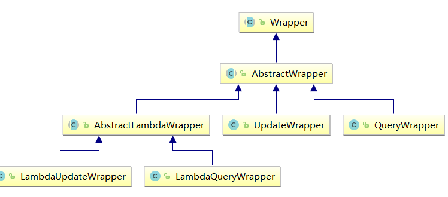

## 主键策略

### ID_WORKER

```java
MyBatis-Plus默认的主键策略是：ID_WORKER  全局唯一ID
```

### 自增策略

```java
使用
    1. 需要在创建数据表的时候设置主键自增
    2. 实体字段中配置 @TableId(type = IdType.AUTO)
    
```


## 自动填充

```java
介绍
    项目中经常会遇到一些数据，每次都使用相同的方式填充，例如记录的创建时间，更新时间等。
    以使用MyBatis Plus的自动填充功能，完成这些字段的赋值工作：
语法例子
    
// 实例

@Data
public class User {
    ...... 
    @TableField(fill = FieldFill.INSERT)
    private Date createTime;
    //@TableField(fill = FieldFill.UPDATE)
    @TableField(fill = FieldFill.INSERT_UPDATE)
    private Date updateTime;

}   


// 自动填充
@Component
public class MyMetaObjectHandler implements MetaObjectHandler {
    private static final Logger LOGGER = LoggerFactory.getLogger(MyMetaObjectHandler.class);
    @Override
    public void insertFill(MetaObject metaObject) {
        LOGGER.info("start insert fill ....");
        this.setFieldValByName("createTime", new Date(), metaObject);
        this.setFieldValByName("updateTime", new Date(), metaObject);
    }
    @Override
    public void updateFill(MetaObject metaObject) {
        LOGGER.info("start update fill ....");
        this.setFieldValByName("updateTime", new Date(), metaObject);
    }
}
```


## 乐观锁

```java
springBoot 中

    
@EnableTransactionManagement
@Configuration
@MapperScan("com.atguigu.mybatis_plus.mapper")
public class MybatisPlusConfig {
    /**
     * 乐观锁插件
     */
    @Bean
    public OptimisticLockerInterceptor optimisticLockerInterceptor() {
        return new OptimisticLockerInterceptor();
    }
}


// 实例
public class User{
    @Version
    private Integer version
}
```


## 分页插件

```java
// 看官网’
本质是拦截器
```

## 删除

```java
介绍
    物理删除： 真是删除， 将对应数据从数据库中删除，之后查询不到这条被删除的数据
    逻辑删除： 假删除， 将对应数据中代表删除的删除字段设置为被删除状态，还是能查得到的
逻辑删除使用场景
    可进行数据恢复
    有关联数据，不便删除
```


## 条件构造器

