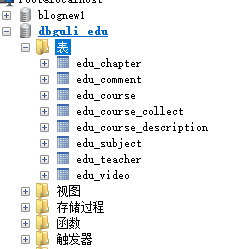

## 工程结构

```java
guli_parent：根目录（父工程），管理四个子模块：
    canal_client：canal数据库表同步模块（统计同步数据）
common：公共模块父节点
    common_util：工具类模块，所有模块都可以依赖于它
    service_base：service服务的base包，包含service服务的公共配置类，所有service模块依赖于它
    spring_security：认证与授权模块，需要认证授权的service服务依赖于它
infrastructure：基础服务模块父节点
    api_gateway：api网关服务
service：api接口服务父节点
    service_edu：教学相关api接口服务
    service_oss：阿里云oss api接口服务
    service_acl：用户权限管理api接口服务（用户管理、角色管理和权限管理等）
    service_cms：cms api接口服务
    service_sms：短信api接口服务
    service_trade：订单和支付相关api接口服务
    service_statistics：统计报表api接口服务
    service_ucenter：会员api接口服务
    service_vod：视频点播api接口服务
```

## 项目搭建

### 补充

```java
artifactId：
    一般是项目名或者模块名。
groupId
    // 第一段为域，第二段为公司名称
    分为几个字段，例如cn.com.fullstack，前面的com叫【域】，后面的是你自己起的域名。 
设置原因
    包名根目录=groupId+artifactId。
    这个是不允许和别人重复的，尤其是需要上线的项目。
    一般公司为了不重复都会注册一个域名（URL用的那种），这样就肯定不会重复了
    
    
```

## parent 项目

### 创建

```java
创建
	new project -- spring initializer --  groupId artifactid
修改
    府项目中是没有代码的
    删除 src 目录
依赖管理 pom.xml

```

### 导包 pom.xml

#### 修改

```java
// 修改 springBoot 的版本号
    <parent>
        <groupId>org.springframework.boot</groupId>
        <artifactId>spring-boot-starter-parent</artifactId>
        <version>2.4.4</version>
        <relativePath/> <!-- lookup parent from repository -->
    </parent>
// 项目打包方式
    <artifactId>guli-parent</artifactId>
    <packaging>pom</packaging>    
        
// 删除第三方包依赖
	父工程只做版本限定，不做其他的
	<dependencies> 标签全部删除   
        
注意
	com.aliyun   是非开源的，所以在 maven 库中是找不到的
        
        
```

#### 添加 - properties

```java
介绍
	// 依赖具有传递性，对于第三方包，有些需要，有些不需要，
    // 所以在父项目中只进行版本锁定，不做其他的
  
<properties>
    <java.version>1.8</java.version>
    <mybatis-plus.version>3.3.1</mybatis-plus.version>
    <velocity.version>2.0</velocity.version>
    <swagger.version>2.7.0</swagger.version>
    <aliyun.oss.version>3.1.0</aliyun.oss.version>
    <jodatime.version>2.10.1</jodatime.version>
    <commons-fileupload.version>1.3.1</commons-fileupload.version>
    <commons-io.version>2.6</commons-io.version>
    <commons-lang.version>3.9</commons-lang.version>
    <httpclient.version>4.5.1</httpclient.version>
    <jwt.version>0.7.0</jwt.version>
    <aliyun-java-sdk-core.version>4.3.3</aliyun-java-sdk-core.version>
    <aliyun-java-sdk-vod.version>2.15.2</aliyun-java-sdk-vod.version>
    <aliyun-sdk-vod-upload.version>1.4.11</aliyun-sdk-vod-upload.version>
    <fastjson.version>1.2.28</fastjson.version>
    <gson.version>2.8.2</gson.version>
    <json.version>20170516</json.version>
    <commons-dbutils.version>1.7</commons-dbutils.version>
    <canal.client.version>1.1.0</canal.client.version>
    <docker.image.prefix>zx</docker.image.prefix>
    <alibaba.easyexcel.version>2.1.1</alibaba.easyexcel.version>
    <apache.xmlbeans.version>3.1.0</apache.xmlbeans.version>
</properties>
```

#### 添加 - 版本锁定

```xml
<dependencyManagement>
    <dependencies>
        <!--Spring Cloud-->
        <dependency>
            <groupId>org.springframework.cloud</groupId>
            <artifactId>spring-cloud-dependencies</artifactId>
            <version>Hoxton.RELEASE</version>
            <type>pom</type>
            <scope>import</scope>
        </dependency>
        <dependency>
            <groupId>org.springframework.cloud</groupId>
            <artifactId>spring-cloud-alibaba-dependencies</artifactId>
            <version>${cloud-alibaba.version}</version>
            <type>pom</type>
            <scope>import</scope>
        </dependency>
        <!--mybatis-plus 持久层-->
        <dependency>
            <groupId>com.baomidou</groupId>
            <artifactId>mybatis-plus-boot-starter</artifactId>
            <version>${mybatis-plus.version}</version>
        </dependency>
        <!-- mybatis-plush  3.0.3 之后移除了代码生成器与模板引擎的默认依赖，需要手动添加相关依赖-->
        <dependency>
            <groupId>com.baomidou</groupId>
            <artifactId>mybatis-plus-generator</artifactId>
            <version>${mybatis-plus.generator}</version>
        </dependency>
        <!-- velocity 模板引擎, Mybatis Plus 代码生成器需要 -->
        <dependency>
            <groupId>org.apache.velocity</groupId>
            <artifactId>velocity-engine-core</artifactId>
            <version>${velocity.version}</version>
        </dependency>
        <!--swagger-->
        <dependency>
            <groupId>io.springfox</groupId>
            <artifactId>springfox-swagger2</artifactId>
            <version>${swagger.version}</version>
        </dependency>
        <!--swagger ui-->
        <dependency>
            <groupId>io.springfox</groupId>
            <artifactId>springfox-swagger-ui</artifactId>
            <version>${swagger.version}</version>
        </dependency>
        <!--aliyunOSS-->
        <dependency>
            <groupId>com.aliyun.oss</groupId>
            <artifactId>aliyun-sdk-oss</artifactId>
            <version>${aliyun.oss.version}</version>
        </dependency>
        <!--日期时间工具-->
        <dependency>
            <groupId>joda-time</groupId>
            <artifactId>joda-time</artifactId>
            <version>${jodatime.version}</version>
        </dependency>
        <!--xls-->
        <dependency>
            <groupId>org.apache.poi</groupId>
            <artifactId>poi</artifactId>
            <version>${poi.version}</version>
        </dependency>
        <!--xlsx-->
        <dependency>
            <groupId>org.apache.poi</groupId>
            <artifactId>poi-ooxml</artifactId>
            <version>${poi.version}</version>
        </dependency>
        <!--文件上传-->
        <dependency>
            <groupId>commons-fileupload</groupId>
            <artifactId>commons-fileupload</artifactId>
            <version>${commons-fileupload.version}</version>
        </dependency>
        <!--commons-io-->
        <dependency>
            <groupId>commons-io</groupId>
            <artifactId>commons-io</artifactId>
            <version>${commons-io.version}</version>
        </dependency>
        <!--httpclient-->
        <dependency>
            <groupId>org.apache.httpcomponents</groupId>
            <artifactId>httpclient</artifactId>
            <version>${httpclient.version}</version>
        </dependency>
        <dependency>
            <groupId>com.google.code.gson</groupId>
            <artifactId>gson</artifactId>
            <version>${gson.version}</version>
        </dependency>
        <!-- JWT -->
        <dependency>
            <groupId>io.jsonwebtoken</groupId>
            <artifactId>jjwt</artifactId>
            <version>${jwt.version}</version>
        </dependency>
        <!--aliyun-->
        <dependency>
            <groupId>com.aliyun</groupId>
            <artifactId>aliyun-java-sdk-core</artifactId>
            <version>${aliyun-java-sdk-core.version}</version>
        </dependency>
        <dependency>
            <groupId>com.aliyun.oss</groupId>
            <artifactId>aliyun-sdk-oss</artifactId>
            <version>${aliyun-sdk-oss.version}</version>
        </dependency>
        <dependency>
            <groupId>com.aliyun</groupId>
            <artifactId>aliyun-java-sdk-vod</artifactId>
            <version>${aliyun-java-sdk-vod.version}</version>
        </dependency>
        <dependency>
            <groupId>com.aliyun</groupId>
            <artifactId>aliyun-java-vod-upload</artifactId>
            <version>${aliyun-java-vod-upload.version}</version>
        </dependency>
        <dependency>
            <groupId>com.aliyun</groupId>
            <artifactId>aliyun-sdk-vod-upload</artifactId>
            <version>${aliyun-sdk-vod-upload.version}</version>
        </dependency>
        <dependency>
            <groupId>com.alibaba</groupId>
            <artifactId>fastjson</artifactId>
            <version>${fastjson.version}</version>
        </dependency>
        <dependency>
            <groupId>org.json</groupId>
            <artifactId>json</artifactId>
            <version>${json.version}</version>
        </dependency>
        <dependency>
            <groupId>commons-dbutils</groupId>
            <artifactId>commons-dbutils</artifactId>
            <version>${commons-dbutils.version}</version>
        </dependency>
        <dependency>
            <groupId>com.alibaba.otter</groupId>
            <artifactId>canal.client</artifactId>
            <version>${canal.client.version}</version>
        </dependency>
    </dependencies>
</dependencyManagement>


```


## 子项目

### 介绍

```java
在 parent 项目中新建 module
    子项目都是 maven 项目，
    1.添加依赖， 就是字模需要的第三方包

注意
    添加的子模块，需要 添加打包方式
    <artifactId>common</artifactId>
    <packaging>pom</packaging>
 
注意
    utils 是所有项目的总组件，有些组件也需要他，所有也要添加上依赖
    
祖父
    父
    	子,实际的 模块
```

## 数据库

```java
介绍
    本项目是业务分库，
    
    
数据库是使用导入的 脚本， 这个脚本是怎么设计的 ，
    是有专门的的人进行设计？
    还是后端设计？还是什么时候进行设计？    
    是在什么时候设计的？
    该怎么设计？

    
//-----------------------------------------------
红黑树、索引、语句优化
    
    
对于逻辑删除的字段，需要添加 @TableLogic 标注    
    
aili 开发手册
    数据库设计
    面试的时候，会问数据库优化， 数据库语句优化，数据库优化，数据库设计规范
    这个里面就体现的有数据库设计
    
58到家数据库30条军规解读（58沈剑）    
    https://www.w3cschool.cn/architectroad/architectroad-58-home-database-rules.html
```




## MP

### 代码生成器

```java
介绍
    // !!!!!!!!!!!!!!!!!!!!!!!!!!!!!
	这个是根据数据库自动生成代码
    其他的： 还可以根据配置文件生成代码
	自动生成的代码上边的字符，是根据数据库设计的时候设计的字符生成的，不是凭空产生的
    注意：sqlyong 里面对应的有一个 comment 就是这个备注


从官网找这个玩意儿，然后粘贴过来，按需求该就行
    
    
代码生成器，在正式的项目上线以后，都会被排除出去，所以，写到 test 目录中即可

使用
    在test/java目录下创建包com.atguigu.eduservice，
    创建代码生成器：CodeGenerator.java

    
对于 
    is has 注意
    lombok 
    
    
优化
    介绍
    	对于要生成数据库的三个字段，即所有的类都要设置这三个总段，所以抽取一个公共类
    	让所有实现的额类继承这个类，实现共享这三个字段
    
    
我自己生成的代码中
    BaseEntity 类中自动生成的文件没有
    没有： @TableField(fill = FieldFill.INSERT)
    
    sdf>fsfs
    
    
    
设置父类进行优化
    根据阿里java 开发手册，需要有三个字段，因为每个类都需要有， 所以设置一个基类，
    继承，进行快速开发
    
    

```

## 程序启动配置

```java
CodeGenertator 中的数据源，丝自动执行代码的时候执行的，
application 中的数据源，是程序真正执行的时候执行的数据库
    
SpringBoot 配置文件
    
mybatis 
    配置文件，扫描配置、分页设置
springBoot
    启动类    
```

## 讲师

```java
// 项目根就将的有出入
	/edu/teacher     /eduService/teacher
// 注意添加   /admin 跟 api 相同         
```


## 错误

```java
java.lang.IllegalStateException: ConfigFileApplicationListener [org.springframework.boot.context.config.ConfigFileApplicationListener] is deprecated and can only be used as an EnvironmentPostProcessor
```

