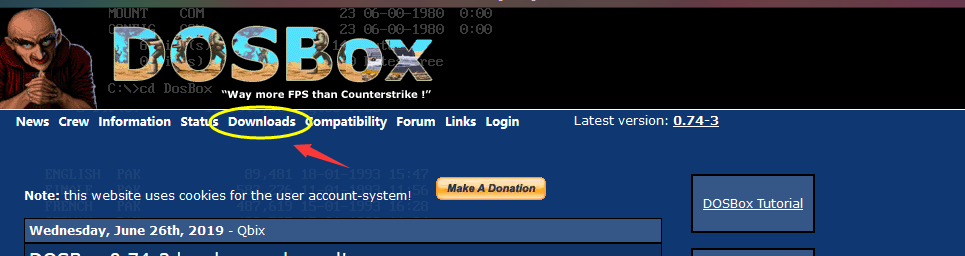
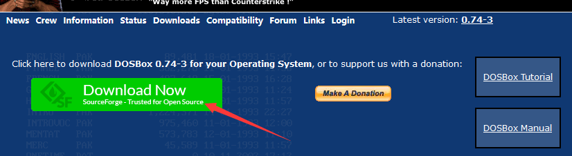

## 介绍

*   汇编学习使用到的 debug 调试工具，现在 win10 默认已经移除了这个插件，需要的话，需要手动安装

## 过程 

### 安装 DOSBox

*   官网 https://www.dosbox.com/

*   官网标题栏【Downloads】 -  绿色的 【Download Now】 -- (可能会跳转到另一个界面，等一会啊) -- 保存文件

    *   注意点完绿色的哪个，会跳转到另一个页面，要等一会儿才会弹出来下载的框

    



*   安装

    *   除了安装路径改一下，其他的都是默认安装（不大，不改也没问题）

        


### 挂载盘符

*   盘符作用

    ```go
    E:\encode\debug\masm
    	里面放着编译工具包
    	debug masm link 
    	以后你写的asm 文件也放在这个地方，相当于环境配置
    
    比如 E:\encode\debug\masm 下，然后将这个目录挂着为DOSBox的一个盘符下
    ```

*   方法一
    *   DOSBox安装目录找到  找到DOSBox 0.74 Options.bat，双击进入配置  

        ```go
        // 不要用记事本或者其他文本编辑器打开，直接双击
        ```

        

    *   拉取到最下面，输入以下语句

        ```go
        // MOUNT是挂载，C是参数，E:\encode\debug\debug 是debug.exe存放的文件夹路径(刚才需要记住的路径)
        
        // 将文件直接拉到最下面，添加一下语句
        MOUNT C E:\encode\debug\masm
        
        // 再添加以下语句
        // 你一打开 dos,他就会直接加载 debug
        
        C:
        debug
        ```

    *   保存退出

*   方法二(还没有使用)

    ```go
    // 打开 dosbox ,写入命令
    	Mount c e:\masm
    // 切换到 e 盘
    	e:
    // 执行编译文件
    	masm 1.asm
    // 连接
    	link 1.asm
    ```

    


