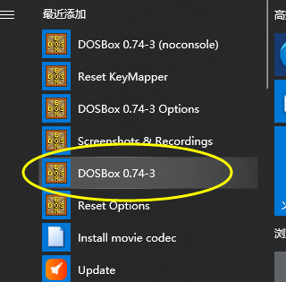

## 注意

*   以下指令是在 windows10 中进行的


## 启动

*   直接双击 图标或者 直接点击 DOSBox.exe 




## 命令

```go
不区分大小写
我们每次看到的内存中的内容，在不他那个的计算机中是不一样的，每次 debug 的内容也是不一样的

read tu
```


*   R   命令查看、改变CPU寄存器的内容

    ```go
    r //查看当前寄存器中的内容
    
    
    r 寄存器名称   // 对寄存器内容进行修改
    	（回车，出现 ：） 输入的数据  （回车）  
    
    
    r ip (回车) 输入 0100 回车 // 将寄存器 ip 的内容改成 0100  ，注意两次回车是退出当前命令
    ```

*   D   命令查看内存中的内容

    *   d
        *   debug 将列出预设的地址处的内容

    *   d 段地址：偏移地址

    ```go
    d 段地址：偏移地址  // 将列出从指定单元开始的 128 个内存单元的内容
    
        // 命令结果分析
        左边的 
            每行的起始地址
        中间的
            从指定地址开始的 128 个内存单元的内容，16 进制格式，从16 的整数倍开始，最多输出 16 个单元的内容
            从左到右，单元地址依次增加
            中间的 - ，前面为前 8 个单元，后面为后 8 个单元
    
        右边
            每个内存单元中的数据对应的可显示的 ASCII 码
            没有对应的用 . 代替
    
    d 段地址：起始偏移地址  结尾偏移地址
    ```

    

*   E    命令改写内存中的内容

    ```go
    // 向内存中写入机器码
    e 起始地址 数据 数据 数据  ...  // 从起始地址开始更改为指定的数据
    
    e 起始地址 enter
    	显示第一个单元的原始内容，光标后面输入数据 、空格表示输入完成。只输入空格比哦啊还是不更改，按 enter 结束
    ```

    

*   A   命令以汇编指令的格式在内存中写入一条机器指令

    ```go
    e 命令写入机器指令
    a 命令写入汇编指令
    
    a  起始单元内存地址
    	然后输入相应汇编指令
    a enter 然后就可以批量执行
    ```

    

    

*   T     命令执行内存中的机器码

    ```go
    // 执行一条或多条指令，简单实用 T 指令，可以执行CS：IP指向的指令
    
    我们向 1000:0 写入 8 个字节的机器码（e 命令）
    若要用 T 命令控制 CPU 执行我们写到的 1000:0 得指令，必须先让 CS：IP 指向 1000：0（jmp）,然后就可以执行（t）
    ```

    

*   U     命令将内存中的机器指令翻译成汇编指令（查看机器码的含义）

    ```go
    // 结果含义 （3 部分） ： 每一条机器指令的地址、机器指令、机器指令所对应的汇编指令
    
    可以看出  ： 内存中的数据和代码没有任何区别，关键在于如何解释
    
    ```
    
    
    
    


