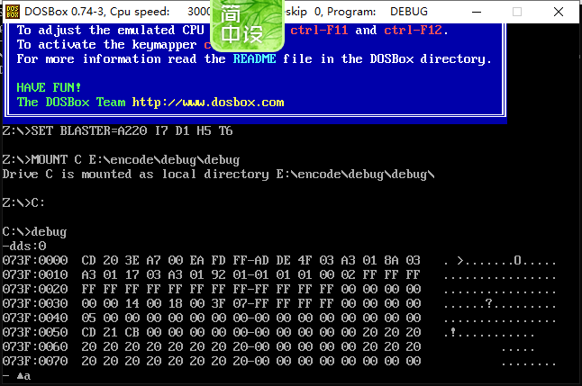

## 注意

```go
前面你挂载 debug 使用的是 打开 dosbox 就是启动 debug
在运行除了 debug 以外的工具的时候，需要从 debug 模式退出来（ q / quite ）
```


## debug

### 准备

*   DOSBox
*   debug.exe
*   win10  ( 我用的专业版 )

### 挂载 debug

*   下载

    *   在百度上百度一个就行

*   安装

    *   debug.exe是可执行文件，直接下载不需要安装的，
    *   需要注意保存路径 , 因为等下配置的时候需要用到

*   挂载

    *   把 debug.exe 放在你挂载的 DOSBOX 虚拟文件夹（挂载盘符）下面

        ```go 
        前面你使用了
        C:
        debug
        你打开 dosbox 就会自动进入 debug
        ```

        

### 测试

*   启动DOSBox.exe，在光标处输入dds：0，结果如下所示即安装配置成功：

    

## masm


### 准备

*   DOSBox

*   masm.exe

    ```go
    // 官网 这个应该是 ml.exe
    	https://www.microsoft.com/zh-CN/download/details.aspx?id=12654
    	// 这个直接安装出来是 ml.exe  , 注意这个官网介绍安装在什么地方
    	// 然后拿出来进行挂载
    	// 这个跟 masm & link 的 ml.exe  有何区别，我貌似还没有试过
    
    // 别人的安装包 ，这个应该是  MASM.exe 
    
    	这个就直接挂载就行了，挂载方法同 masm 一样
    ```

    

*   win10  ( 我用的专业版 )

### 挂载

*   安装
    *   不用安装直接挂载就行
*   挂载
    *   将 masm.exe 文件放在你挂载的 DOSBOX 虚拟文件夹（挂载盘符）下面

## link

*   根 masm 一样，直接挂载
*   将 link.exe 文件放在你挂载的 DOSBOX 虚拟文件夹（挂载盘符）下面


## ml

*   就是 masm 和 link 的组合体，直接挂载就行
*   将 ml.exe 文件放在你挂载的 DOSBOX 虚拟文件夹（挂载盘符）下面