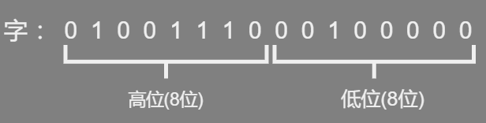
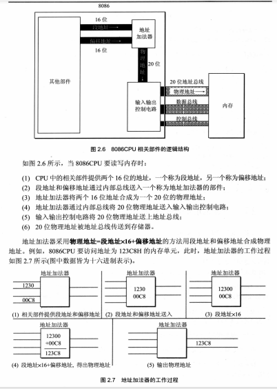
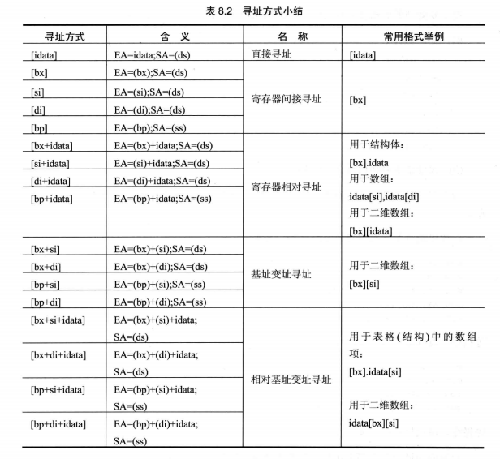

*   8086 CPU 中的数据


## 8086CPU 

*   概述
    *   上一代 8086CPU (8080,8085等)是 8 位机器
    *   8086 是 16 位机，即 16 位CPU
    *   16 位结构 = 16 位机 = 字长为 16 位
    *   内存单元的地址在送上地址总线之前，在 16 位CPU中，能一次性处理、处理、暂时存储 16 位地址
*   16 位CPU
    *   运算器一次最多处理 16 位数据
    *   寄存器的最大宽度为16 位
    *   寄存器和运算器之间的通路为 16

```assembly
cpu = 运算器 + 控制器 + 寄存器 + 内部总线

内部总线 ： 实现 CPU 内部各个器件之间的联系
外部总线 ： 实现 CPU 和主板上其他器的联系
```

### 工作过程简述

*   从 CS：IP 指向的内存单元读取指令，读取的指令进入指令缓冲器
*   IP = IP + 所读取指令的长度，从而指向吓一条指令
*   执行指令
*   转到步骤 1 重复这个过程


## 字概念

### 字节 

*   byte
*   一个字节由 8 个 bit 组成，存在 8 位寄存器中

### 字单元

*   概念

    ```go
    存放一个字型数据（16 位）的内存单元，（任意）两个连续的内存单元组成：高地址内存单元 + 低地址内存单元
    一个字存在一个 16 位的寄存器中，这个字的高位字节和低位字节自然就存在这个寄存器的高8位寄存器和低8位寄存器中
    
    // 一些术语
    高字节 = 高位字节 = 高位 放在 高地址单元 ， 高位字节单元
    低字节 = 低位字节 = 地位 放在 低地址单元 ， 地位字节单元
    
    ```

*   特点

    *   内存存储时。内存单元是字节单元（一个单元存放一个字节）
    *   长度 ：内存单元  = 字节单元 = 字单元 X 0.5

*   术语

    ```go
    N 的字节单元 = N 地址字单元  （N 是单元起始地址）
    // 例子
    	一个字单元有 2 、3 两个内存单元组成，这个字单元的起始地址为 2 。即说 这是 2 地址字单元 
    
    
    N 地址单元  : 地址为 N 的那个字节单元（没说什么单元就是字节单元）
    N 地址字单元 ： 起始地址为 N 的那个字单元
    
    地址单元 = 内存单元  = 存储单元 = 字节单元 = 字单元 X 0.5 
    地址字单元 = 字单元 = 字
    ```

*   字的存放
    *   一个字由两个地址连续的字节组成 ， 两个自己和分别称为高字节 、低字节
        *   高位字节 ：放在高地址单元
        *   低位字节 ： 放在低地址单元




*   字的传送

    ```go
    mov 指令就可以在寄存器和内存之间进行字节型数据传送
    	8086CPU 是16位结构，有16根数据线，一次性传输16位的数据，即一次性传输一个字
    	mov 指令中给出16位寄存器就可以
    ```

    


## 段概念

*   概念
    *   根据需要，将若干连续的内存单元看做一个段（看做一个）
    *   一个段用 段地址 X 16  定位段的起始地址（基础地址），用偏移地址定位内存单元
        *   起始地址是16的倍数，偏移地址 16 位，寻址能力为 64KB，一个段最大长度也是 64KB

```go
数据段地址 ：ds   用一个段存放数据，将它定义为数据段
代码段地址 ：Cs  用一个段存放代码，将它定义为代码段
栈的段地址 ：SS  用一个段当做段，将它定义为栈段
```

*   本质

    ```go
    //  段地址 X 16 = 基础地址
    //  物理地址 = 基础地址 + 偏移地址
    
    基础地址 ： 段的起始地址，用 段地址 X 16
    偏移地址 ： 定位段中的内存单元
    
    // 打个简单的比方 ： 10 - 19 都是属于 10这个数据段的，十位数是 1 ，16 中的 6 定位
    地址 10000H - 100FFH 的内存单元组成一个段，改短的起始地址(基础地址)为 10000H ，段地址为1000H 大小为 100H
    ```


*   相关计算
    *   确定物理地址
    *   不同的段地址和偏移地址组合可以得出相同的物理内存地址

    ```go
    物理地址	段地址		偏移地址
    21F60H 	    2000H      1F60H
    		   2100H       0F60H
    		   21F0H       0060H
    ```


*   寻址定内存单元

```go
// 给定一个段地址，仅通过偏移地址来寻址，最多可定义的内存单元数
	偏移地址 16 位，变化范围 0 - FFFFH ，最多 64KB
// 正常计算
    段地址	1000H  ：须知范围 10000H - 1FFFFH
```


### 代码-指令段

*   概念
    *   根据编程需要，将内存中一段连续的内存单元（长度≤64KB，起始地址为16倍数）用来存放代码，定义为一个代码段

*   执行代码段
    *   代码段只是我们在变成的时候的一种安排
    *   CPU  只认定 CS ：IP 指向的内存单元中的内容作为指令
    *   执行代码段中的指令，就要将CS:IP 指向所定义的代码段中的第一条指令的首地址

### 代码-数据段

*   概念
    *   根据需要讲一组内存单元定义为一个段
    *   将一组长度为 N ( N≤ 64KB ) 、 地址连续 、起始地址为 16 倍数的内存单元 ， 这个空间专门用于存储数据，就定义了一个数据段

*   访问数据段
    *   把内存当成数据段，只是一种安排
    *   具体操作，用 ds 存放数据段的段地址，再根据需要，用相关指令你访问数据段中的具体单元


### 栈段

*   概念
    *   我们将 长度为 N （N ≤ 64K ） 的一组地址连续、起始地址为 16 倍数的内存单元，当做栈使用，就定义了一个栈段
    *   这个还是我们自己的安排。CPU 只执行 push 、pop 时，会自动将我们定义的栈段当做栈空间

## 栈概念

### 概念

*   参看数据结构和算法 的 《栈和队列》 

     [栈和队列.md](..\..\..\..\数据结构与算法\数据结构算法基础\s5_栈和队列\栈和队列.md) 

### 操作指令

```go
push
pop
```


### 介绍

*   现代 CPU 都有栈的设计
*   基于 8086CPU 编程的时候，可以把一段内存当做栈来使用
*   栈 ： 从顶到底的内存地址依次增大

### 栈顶越界

*   概念

*   栈空间是内存空间的一部分，只是一段可以以一种特殊的方式进行访问的内存空间

*   栈大小

    *   栈顶的变化范围最大就是 64KB 范围 ，即 0 - FFFFH（ CPU 是 16 位）

*   越界

    *   栈满的时候进行 push 
    *   栈空的时候进行 pop
    *   越界就会访问栈规定以外的空间地址，造成越界

*   工作机理

    ```go
    8086CPU 只考虑当前的情况
    1. 只考虑栈顶在何处  SS ：SP 只是确保找到栈顶
    2. 当前要执行的指令是哪一条
    3. 我们需要自己管理栈的空间大小 ！！！
    
    
    
    10000H - 1FFFFH
    当次栈段为空时，相当于栈中唯一元素出栈，出栈后，SP = SP + 2 
    只有一个元素， SP 原本为 FFFEH ，加 2 后，sp = 0
    所以此段栈 ： SS = 1000H SP = 0 （也可以理解为栈段溢出，溢出的不要了）
    ```

### 数据操作

```go
将 10000H - 1000F 这段空间作为栈，初始状态为空。将 ax , bx , ds 中数据入栈
// 将 SS:SP 指向我们定义的栈空间就行
	栈顶设置(栈段地址、偏移地址设置) -- push pop

// 段地址不能直接接受数据，栈也是段地址,所以栈段地址，需要用通用寄存器中转
mov ax 1000H  // 
mov ss , ax     // 栈段地址设置
mov sp , 0010H  // 栈偏移地址设置 （注意这个是栈顶的下一个内存单元，代表是空栈）
push ax
push bx

// 清空寄存器内容
mov ax , 0
sub ax , ax
```

### 本质

```go
push pop 
	两步操作（有顺序）
	本质上是一种内存传送指令，可以在寄存器和内存之间传递数据
	访问的内存单元的地址不是在指令中给出的，而是由SS：SP 指出的
	还要改变改变 SP 中的内容

mov 
	一步完成，就是传送
```


## 物理地址

*   概念

    *   CPU 访问内存单元时，必须要给出内存单元的地址,即 CPU 向地址总线发出物理地址之前，必须自内部形成这个物理地址
    *   所有内存单元构成的存储空间是一个一维的线性空间
    *   每个内存单元在这个空间中都有唯一的地址，我们称为物理地址
    *   不同 CPU 有不同形成物理地址的方式

*   计算方法（8086）

    *   8086 CPU 有 20 位地址总线，又是 16 位结构，所以采用用 两个 16 位地址合成的方法来形成一个 20 位的物理地址

        ```go
        段地址 X 16 + 偏移地址
        // 段地址向左移动一位 + 偏移地址
        ```

        

*   本质含义

    *   CPU 在访问内存单元时，用一个基础地址（段地址 X16）和一个相对于基础地址的偏移地址相加，给出内存单元的物理地址

        ```go
        基础地址 + 偏移地址 = 物理地址
        ```

        

    


## 常量

``` 
[idata]
	; 是个约定符号,表示常量
mov ax,[idata] : mov ax,[1]、mov ax,[2]、等
mov ax,idata   : mov ax,1 、mov ax,2、等 
```


## 内存单元寻址

*   内存存储内容描述

    ```go
    （）元素 ：描述一个寄存器或一个内存单元中的内容
    	1. 寄存器名 
    	2. 段寄存器
    	3. 内存单元的物理地址（一个20位数据）
        (X) :是哪种类型由寄存器名或具体的运算决定
            1.字节型 ：[al] [bl]
            2.字型   : [ax] [al]
        (al) = (20000H)  (20000H)得到的就是字节型
        (ax) = (20000H)  (20000H)得到的就是字型
    
    [2]
    ((ds)*16 + 2 ) 
    	使用 ds 中的 ADR1 作为段地址  bx 中的 ADR2 为偏移地址  内存单元ARD1:ARD2 单元的内容
    
    ax 中的内容为 0010H
    	(ax) = 0010H 
    
    2000:1000 处的内容为 0010H	
    	（21000H） = 0010H
    
    mov ax [2]	
    	(ax) = ((ds)*16 + 2 )   
    
    add ax,[2]	
    	(ax) = (ax) + 2
    	
    push ax
    	(sp) = (sp)-2
    	((ss)*16+(sp)) = (ax)
    pop ax
    	(ax) = ((ss)*16+(sp))
    	(sp) = (sp) - 2
    ```

    

*   内存表示

    *   段地址都在 ds 、ss  、 指定段地址
    *   数据放在内存中，可以使用这个内存单元的偏移地址表示地址，这个定位内存单元的方法被称为 寻址方式
    
    ```assembly
    ; 完整描述以一个内存单元： 1. 内存单元的地址  2. 内存单元的长度（类型）
    只有 bx si di dp 才能通过 “[...]” 进行内存单元寻址  + [idata]
    出现方式
    	1. 都是单个出现 
    	2. {bx + si、di}  : 段地址 ds
    	   {bp + si、di}  : 段地址 ss
    	3. 1 和  2 的各个组合 + [idata]
    
	; 以下 idata 是数字
    
    [idata]  
    	; 是常量，不是符号 idata .表示地址，可用于直接定位一个内存单元
        [0] 表示内存单元，偏移地址是 0 ，段地址默认在 ds 中，
        	; 在 debug 中是地址，默认段地址在 ds 中
        	; 在汇编源程序（编译器）当中就是数字 0
        	
            
            单元的长度（类型）可以由具体指令中的其他操作对象指出（比如寄存器）
    
    [bx]
    	; 变量，标识地址，可用于间接定位一个内存单元，debug 和 编译器中都表示内存
    	[bx] 表示一个内存单元，
    	bx 中的数据作为一个偏移地址 EA ，段地址 SA 默认在 ds 中， SA：EA 处的数据
    	内存单元长度根据目标不同长度而不同 
    	mov ax , [bx] // [bx] 2 个字节（字单元）
    	mov al , [bx] // [bx] 1 字节（字节单元）
    	mov ax , [bx]  ; SA：EA 处的数据送入 ax    (ax) = ((ds)*16+(bx))
    	mov [bx] , ax  ;   ax 处的数据送入 SA：EA  ((ds)*16+(bx))=(ax)
    
    [ bx + idata ]
    	; 变量 + 常量 ，在一个起始地址的基础上，用变量 间接定位一个内存单元 （设置步长 ）进行数组处理
    	mov ax , [bx + 200]  ; (ax) = ((ds)*16+bx+200)
    	[bx+200] 一个偏移地址为 (bx)+200 的内存单元，
    	ax 16为寄存器（[bx+200] 是一个字单元）
    	将一个内存单元((bx)+200)的内容送入 ax 
    	
    	
    
    [ bx + di ]
    [ bx + si ]  == [bx][si]
    	; 变量 + 变量 ， 表示地址,偏移地址为 (bx)+(si),段地址在 ds 中
    	mov ax , [bx+si] ; (ax) = ((ds)*16+bx+si)
    	
    	
    
    
    [ bx + si + idata]
    [ bx + si + idata ]
    	; 变量 + 变量 + 常量 ，表示地址,偏移地址为 (bx)+(si)+(idata) ,段地址在 ds 中
    	mov ax , [bx+si+idata] ; (ax) = ((ds)*16+(bx)+(si)+idata)
    	变形 ： idata[bx][si] ,[bx].idata[si] , [bx][si].idata
    	
    	
    
    十六进制，每两个位是一个字节 。存储的时候，高地址对应高地址位，低地址对应低地址为
    
    字形数据
    地址单元
    
    字节是 8 位， 字型是 16 位
    ```



*   使用

    ```assembly
    汇编源程序中，如果用指令访问一个内存单元，则在指令中必须用 [...] 表示内存单元
    1. ds:[0]
    	mov al , ds:[0]
    	其中 ds 为 段前缀,可设置的有 ：ds 、 cs 、ss 、es
    2. [bx]
        mov [bx] , 0  ; 偏移地址 0 送入 bx
        mov al , [bx] ; ds:bx 单元中的数据传入 al
        bx 间接给出内存单元的偏移地址，段地址默认在 ds 中
    ```

## 一段安全的空间

*   我们向一段内存中写入内容，这段空间不应存放系统或者其他程序的数据和代码

*   DOS 模式下，没有系统或者掐程序的数据和代码段

    ```assembly
    ; 可以直接向这段内存中写入内容
    0:200 ~ 0:2ff
    ```


## 数据

*   数据类型及长度

    ```assembly
    dw define word ; 定义字型数据，字，16 字节
    	dw 0001H
    db define byte ; 字符
    	db 'unix'  ; 编译器将阿门转化成对应的 ASCII 码
    ; 伪指令
    dd  dword(double word 双字)型数据
    ;----------------------------------------------------------------
    
    data segment
    	db 1    ; 1 个字节
    	dw 1	; 1 个字
    	dd 1	; 2 个字
    data ends
    
    
    ; ----------------------------------------------------------------	
    1. 通过寄存器指明要处理的数据的尺寸
    	mov ax , 1  ; 指明了进行的是字操作
    	mov al , 1  ; 指明了进行的是字节操作
    
    2. 没有寄存器名存在，用操作符 X ptr 指明内存单元的长度
    	mov word ptr ds:[0] , 1  ; word ptr 指明指令访问的内存单元是一个字单元
    	mov byte ptr ds:[0] , 1  ; byte ptr 指明指令访问的内存单元是一个字节单元
    
    3. 其他方法 
    	有些指令默认了访问的是字单元还是字节单元 
    	push [1000H] 默认指令只进行字操作
    ```

*   数据处理

    ```go
    // 两个基本问题
    1. 处理的数据在什么地方
    2. 要处理的数据有多长
    
    // reg 表示一个寄存器
    reg :
    	ax bx cx dx 
    	sp bp si di
    	ah al bh al ch cl dh dl 
    
    // sreg 表示一个段寄存器
    sreg :
    	ds ss cs es
    ```

*   机器指令处理的数据在什么地方

    ```go
    // 机器指令并不关心数据的值是多少，而关心指令执行前一刻，要处理的数据所在的位置 
    数据处理指令 ：读取、写入、云端
    数据所在位置 ： CPU 内部 、内存 、 端口
    ```

    | 机器码   | 汇编指令   | 指令执行器前数据的位置 |
    | -------- | ---------- | ---------------------- |
    | 8E1E0000 | mov bx,[0] | 内存，ds:0 单元        |
    | 89C3     | mov bx,ax  | CPU 内部 ， ax 寄存器  |
    | BB0100   | mov bx,1   | CPU 内部， 指令缓冲器  |

*   数据位置表达

    *   立即数（idata）

        ```assembly
        ; 直接包含在机器指令中的数据（执行前在CPU的指针缓冲器中），汇编指令中直接给出
        mov ax , 1
        ```

    *   寄存器

        ```assembly
        ; 指令要处理的数据在寄存器中，在湖边指令中给出相应的寄存器名
        mov ax , bx
        ```

    *   段地址(SA) 和 偏移地址(EA)

        ```assembly
        ; 指令要处理的数据存在内存中，汇编指令中用 [X] 的格式给出 EA，SA 在某个段寄存器中
        段寄存器存放
        ds  	  : [0] [di] 含有bx
        ss 		  : 含有bp
        指定寄存器  ： es:[bx]
        ```


## 程序

*   概念
    *   源程序（文件） ----- 编译 ----->  目标文件  ----- 连接程序连接 ----->可执行文件（*.exe）
    *   可执行文件  ----- 操作系统加载入内存  -----  初始化  --- CPU 执行程序


