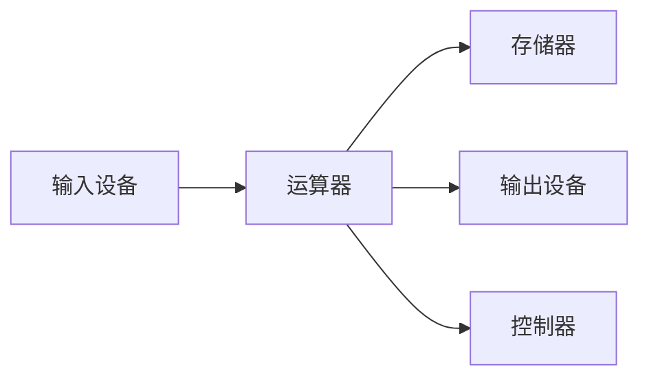

## 计算机

*   体系结构
    *   用机器或汇编语言编程的程序员能看到的传统机器的属性（指令集、数据类型‘等抽象计数）
*   层次结构
    *   
*   组成
    *   
*   解题过程

## 基本组成

### 典型冯诺依曼结构（运算器为中心）

### 硬件框图（存储器为中心）

### 现代硬件框图（三大部分）

```mermaid
graph LR
B[运算器] --> E[存储器]
A[输入设备] --> B[运算器] --> C[输出设备] 
B[运算器] --> D[控制器]


```

