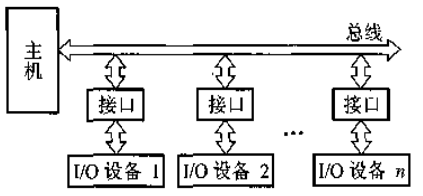
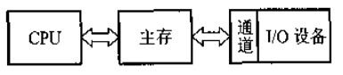

## 发展

### 发展概况

```go
1. CPU 直接交换
2. 接口模块 和 DMA
3. 通道结构
4. I/O 处理机阶段
```


*   早期 -- CPU

    ```mermaid
    graph LR
    A[主存] --> B[CPU] --> C[I/O 设备]
    B[CPU] --> A[主存]
    C[I/O 设备] --> B[CPU]
    ```

    ```go 
    I/O 设备种类较少， I/O 设备与主存交换信息必须通过 CPU 
    
    // 此方式的的特点
    1. 每个 I/O 设备都必须配有一套独立的逻辑电路和CPU相连,用来实现 I/O 设备和主机之间的信息交换，因此线路十分散乱、庞杂
    
    2. 输入输出过程 是穿插在 CPU 执行程序过程中进行的，当 I/O 设备与主机之间减缓信息时，CPU 不得不停止各种运算，因此 I/O 设备与 CPU 是按照串行方式工作的，极浪费时间
    
    3.每个 I/O 设备的逻辑控制电路与 CPU 的控制器紧密构成不可分割的整体，彼此关联，很难添加、撤减或更换 I/O设备
    ```

*   接口模块和 DMA 阶段

    

    ```go
    接口 ： 设备通过接口模块与主机连接，计算机系统采用了总线结构
    DMA  ： 后来为了提高 CPU 的工作效率，出现了直接存储器存取（Direct Memory Access DMA)
    ```

    

    *   通道结构阶段

        

        ```go
        采用 I/O 通道方式进行数据交换
        ```

    *   I/O 处理机阶段

    


## 组成

## 


*   接口模块
    *   数据通路（串-并，并-串转换）
    *   控制通路
    *   可满足中断请求
    *   可使 i/o 分时占用总线
    *   CPU 可通过接口地址访问 i/o 设备
*   I / O 处理机
    *   独立于主机工作，完成 I/O 控制、码值转换、格式处理、数据块检错、纠错
*   I / O 指令
    *   是 CPU 的一列，反应 I/O 与 CPU 交换信息的特点，以及不同硬件的具体操作
    *   操作码
    *   命令码
    *   设备码
*   I / O 硬件
    *   接口模块 + I / O 设备
*   I / O 编址方式
    *   统一编址，将 I / O地址看做存储器地址的一部分
    *   CPU 访问与 I / O 设备相似，不同意编址
    *   I / O 地址域存储器地址不同
*   传送方式
    *   并行传送（速度快，线路多）
    *   串行传送（远距离传送，线路简单，速度慢）
*   联络方式
    *   立即响应（慢速 I/O 设备）
    *   异步工作（速度不匹配）并行
    *   串行
    *   步行
*   连接方式
    *   辐射
    *   总线
*   控制方式
    *   程序查询方式    
        *   CPU 和 I / O 串行工作踏步等待
    *   程序中断方式
        *   CPU 和 I/O 与主存之间信息的交互
    *   DMA方式
        *   主存与 I/O 设备有数据通路，无需中断
        *   若 CPU 和 DMA 同时访问内存，CPU 会让着 DMA （仅一个存储周期），此后 CPU 可继续内部操作。若赶上 CPU 进行内部操作，则 DMA 不会影响 CPU 工作
*   接口
    *   两种硬件设备之间的连接电路，两种软件之间的共同逻辑边界
    *   在接口中都设置的有数据通路和控制通路
*   I/O 接口
    *   主机和外设之间设置的一个硬件电路和响应的软件软件控制
    *   会涉及到设备独有的设备控制器
*   接口作用
    *   接口可实现数据缓冲达到速度匹配
    *   数据串 - 并格式的转换
    *   电平转换
    *   CPU 启动外部设备工作，接口可传送控制指令
    *   供 CPU 及时发送外设的工作状态（忙、就绪、错误、中断请求）
*   端口
    *   值接口电路的一些寄存器，用来存放数据信息、控制信息、状态信息
    *   接口 = 端口 + 控制逻辑
*   


