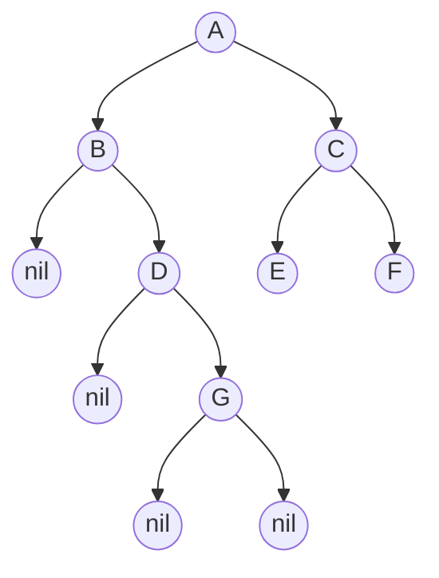

## 递归思路

### 补为完全满二叉树

```go
递归就是调用自身
	递归结束条件
	递归（深入）方向
	递归返回值

把图示转化为一个完全满二叉树
	不管什么，对数据进行重复性的操作： 找到该数据，然后进行输出
	处理相似性
控制递归的方向
	方向口控制可以在函数体内
	也可以作为参数传递给函数
多个递归函数
	多个递归函数，多是通过不同的参数，来控制不同的方向
递归执行
				递归1 [递归退出点，出栈] 递归2 [递归退出点，出栈] 递归3  [递归退出点]
				递归1 [递归退出点，出栈] 函数2 [递归退出点，出栈] 函数3  [递归退出点]
	
	从入口执行递归 1 
		到结束，出栈执行函数 2 ，函数退出，执行函数3
	从入口处处理递归 2
		其实就是处理递归 1 ，只是方向不同
	即使有多个递归函数同时在本体中存在，
		实际入口只有一个，其他递归函数。是在
	
	高层次的运行，高层次跳跃构思
	底层次的运行，低层次连续运行
	

	


从底层开始，按照顺序执行函数自身（执行不同方向的自身），然后依次往根结点走
你自己仔细就追的话，就是整个函数碰到自身，进行深入，然后深入的最后，才开开始结束
相当于 一致开始，碰到一个结束，网上进行结束

开始1 
	开始2
		开始3     结束3
						结束2
							结束1


	
	


前序遍历 ：A B # D # # C # # 
```

### 

## 遍历

### 前序遍历



#### 分析过程

```go
当前节点为 P
	当前节点非空，就将当前入栈，同时输出该节点的值，
	当前节点为空，就将栈顶元素弹出，同时将 P 指向弹出元素，此时无输出
P 指向顺序
	P 当前节点 - P 左树节点 —— P 右树节点
结果
	就是 P 非空时候，输出的结点的值的集合
// 总结
	一直压栈，压栈的同时进行访问（输出）
	碰到 nil 结点就弹栈
	（左子树压到底，压到底就开始弹）

// 开始 P 指向当前节点 非空
P = A ： A 入栈 , 输出 A ，输出结果[A]
	[A]
//  p 指向 A 的左子树 ，非空
P = B ： B 入栈 , 输出 B ，输出结果[A,B]
	[A,B]

//  p 指向 B 的左子树 ，非空
P = D ： D 入栈 , 输出 D ，输出结果[A,B,D]
	[A,B,D]

//  p 指向 D 的左子树 ，空 :P = nil 栈顶弹出D： 栈[A,B] 
	P 指向弹出元素D ： P = D

//---------------------------------------------------------------------
//  p 指向 D 的右子树 ，非空
P = G ：G 入栈 , 输出 G ，输出结果[A,B,D,G]
	[A,B,G]
//  p 指向 G 的左子树 ，空 :P = nil 栈顶弹出B： 栈[A], 无输出
	P 指向弹出元素B ： P = B
//  p 指向 G 的右子树 ，空 :P = nil 栈顶弹出A： 栈[], 无输出
	P 指向弹出节点A ： P = A
//---------------------------------------------------------------------
//  p 指向 A 的右子树 ，非空
P = C ：C 入栈 , 输出 C ，输出结果[A,B,D,G,C]
	[C]

//  p 指向 C 的左子树 ，非空
P = E ：E 入栈 , 输出 E，输出结果[A,B,D,G,C,E]
	[C,E]

//  p 指向 E 的左子树 ，空 :P = nil 栈顶弹出E： 栈[C], 无输出
	P 指向弹出节点E ： P = E

//  p 指向 E 的右子树 ，空 :P = nil 栈顶弹出C： 栈[], 无输出
	P 指向弹出节点C ： P = C

//  p 指向 C 的右子树 ，非空
P = F ：F 入栈 , 输出 F，输出结果[A,B,D,G,C,E,F]
	[F]

//  p 指向 F 的左子树 ，空 :P = nil 栈顶弹出F： 栈[], 无输出
	P 指向弹出节点F ： P = F

//  p 指向 E 的右子树 ，空 :P = nil 栈顶弹出,此时已经无法弹出，所以
	在 p == nil + 栈为空的时候，就结束了

```

#### 伪代码

```go
1. 栈初始化 、输出数组初始化
2. 循环到 P 为空且栈 s 为空
	2.1 P 不为空，循环
		输出 P 的值 + 将 P 指向的结点(结点值)入栈 + 遍历 P 的左子树
	2.2 P 为空，栈不为空
		栈顶元素弹出 + P 指向弹出结点(结点值) + 遍历 P 的右子树
	2.3 P 为空，栈为空，跳出循环


```


### 中序遍历

#### 分析过程

```go
1. 就是在前序遍历的基础上得来的
2. 遍历过程中，遇到某个节点并不立即访问（输出）它，而是压栈，等到左子树遍历完全，从栈中弹出的时候进行访问（输出）
// 总结	
	一直压栈，碰到 nil 结点弹栈
	弹栈的时候，进行访问（输出）
	（左子树压到底，就开始弹）

// p 指向当前节点 A ，非空 ， A 入栈 :[A] ，无输出（访问）
	p 指向 A 的左子树 ,非空
// p 指向当前节点 B ，非空 ， B 入栈 :[A,B] ，无输出（访问）
	p 指向 B 的左子树 ，非空
// p 指向当前节点 D ，非空 ， D 入栈 :[A,B,D] ，无输出（访问）
	p 指向 D 的左子树 ，空
// P = nil ，弹出栈顶元素 D：[A,B] ，将 P 回退指向 D  ，并访问（输出）D , 输出总结果[D]
	P 指向 D 的右子树 ，非空 
// p 指向当前节点 G ，非空 ， G 入栈 :[A,B,G] ，无输出（访问）
	p 指向 G 的左子树 ，空
// P = nil ，弹出栈顶元素 G：[A,B] ，将 P 回退指向 G  ，并访问（输出）G , 输出总结果[D,G]
	p 指向 G 的右子树 ，空
// P = nil ，弹出栈顶元素 B：[A] ，将 P 回退指向 B  ，并访问（输出）B , 输出总结果[D,G,B]
	p 指向 B 的右子树 ，空
// P = nil ，弹出栈顶元素 A：[] ，将 P 回退指向 A  ，并访问（输出）A , 输出总结果[D,G,B,A]
	P 指向 A 的右子树 ，非空
//---------------------------------------------------------------------
// p 指向当前节点 C ，非空 ， C 入栈 :[C] ，无输出（访问）
	p 指向 C 的左子树 , 非空
// p 指向当前节点 E ，非空 ， E 入栈 :[C,E] ，无输出（访问）
	p 指向 E 的左子树 , 空

// P = nil ，弹出栈顶元素 E：[C] ，将 P 回退指向 E  ，并访问（输出）E , 输出总结果[D,G,B,A,E]
	P 指向 E 的右子树 ，空
// P = nil ，弹出栈顶元素 C：[] ，将 P 回退指向 C  ，并访问（输出）C , 输出总结果[D,G,B,A,E,C]
	P 指向 C 的右子树 ，非空
// p 指向当前节点 F ，非空 ， F 入栈 :[F] ，无输出（访问）
	p 指向 E 的左子树 , 空
// P = nil ，弹出栈顶元素 F：[] ，将 P 回退指向 F  ，并访问（输出）F , 输出总结果[D,G,B,A,E,C,F]
	P 指向 F 的右子树 ，空
// P = nil ，需要弹出栈顶元素 ，但是此时栈为空，无法弹出，所以就应该跳出循环
	跳出循环的条件为  P = nil 栈为空
```


### 后序遍历

```go
// 结点需要两次入栈两次出栈
第一次出栈：
	只遍历完左子树，该结点不出栈，利用栈顶结点找到他的右子树，准备遍历它的右子树
第二次出栈：
	遍历完右子树，将该节点出栈，并访问它，
应对
	区别一个同一个结点的两次出栈，设置标志 flag

// 栈元素类型定义
struct element {
	BiNode *ptr
    int flag // 1 表示第一次出栈，2表示第二次出栈
}
```

#### 分析过程

```go

|   1	 |
```


## 二叉树最大深度

*   递归实现

    ```go
    给定二叉树 [3,9,20,null,null,15,7]， 
        3
       / \ 
       9 20 
    	/ \ 
        15 7
    ```

*   思路

    ```go
    // 递归压栈
    
    
    Definition for a binary tree node.
type TreeNode struct {
         Val int
         Left *TreeNode
         Right *TreeNode
    }
    
    func maxDepth(root *TreeNode) int {
    	// 递归结束条件
        if root == nil {
            return  0
        }
        // 方向 ：root.Left  root.Right
        left = maxDepth(root.Left) + 1
        right = maxDepth(root.Right) + 1
        return max(left,right)
    }
    func max(a,b int) int {
        if a > b {
            return a
        } else if a < b {
            return b
        } else if a == b {
            return a
        }
    }
    
    // 函数分析
    这个是同时调用两个自身函数,进行两个自身的递归
        上面两个递归函数，每个函数控制一个递归方逆向
        maxDepth(root.Left) 中 root.Left 控制向左边递归
        maxdepth(root.Right) 中 root.Right 控制向右边递归
    	先执行 maxDepth(root.Left) , 终点 ， 再执行 maxDepth(root.Right)
    
    // 递归函数执行情况
    初始化指向 root == 3 , 非空，深入
    执行 max 中调用函数自身，调用前将 maxdepth()：root == 3 进行压栈[3]
    	调用函数 root.Left 	root.Right 没有执行到
     
    // 这个就是底层了。执行完
    递归 root == 9 , 非空 ，深入
    执行 max 中调用函数自身，调用前将 maxdepth()：root == 9 进行压栈[3,9]
    	调用函数 root.Lef root.Right 没有执行到
    
    递归 root == nil , 空，跳出调用
        递归已经深入到底层，进行出栈操作，返回 root == 9 的现场，
    	执行 root==9 的时候,剩余的 root.right 
    
    递归 root == nil ,空， 跳出调用
    	递归到达最底层，进行出栈操作，返回 root == 3 的现场
    	执行 root == 3 的时候,还没有执行的 root.right 递归
    
    // 右树
    递归 root == 20 ,非空 ， 深入
    	执行 max 中调用函数自身，调用前将 maxdepth()：root == 20 进行压栈[20]
    	调用函数 root.Left， root.Right 没有执行到
    递归 root = 15 ,非空 ， 深入
    	执行 max 中调用函数自身，调用前将 maxdepth()：root == 15 进行压栈[20,15]
    	调用函数 root.Left， root.Right 没有执行到
    递归 root = nil , 空，跳出调用 
        递归已经深入到底层，进行出栈操作， root == 15 的现场
    	执行 root == 15 的时候,还没有执行的 root.right 递归
    递归 root == nil ，空，跳出调用	
        递归已经深入到底层，进行出栈操作， root == 20 的现场
    	执行 root == 20 的时候,还没有执行的 root.right 递归
    递归 root == 7 ,非空 ， 深入
    	执行 max 中调用函数自身，调用前将 maxdepth()：root == 7 进行压栈[20,7]
    	调用函数 root.Left， root.Right 没有执行到
    递归 root = nil , 空，跳出调用 
        递归已经深入到底层，进行出栈操作， root == 7 的现场
    	执行 root == 7 的时候,还没有执行的 root.right 递归
    递归 root == nil ，空，跳出调用	
        递归已经深入到底层，进行出栈操作， root == 20 的现场
    	执行 root == 20 的时候,还没有执行的 root.right 递归
    ```
    
    