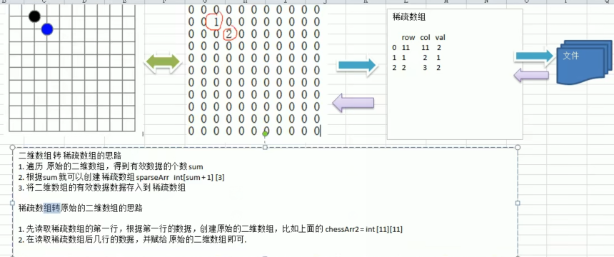

## 介绍

```java
*    如果矩阵中分布有大量的元素 0，即非 0 元素非常少 
*    只存储矩阵中的非 0 元素 
*    稀疏矩阵非 0 元素的存储需同时存储该元素所在矩阵中的行标和列标。
```


## 压缩

### 三元数组压缩

```java
主要是应对大量重复的数值，
    在大量重复的数据中， 非重复的数据量少，所以记录这些问题，就可以实现数组压缩
```



#### 稀疏数组创建

```java
// ---- 稀疏数组创建
    int[][] arr = new int[5][5];
    arr[2][1] = 2;
    arr[3][4] = 1;
```

#### 压缩

```java
// ---压缩
	    // 先遍历一遍数组（我没有写上），找出来元素非零的个数 num
        int[][] newArr = new int[num+1][3];
        newArr[0][0] = 5;
        newArr[0][1] = 5;
        newArr[0][2] = num;

        // 迭代进行存储非零值
        int count = 1;
        for(int i=0; i<5; i++){
            for (int j=0; j<5; j++){
                if (arr[i][j] != 0 ){
                    newArr[count][0] = i;
                    newArr[count][1] = j;
                    newArr[count][2] = arr[i][j];
                    count++;
                }
            }
        }
```


#### 还原

```java

```

