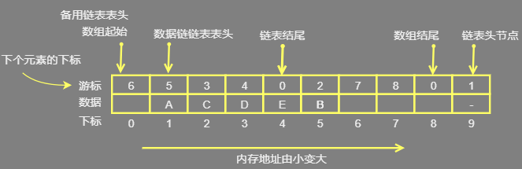

<font size=5 color= yellow>静态链表</font>

*     用数组描述的链表 ，这种描述的方法叫做游标实现法
*     是线性存储结构的一种
*     数据全部存储在数组中（和顺序表一样），但存储位置是随机的，数据之间"一对一"的逻辑关系通过一个整形变量（称为"游标"，和指针功能类似）维持（和链表类似）。 

## 分析

### 优点

*   对于没有指针的编程语言，可以用数组替代指针，来描述链表 
*   兼顾了顺序表和链表的优点于一身，可以看做是顺序表和链表的升级版 
    *   在插入和删除时候，只需要修改游标，不需要移动元素，从而改进了顺序存储结构中插入和删除操作需要移动大量元素的缺点，仍具有链式存储结构的主要优点。

### 缺点

*   需要预先分配一块连续的内存空间
*   不如单链表用起来方便
*   没有解决连续存储分配带来的表长难以确定的问题；
*   失去了顺序存储结构随机存取的特性。 

## 2.实现

* 介绍

    *   使用数组申请的物理空间中，存有两个链表，一条连接数据，另一条连接数组中未使用的空间。
    *   这两个链表在同一块内存中【特别注意 ！！！】

* 备用链表

    * 连接各个空闲位置的链表，称为备用链表。 
    * 回收数组中未使用或之前使用过（目前未使用）的存储空间， 可以清楚地知道数组中是否有空闲位置，以便数据链表添加新数据时使用 
    * 头节点存储在数组第一个元素位置(a[0])

* 数据链表

    *   存放数据的链表
    *   从 a[1] 的位置开始

* 结点

    * 数据域：data

    * 游标   ：cur

        *   也可称为指针域
        *   直接后继元素在数组中的位置下标， 【特别注意，是下个元素在数组中的位置下标】
        *   以 cur = 0  表示空指针  ,相当于 golang 中的 nil ,表示后面内有元素了

    

* 五个特殊的点

    ```go
    // 1. 数组头一个节点
    	1. 不包含任何数据
    	2. 下标 从 0 (a[0]) 开始
    	3. 它的 cur ，存的是备用链表的头节点	
    // 2. 数组第二个节点 、链表第一个元素
    	1. 存放数据的链表
    	2. 下标从 1 (a[0])开始
    	3. 虽然有头节点，但是可以一般在此处设置第一个链表数据节点
    // 3. 链表最后一个元素
    	1. cur = 0
    	2. 链表的最后一个元素，并不一定是数组的最后一个元素 
    // 4. 数组倒数第二个元素
    	1. cur = 0 ,表示此数组元素后面就没有元素了
    	2. 位置上存有数据，则证明数组已满。
    // 5. 数组最后一个元素
    	1. 存放的是静态链表的第一个有实质意义的数据的元素的下标
    	2. 相当于头节点
    	3.当整个链表为空时。其 cur = 0
    // 根据以上，建立一个链表为 0 的链表，最起码有三个数组元素。数组不可变
    // 但是如果你使用的是切片，那就另当别论了
    	一个：头节点
    	一个：数据点
    	一个: 头节点
    ```


## 3.操作

### 1.创建

*    在数据链表未初始化之前，数组中所有位置都处于空闲状态，因此都应被链接在备用链表上 

### 2.添加

*    当向静态链表中添加数据时，需提前从备用链表中摘除节点，以供新数据使用 
     *   备用链表操作 ： 
         *   摘除节点  ：  最简单的方法是摘除 a[0] 的直接后继节点 
         *   添加节点  ： 也是添加作为 a[0] 新的直接后继节点 
         *   因为 a[0] 是备用链表的第一个节点，位置已知，操作它的直接后继节点相对容易，无需遍历备用链表，耗费的时间复杂度为 `O(1)`。 
*    每添加一个元素，静态链表的 a[0] 记录备用链表的下标，都要随时改变
*    过程
     *   备用链表删除一个元素
     *   数据链表在备用链表删除的对应位置上，添加上该数据
     *   更改下标

## 3. 删除

* 过程

    *  将存有目标元素的节点从数据链表中摘除；
    *  将摘除节点添加到备用链表，以便下次再用
* 涉及大量删除元素的操作，建议读者在建立静态链表之初创建一个带有头节点的静态链表，方便实现删除链表中第一个数据元素的操作。 

## 4. 查询

* 我们只知道静态链表第一个元素所在数组中的位置，因此只能通过逐个遍历静态链表的方式，进行查找

## 5.更改

*    更改静态链表中的数据，只需找到目标元素所在的节点，直接更改节点中的数据域即可。 

```go
1.	数据链表未初始化之前，数组中所有位置都处于空闲状态，因此都应被链接在备用链表上
2.  备用链表
	摘除、添加 节点，都是从 a[0] 开始的 ——》O(1)

```


### 2、需要整理

```go
使用静态链表存储数据，数据全部存储在数组中（和顺序表一样），但存储位置是随机的，数据之间"一对一"的逻辑关系通过一个整形变量（称为"游标"，和指针功能类似）维持（和链表类似）。

```

