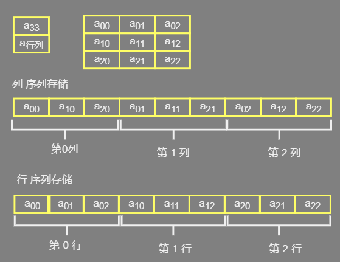
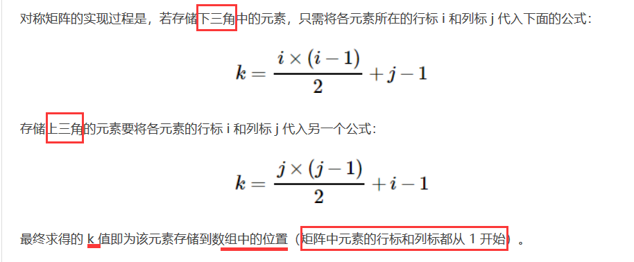

## 介绍

*    顺序结构存储的线性表
*    使用 ：数据查找、修改
*    基本每一种语言都实现了数组


## 优缺点

### 结构特点

```java
// 这是一种存储结构， 要跟平时使用的数组类型区分开
有 "一对一" 逻辑关系
元素的内存是连续的
存储不可再分的单一数据
```


### 使用特点

*    查询快
     *    数组的地址是连续的 ， 通过数组的首地址可以找到数组，通过数组的索引可以快速查找一个元素
     *    访问元素为常数时间
*    增删慢
     *    增删一个非尾部元素，需要移动影响位置之后的所有元素
     *    前后移动或者使用一个新的数组

### 缺点：

* 大小固定，
    * 数组开辟前需要制定大小
* 空间连续，大小固定
    * 无法动态修改容量
    * 数组规模过大，会造成内存不够用


## 存储

* 列序为主（先列后行） ：

    *    按照行号从小到大的顺序，依次存储每一列的元素 
    *    依次存储各列的内容，存储顺序第 0 列、第 1 列、第 2 列、... 

* 行序为主（先行后序）： 

    * 按照列号从小到大的顺序，依次存储每一行的元素。

    * 依次存储各行的内容，存储顺序第 0 行、第 1 行、第 2 行、...

        ```java
        C语言使用 行序列为主，golang应该也是
        ```

* 存储状态图示

    

* 存储元素查找

    *   需要知道的信息
        *   数组的存储方式；
        *   数组在内存中存放的起始地址；
        *   指定元素在原多维数组的坐标；


## 分类

```java
// 其实数组就是矩阵，一个按照矩阵排列的对象
// 一维数组，应该是二维 数组把
一维数组 
    普通的数组
n 维数组
    矩阵
    

```


## 操作  -- 稀疏数组

### 稀疏矩阵（数组）

```java
/*
    0 0 0 0 0 0 
    0 1 0 0 0 0
    0 0 0 1 0 0
    0 1 0 0 0 0
*/
介绍
    矩阵中有大量重复性的元素，只有少量不同的元素
    主要记录少量的不同元素，即可减少矩阵占用内存

变形
    上下三角矩阵
    /*
      这种的掌握规律
    	1 0 0		1 2 3
    	2 1 0		0 4 5
    	3 4 1		0 0 6    	
      只用记录一半即可
        1    		1 2 3
    	2 1  		  4 5
    	3 4 1		    6  	
    	
    */
    
	对称矩阵
    /*
     1  2  3
     2  1  4
     3  4  1	

     主对角线： 1  1  1  所在的线
     矩阵中沿对角线两侧的数据相等，因此数组中只需存储对角线一侧（包含对角线）的数据即可。

     1  
     2  1  
     3  4  1
    */     


矩阵中的相同数据元素（包括元素 0）只存储一个, 即它的特殊值记录即可 
```



### 压缩 

#### 1. 三元组顺序表

* 将矩阵中各个非 0 元素的行标、列标和元素值以三元组的形式存储到一维数组中  （行，列，元素值）， 将这些数据追加到切片中
* 每次提取指定元素都需要遍历整个数组
* 运行效率很低

```java
介绍
    因为大多数的值为 0 ，所以记录下非零数值的 坐标（x, y. value) 就实现了数组压缩
例子
    // 未压缩
        0 0 0 0 0 
        0 0 0 0 0 
        0 2 0 0 0 
        0 0 0 0 1 
    // 压缩后
    //  x y value	
    	4 5 2  // 4行 5列 2个非零值
        2 1 2  // 非零值 2  在 2 行 、1 列
        3 4 1  // 非零值 1  在 3 行、 4 列
	// 总结
    原本很大的数组，只用记录下面那个小的数组就行了
    麻烦处 ： 进行数组压缩和复原都要进行一次整个数组的遍历
    	压缩 ： 找出非零值的个数进行数组空间开辟， 遍历进行非零值的存储
    	解压 ： 遍历压缩后的数组，将具体位置的数字复
```

#### 2. 行逻辑链接的顺序表

* 即在三元组顺序表的基础上改善了提取数据的效率 

* 它们存储矩阵的过程完全相同，都是将矩阵中非 0 元素的三元组（行标、列标和元素值）存储在一维数组中

* 在存储矩阵时多使用了一个数组，专门记录矩阵中每行第一个非 0 元素在**一维数组**中的位置  

    *   注意是： 每行第一个非 0 元素在**一维数组**中的位置 

    ```go
    type Node struct {
    	x    int         // x坐标
    	y    int         // y坐标
    	data interface{} // 数据
    }
    
    type TSMatrix struct {
    	x, y int    // 数组规模
    	node []Node // 数组
        rpos []int  // 每行第一个非零元素在data数组中的位置
    }
    ```

 #### 3. 十字链表法

* 上两种压缩存储方式都不适合解决类似 "向矩阵中添加或删除非 0 元素" 的问题。 

* 链式存储结构存储稀疏矩阵三元组的方法 

* "链表+数组" 结构 

    *    各行各列都各用一各链表存储 
    *    所有行链表的表头存储到一个数组（rhead） 
    *    所有列链表的表头存储到另一个数组（chead）中。
    *    两个指针域分别用于链接所在行的下一个元素以及所在列的下一个元素 

    ```go
    type Node struct {
    	x    int         // x坐标
    	y    int         // y坐标
    	data interface{} // 数据
        right *Node 	 // 所在行的下一个元素
        down  *Node		 // 所在列的下一个元素 
    }
    
    type TSMatrix struct {
        x, y ,num int    // 数组规模 : 行 、列 、非零数据的个数
    	rhead *Node 	// 行链表头指针
        chead *Node		// 列链表头指针
    } 
    ```

### 转置

#### 介绍

```java
介绍
    就是数学上的矩阵转置，将矩阵的行数据转为列数据
    1 2  3  4			1	5	9
    5 6  7  8    ===》   2	6	10
    9 10 11 12			3	7	11
    				   4    8   12
    
    
方法
   // 实现矩阵转置的前提是将矩阵存储起来 
   三元数组、行逻辑链接  ： 涉及三元组表也跟着改变的问题
   十字链表  
思路
    不断遍历存储矩阵的三元组表，每次都取出表中 j 列最小的那一个三元组
    以 j 列为序，重新排列三元组表中存储各三元组的先后顺序
    

    
```

#### 稀疏数组的快速转置

```java
// 要增设两个数组
array 
    数组负责记录原矩阵每一列非 0 元素的个数 
    为了帮助我们得到 copt 数组
copt  
    数组用于计算稀疏矩阵中每列第一个非 0 元素在新三元组表中存放的位置  
    默认第一列首个非 0 元素存放到新三元组表中的位置为 1 
    通过 cpot[col] = cpot[col-1] + array[col-1] 公式可计算出后续各列首个非 0 元素存放到新三元组表的位置 
    后一列首个非 0 元素存放的位置等于前一列首个非 0 元素的存放位置加上该列非 0 元素的个数
    根据每个三元组中 j 的数值，可以借助 cpot 数组直接得到此三元组新的存放位置     
    
    
    
性能
   时间复杂度为 `O(n)`。即使在最坏的情况下（矩阵中全部都是非 0 元素），该算法的时间复杂度也才为 `O(n2)`。   
```


### 乘法

*   行逻辑链接的顺序表
    *    顺序表中存放的非0元素是哪一行
    *    已经知道了每一个矩阵中的每一行有多少个非0元素，而且第一行的第一个非0元素的位置一定是1。 
    *    第 n 行的非0元素的位置范围是：大于或等于第 n 行第一个元素的位置， 小于第 n+1 行第一个元素的位置（如果是矩阵的最后一行， 小于矩阵中非 0 元素的个数 + 1）。  
    *    当稀疏矩阵 Amn 和稀疏矩阵 Bnp 采用行逻辑链接的顺序表做乘法运算时，在矩阵 A 的列数（矩阵 B 的行数） n 不是很大的情况下，算法的时间复杂度相当于`O(m*p)`，比普通算法要快很多。 

### 加法

* 将矩阵 B 加到矩阵 A  

* 十字链表

    *   判断位置
        *    在同一行中通过列标来判断位置；在同一列中通过行标来判断位置。 
    *   判断行位置（ A（例如三元组为：（i，j，k）） ）
        *    如果 A 的列标 j 值比该行第一个非 0 元素 B 的 j 值小，说明该数据元素在元素 B 的左侧，这时 A 就成为了该行第一个非0元素（也适用于当该行没有非 0 元素的情况，可以一并讨论）
        *    如果 A 的列标 j 比该行第一个非 0 元素 B 的 j 值大，说明 A 在 B 的右侧，这时，就需要遍历该行链表，找到插入位置的前一个结点，进行插入。
    *   判断咧位置（ A（例如三元组为：（i，j，k）） ）
        -    如果 A 的行标比该列第一个非 0 元素 B 的行标 i 值还小，说明 A 在 B 的上边，这时 A 就成了该列第一个非 0 元素。（也适用于该列没有非 0 元素的情况）
        -    反之，说明 A 在 B 的下边，这时就需要遍历该列链表，找到要插入位置的上一个数据元素，进行插入。

* 针对矩阵 B 中每一个非 0 元素，需要判断在矩阵 A 中相对应的位置

    * 情况分类

        ```go
        1. 提取到的 B 中的三元组在 A 相应位置上没有非 0 元素，此时直接加到矩阵 A 该行链表的对应位置上；
        2. 提取到的 B 中三元组在 A 相应位置上有非 0 元素，且相加不为 0 ，此时只需要更改 A 中对应位置上的三元组的值即可；
        3. 提取到的 B 中三元组在 A 响应位置上有非 0 元素，但相加为 0 ，此时需要删除矩阵 A 中对应结点。
        ```

    * 算法中，只需要逐个提取矩阵 B 中的非 0 元素，然后判断矩阵 A 中对应位置上是否有非 0 元素，根据不同的情况，相应作出处理。 

        ```go
        1. 设指针 pa 和 pb 分别表示矩阵 A 和矩阵 B 中同一行中的结点（ pb 和 pa 都是从两矩阵的第一行的第一个非0元素开始遍历
        
        
            当 pa 结点的列值 j > pb 结点的列值 j 或者 pa == NULL （说明矩阵 A 该行没有非 0 元素），两种情况下是一个结果，就是将 pb 结点插入到矩阵 A 中。
            当 pa 结点的列值 j < pb 结点的列值 j ，说明此时 pb 指向的结点位置比较靠后，此时需要移动 pa 的位置，找到离 pb 位置最近的非 0 元素，然后在新的 pa 结点的位置后边插入；
            当 pa 的列值 j == pb 的列值 j， 且两结点的值相加结果不为 0 ，只需要更改 pa 指向的结点的值即可；
            当 pa 的列值 j == pb 的列值 j ，但是两结点的值相加结果为 0 ，就需要从矩阵 A 的十字链表中删除 pa 指向的结点。
        
        ```


## 需整理

```
行序为主的方式存储三维数组
```

