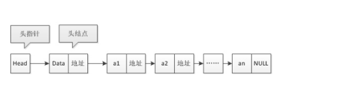

## 1.相关概念



* 单链表

    *    "单" 强调的仅仅是链表各个节点只能有一个指针 

* 结点

    * 指针域 ：存储后继结点的地址的域，
    * 数据域 ：存储数据元素的域

* 头指针

    * 是链表指向第一个结点的指针，第一个结点的存储位置
        * 如果链表有头结点，则是指向头结点指针 （头结点是空的，数据域无意义）
    * 头指针有标识作用，通常用头指针冠以链表的名称，就是链表的名字
    * 无论链表是否为空，头指针均不为空。头指针是链表的必要元素

* 头结点

    * 第一个存放数据的结点之前，设置一个 0 结点，也是一个结点，

        * 数据域 ： 无意义，一般用于存放链表长度等公共数据，用作监视
        * 地址域 ： 记录第一个存放数据的结点地址

    * 意义

        ```go
        有了头结点，对于第一结点前插入和第一节点删除的操作和其他的都一样了
        头结点不是必须的
        ```

* 相关英语缩写

    ```go
    cur		current :当前的
    pre		prefix	:前面的   
    ```

