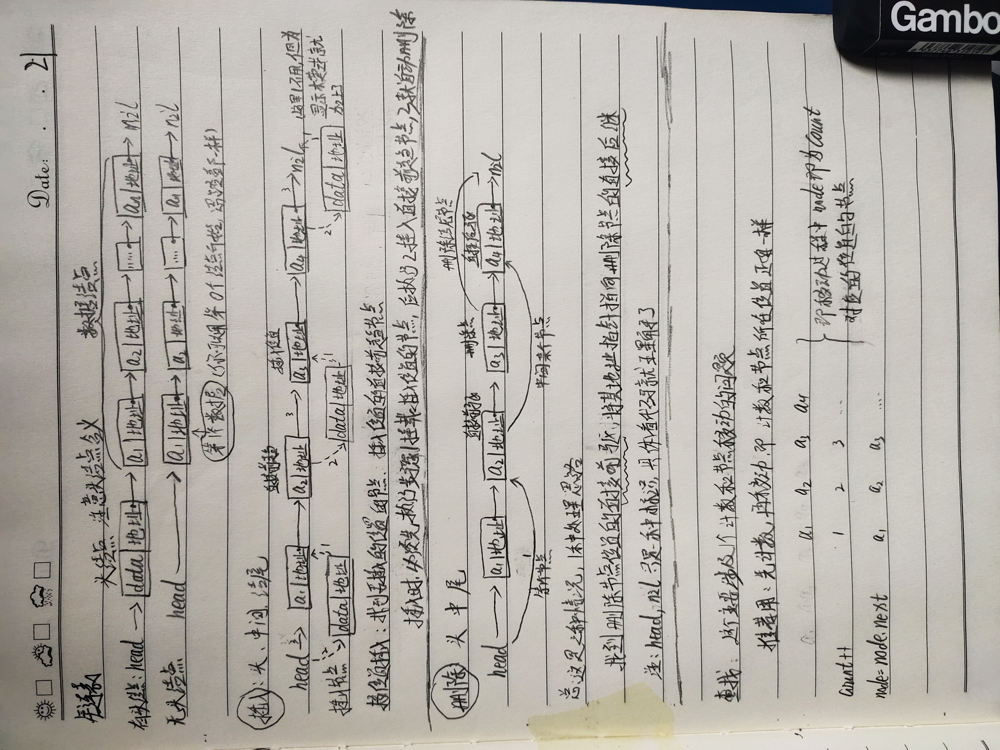
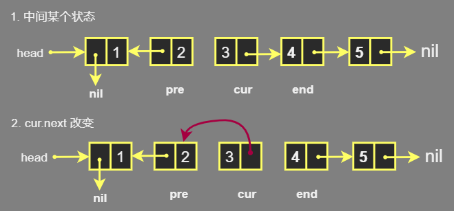
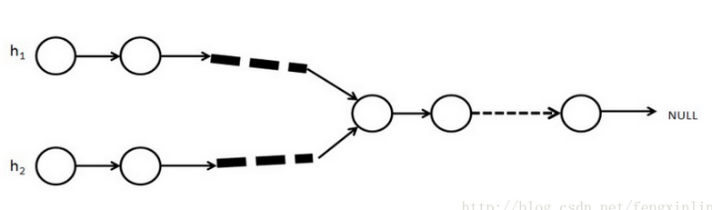
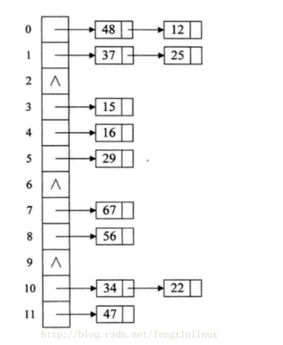

## 单向链表操作

```js
有了头结点，对于第一结点前插入和第一节点删除的操作和其他的都一样了
头结点不是必须的 

// 这里以没有头结点的为例，这个比较麻烦，分析好了可以更好理解有头节点的
head 头节点 第一个数据结点 是不一样的
	head 只是一个指针指向第一个结点 ，第一个节点可以是头结点也可以是第一个数据节点
    
// 增删改查印
    
插入：
	需要知道成插入位置的节点、插入位置的直接前驱节点
        1. 新插入的结点的指针域指向 ：插入位置的结点
 	    2. 找到的直接前驱节点指针域指向 ：新插入的结点
        
删除
	需要知道删除节点的直接前驱节点、直接后继节点
    1 将直接前驱节点的指针域指向直接后继节点即可
    
    
```



## 1.无头节点

### 1.构建

```go

// Node 可以增加一个 count 的字段，防止data相同的情况
type Node struct{
    next *Node
    data int		// 你用啥类型都可以
}

type List struct {
    head *Node	// head 指向头结点或者第一个数据结点
    length  int   
}

// 初始化
//  NewNode 初始化,有疑问参看结构体赋值初始化
func NewNode(data) *Node {
    return &NewNode{data,nil}
}

// NewTree 初始化一个空树
func NewList() *List {
    return &List{nil,0}     
}

```

### 2. 查 、印

```go
// 查询是改查的基础
// LengthTree 查询长度 ，牺牲空间换时间，你可以用长度的时候，一个一个数 ，牺牲时间换空间
func (t *List) LengthTree() int {
    return t.length
}

// SearchNode 查询某个节点是否存在,存在就返回该节点 , 查不到就返回false
func (t *List) SearchNode(data int) (*Node bool) {
    curNode := t.Head
    for curNode != nil {
        if curNode.data == data {
            return curNode,true
        }
        curNOde = curNode.next
    }
    return nil,false
}

// SearchNumNode 查询第 num 个位置的结点 ，存在这个位置的结点就返回这个节点，找不到返回 false
func (t *List) SearchNumNode(num int) (*Node bool) {
    
    // 空树或者超过界限
    if t.head == nil || num > t.length {
        return nil,false
    }
    
    // 非空
    curNode := t.Head  // 第一个数据结点
    count := 1
    for count < num {
        // 注意下面连个语句的位置，很重要，反过来可能就是另一个意思了
        count++			
        curNOde = curNode.next
    }
    return courNode,true
}

// PreNode 查找前驱节点
func (let *List) PreNode(data) (*Node,bool) {
    if t.Length <= 1 {
        return nil , false
    } else {
       preNode := t.head
       curNode := preNode.next
       for curNode != nil {
            if curNode.data == data {
                return preNode,true
            }
            preNode = curNOde 
            curNOde = curNode.next
    	} 
    }
    return nil,false
}


// 打印链表
func (t *List) PrintList(){
    if t.head == nil {
        return
    } else {
        curNode := t.head
        for curNode != nil {
            fmt.Println(curNode.data，" ")
        }
    }
}
```


### 3. 增 / 改 

```go
// 增、改 其实是用的一套逻辑操作 ：操作存在的是 改 ，操作不存在的就是 增/c插

// 改
func (t *Liste) modify(oldData,newData int) bool {
    node,ok := t.SearchNode(oldData)
    if ok == true {
        node.data = newData
    } else {
        // 没有该节点，返回false
        return false
    }
}
// 按照位置增加 :头部添加(第一个结点)、中间节点(第n个节点)、尾部添加进
// 头部添加(第一个结点)、中间节点(第n个节点)该节点之后的结点往后移
// 添加到第一个位置
func (t *List) Add(data) {
    node := newNode(data)
    // 添加
    node.next = head
    head = node
    t.Length++
}

// 尾部添加
func (t *List) Append(data) {
    node := newNode(data)
    // 找到最后一个节点,可以直接调用固定位置的结点，这里为了练习，就不用了
    curNode := t.head
    // 防止curNode出现 nil 无法实现 curNode.next
    if curNode == nil {
        // 空链表直接添加
        t.Head = node
    }else{
        for curNode.next != nil {
			curNode = curNode.next
        }       
        // 直到最后一个节点
        curNode.next = node
    }  
    t.Length++
}

// 中间添加
func (t *List) insert(num,data int){
    // 空链表或者越界
    if t.length == 0 || num > Length {
        t.Append(data)   
    }
    // 往一个特定位置插入一个节点，需要知道这个位置的直接前驱、该位置的结点
    // 所以要考虑没有直接前驱
    count := 1
    if num == 1 {
        // 没有直接前驱
        t.Add(data)
    } else {
        // 有直接前驱节点
        // 切插入位置不在链表的两端，说明至少有两个节点
        preNode := t.head
        curNode := preNode.next
        for count < num {
            count++         
            preNode = curNode
            curNode = preNode.next
        }  
        // 直到直接前驱节点、插入位置的结点，进行插入
        newNode := newNode(data)
        newNode.next = curNode
        preNode.next = newNode
        t.Length++
    }
}

// 按照数据大小插入链表
// 可以得到一个有顺序的链表
func (t *List) Order(data) {
    node := newNode(data)
    // 头部添加
    if t.head == nil || data < t.Head.data {
        node.next = t.Head
        t.head = node
        return
    }
    // 中间添加 ，1 3 中间添加一个元素 2 ，相当于放入 3 的位置，将 3 后移
    preNode := t.head
    curNode := preNode.Next
    for curNode != nil {
        if preNode.data < data || curNode.data > data {
            node.next = curNode
            preNode.next = node
            return
        }
        preNode = curNode
        curNode = preNode.next
    }
    // 中间找不到，到结尾了
    preNode.next = node
}
```

### 4.  删 

```go
func (t *List) Delete(data int) bool {
    if t.Length == 0 {
        return false
    // 第一个结点删除
    } else if t.head.data == data {
        t.head = t.head.next    // 实现删除
        t.length--
        return true
    } else {
        // 第一个数据结点之后的都会有节点，所以直接查询节点
        preNode , ok := t.PreNode(data)  // 删除节点的直接前驱节点
        if ok == true {						// 查到，说明该数据存在
        	delNode := preNode.next		   // 删除节点
       		nextNode := delNode.next	   // 删除节点的直接后继节点，可以是nil,比如在尾节点
       	 	preNode.next = nextNode         // 实现删除
        	t.Length--
       	     return true
        }             
      	  return false  // 说明链表中没有这个数据
    }
    return false
    
}
```


## 2.有头节点

```js
有了头结点，对于第一结点前插入和第一节点删除的操作和其他的都一样了
在第一个数据点儿之前插入删除都是一样的,不用考虑直接前驱节点为空


// 注意链表结构
type List struct{
    head *Node
}

// 注意这里初始化一个树，和前面初始化一个树是不一样的
// 根本原因是 List 的字段改变了,初始化的时候，里面的含义变了
func NewList() *List {
    return &List{head{nil,0}}
}

// 增删改查就不用考虑没有直接前驱节点的问题了，不用判断，一个路子结束
```

## 3. 存放

* 在堆内存中的不连续的存储空间，使用指针作为一个索引

## 4. 翻转链表

*    反转链表 、逆置链表
*    将链表整体“反过来”，将头变成尾、尾变成头 
*    方法
     *    迭代反转法	：更适用于没有头结点的
     *    递归反转法     ： 均可
     *    就地逆置法     ： 均可
     *    头插法             ： 均可

### 1.头插法

*    在原有链表的基础上，依次将位于链表头部的节点摘下，然后采用从头部插入的方式生成一个新链表，则此链表即为原链表的反转版。 

*   demo

    ```go
    func (this *SingleList) Reverse(){
        // 如果是空链表或者只有一个节点的单向链表。就不用动了
        if this.head == nil || this.head.next == nil{
            return 
        }
        var new_head = nil
        
        for {
            if this.head == nil{
                this.head = new_head // 为了使用前面的函数，头结点还是使用原来我的好
                return
            }
            cur := this.head //未翻转链表第一个数据点
            //  cur 下一个节点给head,相当于链表中删除第一个数据点，
            // cur 已经记录了第一个数据点 ,链表第二个数据点已经存于head了  
            this.head = cur.next 
            cur.next = new_head  // 下面两句是新链表和查找到的结点进行头部插入
            new_head = cur
        }   
    }
    ```

### 2.就地逆置法

*   与头插法类似

*    直接对原链表做修改，从而实现将原链表反转。 

     *   依次取出元素，直接插入链表头结点

*   demo

    ```go
    func (this *SingleList)Reverse(){
        // 如果是空链表或者只有一个节点的单向链表。就不用动了
        if this.head == nil || this.head.next == nil{
            return 
        }
        cur := this.head
        
        for {
            if cur.next == nil{
                return
            }
            // 当前游标的下一个节点
            end := cur.next
            // 摘除当前游标的下一个元素
            cur.next = end.next
            // 将前面删除的节点，插入到第一个数据节点的位置
            end.next = this.head
            this.head = end
        } 
    }
    ```

### 3.迭代反转法

*    从当前链表的首元节点开始，一直遍历至链表的最后一个节点，这期间会逐个改变所遍历到的节点的指针域，另其指向前一个节点 

*   需要三个指针每次各向后移动一个节点 （pre cur end）

    ```go
    1.中间某个状态：
        cur 前面的翻转链表：需要一个指针指向他的第一个数据节点，即pre
    	cur 指向后面链表第一个结点
    2.将cur.next 改变：
    	cur 后(右)面的链表： 需要一个指针指向她的第一个数据节点 即 end
    	cur 指向前面的链表
    3.所以就需要三个节点，否则导致链表的数据丢失
    ```

    

*   分析过程

    ```go
    func (this *SingleList) Reverse(){
        // 如果是空链表或者只有一个节点的单向链表。就不用动了
        if this.head == nil || this.head.next == nil{
            return 
        }
        // 初始化三个指针
        pre := nil
        cur := this.head
        end := this.head.next
        // 遍历
        for{     
            if end == nil{ // 当 cur 遍历到最后一个节点
                cur.next = pre  // 翻转完毕，cur 就是翻转后的第一个数据结点
                head = cur      // 将 head 指向 cur 即可 
                return
            }
            cur.next = pre
            pre = cur
            cur = end
            end = end.next  // 这个地方涉及到 end 是nil 的时候，是不能进行end.next 的，左边的end 是nil即可
        } 
    }
    ```

### 4. 递归翻转

*    从链表的尾节点开始，依次向前遍历，遍历过程依次改变各节点的指向，即另其指向前一个节点。

*    ## 在不懂1

     ```go
     func (this *SingleList) Reverse(){
         // 如果是空链表或者只有一个节点的单向链表。就不用动了
         if this.head == nil || this.head.next == nil{
             return 
         }
     }    
     ```


​     

## 5.相交及交点

*   相交即： 两个单链表有共同的节点 

*   两链表相交：那么从第一个共同节点开始，后面的节点都会重叠，直到链表结束。  

    *    两个链表中有一个共同节点，则这个节点里的指针域指向的下一个节点地址一样，所以下一个节点也会相交，依次类推 

    *    两个链表呈“Y”字形 

         

### 1.暴力解法

*    从头开始遍历第一个链表，遍历第一个链表的每个节点时，同时从头到尾遍历第二个链表 
*    第一次找到相同的节点即第一个交点 
*    第一个链表遍历结束后，还未找到相同的节点，即不存在交点 
*    时间复杂度为O(n^2) 

### 2.栈

*    从头遍历两个链表 

*    创建两个栈，第一个栈存储第一个链表的节点，第二个栈存储第二个链表的节点，每遍历到一个节点时，就将该节点入栈 ，直到双方遍历入栈结束

*    通过top判断栈顶的节点是否相等即可判断两个单链表是否相交。

     *   若两个链表相交，则从第一个相交节点开始，后面的节点都相交。 
     *   则循环出栈，直到遇到两个出栈的节点不相同，则这个节点的后一个节点就是第一个相交的节点 

     # 不懂

```go
// 这个应该是java的，应该在栈学习过了，在进行整理
node temp=NULL;  //存第一个相交节点

while(!stack1.empty()&&!stack1.empty())  //两栈不为空
{
    temp=stack1.top();  
    stack1.pop();
    stack2.pop();
    if(stack1.top()!=stack2.top())
    {
        break;
    }
}
// 在没有要求空间复杂度的时候，使用栈来解决这个问题也是挺简便的。
```

​    

### 3.遍历链表用长度

*    同时遍历两个链表到尾部，同时记录两个链表的长度 

     *    两个链表最后的一个节点相同，则两个链表相交 

*   较长链表的长度 - 较短链表的长度

    *   就是从较长链表开始遍历的地方
    *   从此位置,两个链表同时进行遍历相比,碰到相同的节点,就是第一个相交的节点

    ```go
    // 方法也非常的简便并且额外的空间开销很小。时间复杂度为O(len1+len2)。
    ```

### 4. 哈希表法 

*    链表相交，相交节点一定有相同的内存地址，而不同的节点内存地址一定是不同的 

     *    判断两个链表中是否存在内存地址相同的节点判断两个链表是否相交 

*   做法

    *    遍历第一个链表，并利用地址建立哈希表，

*   遍历第二个链表，看看地址哈希值是否和第一个表中的节点地址值有相同即可判断两个链表是否相交。

*    哈希函数 ： 采用除留取余法构造哈希函数   

*   哈希表     ：  采用链地址法解决冲突 

        *    哈希冲突： 对key1 != key2 ，存在f(key1)=f(key2)，链地址法就是把key1和key2作为节点放在同一个单链表中，这种表称为同义词子表，在哈希表中只存储同义词子表的头指针 

    *   ## 这个图不懂

        

    

    ```go
    // 时间复杂度O(length1 + length2)。
    ```

###  5. 转为判断一个链表是否有环

*   转化
    *    先遍历第一个链表到它的尾部，然后将尾部的next指针指向第二个链表(尾部指针的next本来指向的是null)。这样两个链表就合成了一个链表 
    *    若该链表有环，则原两个链表一定相交。否则，不相交 
         *   收尾相接以后，会与交点构成闭环：两链的交点 
         *   如果新链表是有环的，那么原来第二个链表的头部一定在环上。 
         *   可以从第二个链表的头部进行遍历的，从而减少了时间复杂度(减少的时间复杂度是第一个链表的长度)。  


## 6.判断链表有环

### 1、单个单链表有环

*    一般容易想到的方法就是记录每个节点是否被访问过，若一个节点被访问了两次，则该链表一定有环。 
*    设置两个链表指针fast, slow，初始值都指向链表头结点，然后两个指针都往后走，
     *   slow 每次前进一步，即前进一个节点。
     *   fast  每次前进两步，
     *   如果存在环    ： 则在慢指针还没走完一整个环的路程之前，两指针已经相遇
     *   环的入口点   ：  相遇的第一个点 

### 2、两个有环的单链表相交

*   先找到两个环的入口 ：pos1  pos2
*   使用两个指针fast和slow，都初始化为pos1，且fast每次前进2步，slow每次前进1步。
    *   若fast指针在遇到slow前，出现fast等于pos2或fast->next等于pos2，
    *   则说明两个链表相交，否则不相交。 
        *    pos2肯定是两个链表的一个相交点 
        *    点看做两个链表的终止节点，使用我们上面提到的记录链表长度的解法，找相交的第一个节点。 
        *    两个带有环的链表相交，则这两个链表的环肯定是同一个环。  


## for 循环的一个比较好的 例子

```go 
count := 0	//count 代表节点的个数，第几个结点   
for {
    if count == i-1 {
        node.next = cur.next
        cur.next = node
        this.length++
        return
    }
    count++
    cur = cur.next
}

//-----------------------------------------------
	for count := 0; count <= i; i++ {
		if count == i-1 {
			pre.next = pre.next.next //删除元素后面的元素的地址，给其前面的元素的next
			return nil
		}
		pre = pre.next
	}
```


## 参考

*   https://blog.csdn.net/fengxinlinux/article/details/78885764


