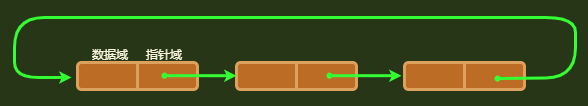

## 单向节点链

```java
public class Node {
    private int value;
    private Node nextNode;
    
    // 初始化
    Node(){};
    Node(int value) { this.value = value} ;
    Node(int value, Node next) { this.value = value; this.nextNode = next};
    
}

// 业务操作
	这种的结构，直接在里面进行增删改查，是比较麻烦的，而且逻辑不清晰
    所以需要另行设置一个工具类，进行节点链的处理
public class NodeUtils {
    public static boolean IsEmpty(Node head) {
        return head == null;
    }
    
    // 其他的都是样，就是需要传入节点链的首节点，然后进行操作
    // 和封装成链表的操作一样，只不过不需要手动传入头结点了
}        
```


## 单向链表

### 创建

```java
public class Node {
    private int value;
    private Node nextNode;
    
    // 初始化
    Node(){};
    Node(int value) { this.value = value} ;
    Node(int value, Node next) { this.value = value; this.nextNode = next};
    
}

// 单向链表
public class List {
    private Node head;		// 头结点
    private int length;		// 链表长度
    
    // 初始化链表
    InintList(){};
    
    // 删除
    // 查询 

    
}
```

### 添加

```java
介绍
    添加的话分成三种情况： 头部添加 、 尾部添加 、 中间添加
    注意： 对于有顺序的链表，可以添加一个哨兵节点，三种情况和中间添加的情况就一样了
    
// 头部添加
    public void addNode(int value) {
		Node newNode = new Node(value);
    	newNode.next = this.head;
    	this.head = newNode;
	}
//尾部添加
	public void addNode(int value) {
        Node newNode = new Node(value);
        Node curNode = this.head;
        while (curNode != null) {
            curNode = curNode.next;
        }
        curNode.next = newNode;
    }
// 特定位置添加： 中间位置添加
	// 假设位置 i 是在链表范围之内，超出可以自己设置界限
	public void insertNode(int i, int value) {
        
        // 加在头部
        if(i <= 1 || this.length == 0) {
            this.addNode(value)
            return;
        }
        
        // 加在尾部
        if (i >= this.length){
            this.appendNode(value)
            return;
        }

        // 中间位置添加
        Node preNode = this.head;
        Node curNode = preNode.next;
        for (int j = 2; j != i; j++) {
            preNode = curNode;
            curNode = curNode.next;
        }
        preNode.next = newNode;
        newNode.next = curNode;
    }
```


### 删除

```java
// 清空链表
	public void clearList() {
        this.head = null;
    }

// 删除某个节点
	// 也可返回删除的结点
	public Boolean deleteNode(int value) {
        if (this.IsEmpty) {
            return null;
        }
        
        // 设置哨兵节点,
        // 注意这里并不是在链表中设置的，而是临时设置的
        Node sentinelNode = new Node(0, this.head);
        Node preNode = SentinelNode;
        Node curNode = preNode.next;
        
        while (curNode != null) {
            if (curNode.value == value) {
                // 当是首节点的时候， preNode.next 就是 head
                preNode.next = curNode.next;
                // head 指向改变，重新给链表的 head
                this.head = sentinelNode.next;
                return true;
            }
        }
        // 找不到就返回 null 
        return null;
    }
```


### 查询

```java
    // 查询 -- 判空
    public boolean IsEmpty(){
        return this.head == null;
    }
    
    // 查询 -- 长度
	// 可以进行循环遍历查询长度
    public Integer Length() {
        // 空链表直接返回 null
        if (this.head == null) return null;
        
        // 非空直接返回其长度
        return this.length;
    }

	// 查询 -- 是否包含某个元素
	public boolean findValue(int value) {
        Node curNode = this.head;
        while (curNode != null) {
            if (curNode.value == value){
                return true;
            }
            curNode = curNode.next;
        }
        
        return false;
    }

	// 打印链表
	public void printList() {
        Node curNode = this.head;
        while (curNode != null) {
            system.out.print(curNode.value + "-—>");
        }
    }
```


## 单向循环节点链



```java
// 介绍
	单向循环节点链， 和单向节点链是一样
    只不过因为尾部的结点需要指向首节点，所以需要明确出来尾结点，来指向首节点

public class Node {
    private int value;
    private Node head;
    private Node trail;
    
    // 初始化
    Node(){};
    Node(int value) { this.value = value} ;
    
}

// 业务操作

public class NodeUtils {
	....
	// 这个跟单向节点链一样，最后只不过是否需要手动传入头结点        

}        
```


## 单向循环链表

### 创建

```java
public class Node {
	.......
    
}

public class List {
    Node headNode;
    int length;
    
    // 初始化
    List(){};
    
}
```

### 添加

```java
介绍
    添加的话分成三种情况： 头部添加 、 尾部添加 、 中间添加
    注意： 对于有顺序的链表，可以添加一个哨兵节点，三种情况和中间添加的情况就一样了
    

    
// 头部添加
    public void addNode(int value) {
		Node newNode = new Node(value);
    	// 空表、非空都是如此
    	newNode.next = this.head;
    	this.head = newNode;
	    this.length++;
	}

//尾部添加
	public void appendNode(int value) {

		// 空表
        if (this.head == null) {
            this.addNode(value);
            return;
        }
        
        // 非空表
        Node newNode = new Node(value);
        Node curNode = this.head;
        // 寻找尾结点
        while (curNode.next != this.head) {
        	curNode = curNode.next;
        }           
		curNode.next = newNode;
         newNode.next = this.head;
    }


// 特定位置添加： 中间位置添加
	// 假设位置 i 是在链表范围之内，超出可以自己设置界限
	public void insertNode(int i, int value) {
 		......
    }
```


### 删除

```java
// 清空链表
	......

// 删除某个节点
	// 也可返回删除的结点
	public Boolean deleteNode(int value) {
        if (this.IsEmpty) {
            return null;
        }

        // 单节点链表处理
        // 对于非空循环链表，单独依靠指针移动是无法引入 null 值的， 索引无论怎么移动，都在原地打转
        // 所以对于删除一个节点编程空链表的情况，需要单独讨论
        if (this.length == 1) {
            if ( this.head.value == value) {
            	this.cleanList();
            	return true;
            }
			return null;
        } 
        
        // 非单节点链表
        Node sentinelNode = new Node(-1, this.head);
        Node preNode = sentinelNode;
        Node curNode = this.head;

        // 方法一
        do {
            if (curNode.value == value) {
                preNode.next = curNode.next;
                this.head = sentinelNode.next;
                this.length--;
                return true;
            }
            
            prevNode = curNode;
            curNode = curNode.next;
            
        } while {curNode != this.head};
        
        
        // 方法二
        while (curNode.next != this.head) {
        	if (valueNode.value == value) {
                preNode.next = curNode.next;
                this.head = sentinelNode.next;
                this.length--;
                return true;
            }
            prevNode = curNode;
            curNode = curNode.next;
        }
        
        // 尾结点处理，包含只有一个节点的情况
        if (curNode.value == value) {
            preNode.next = curNode.next;
            this.head = sentinelNode.next;
            this.length--;
            return true;           
        }
        // ----------  方式二结束
        // 找不到就返回 null 
        return null;
    }


	// =====================================================================
	循环链表： 
        我暂时认为：无法使用哨兵节点进行删除操作，因为无法引入 null 值，
```


### 查询

```java
    // 查询 -- 判空
    public boolean IsEmpty(){
        ....
    }
    
    // 查询 -- 长度
	// 可以进行循环遍历查询长度
    public Integer Length() {
                
        // 空链表直接返回 null
        if (this.head == null) return null;
        
        // 非空直接返回其长度
        return this.length;
        
        // 总和
        // return this.head==null? null: this.length;
    }

	// 查询 -- 是否包含某个元素
	public boolean findValue(int value) {
        if (this.length == 0) return false;
        
        Node curNode = this.head;
        do {
  		  if (curNode.value == value){
                return true;
            }
            curNode = curNode.next;
        } while (curNode != this.head)
        
        return false;
    }

	// 打印链表
	public void printList() {
        if (this.head == null) system.out.print("这是空链表");
                
        String result = "";
		Node curNode = this.head;        
        do {
            result = result + curNode.value + ""-—>"";
            curNode = curNode.next;                        
        } while (curNode != this.head);
        
       system.out.print(result);
    }
```

