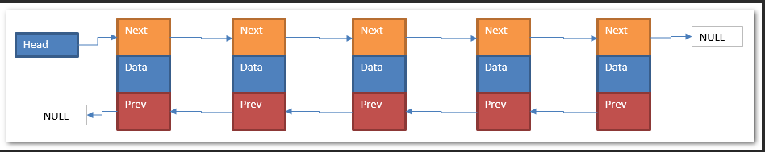
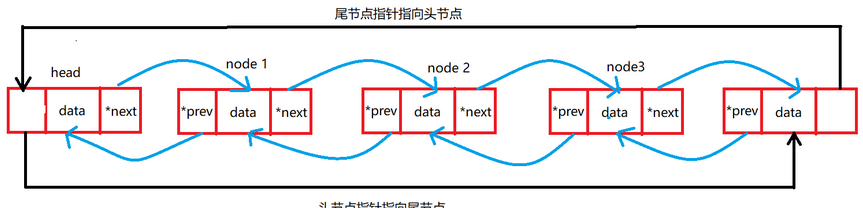

## 节点链表



## 双向链表

### 创建

```java
public class Node {
    Node prev ;
    int data ;
    Node next ;
    
    Node(){};
    Node(int data) { this.data = data};
}

public class List {
    Node headNode;
    int length;
}
```

### 添加

```java
介绍
    添加的话分成三种情况： 头部添加 、 尾部添加 、 中间添加
  	注意
    	添加涉及到三个节点
    	添加的时候，未知部分要先添加
    	
    
// 头部添加
    public void addNode(int value) {
		Node newNode = new Node(value);
    	newNode.next = this.head;
    	// newNode.prev 不用动
    	    	
    	this.prev = newNode;
    	// this.next 不用动
    
    	this.head = newNode;
	}
//尾部添加
	public void addNode(int value) {
        Node newNode = new Node(value);
        Node curNode = this.head;

        // 找到尾结点
        while (curNode.next != null) {
            curNode = curNode.next;
        }
        // 添加
        curNode.next = newNode;
        // curNode.prev 不用动
        
        newNode.prev = curNode;
        // newNode.next 不用动
        
        this.length++;
    }

// 特定位置添加： 中间位置添加
	// 假设位置 i 是在链表范围之内，超出可以自己设置界限
	public void insertNode(int i, int value) {
        
        // 加在头部
        if(i <= 1 || this.length == 0) {
            this.addNode(value)
            return;
        }
        
        // 加在尾部
        if (i >= this.length){
            this.appendNode(value)
            return;
        }

        // 中间位置添加
        Node curNode = this.head;	// 要添加的位置
        for (int j = 1; j != i; j++) {
            preNode = curNode;
            curNode = curNode.next;
        }
        
        // 当前位置 curNode
		// 前一个位置  prevNode
        Node prevNode = curNode.prev;
        // 添加 prevNode newNode curNode
        prevNode.next = newNode;
        curNode.prev = curNode;
        
        newNode.prev = prevNode;
        newNode.next = curNode;
        
    }
```


### 删除

```java
// 清空链表
	public void clearList() {  ......  }

// 删除某个节点
	// 也可返回删除的结点
	public Boolean deleteNode(int value) {
        if (this.IsEmpty) {
            return null;
        }
        
        // 设置哨兵节点,
        // 注意这里并不是在链表中设置的，而是临时设置的
        Node sentinelNode = new Node(0, this.head);
        Node preNode = SentinelNode;
        Node curNode = preNode.next;
        
        while (curNode.next != null) {
            if (curNode.value == value) {
                
                // 删除节点前面的一个节点 、 后面的一个节点
                Node prevNode = curNode.prev;
                Node nextNode = curNOde.next;
                
                // 添加
                prevNode.next = nextNode;
                nextNode.prev = nextNode;  // 当是尾结点的时候 nextNode就是 null 了

                // 当是头结点的时候， sentinelNode 就是 prevNode
                this.head = sentinelNode.next;
                return true;
            }           
           curNode = curNode.next;
        }
        // 尾结点处理
        if (curNode.next.value == value) {
            curNode.next = null;
            return true;
        }
        
        // 找不到就返回 null 
        return null;
    }
```


### 查询

```java
    // 查询 -- 判空
    public boolean IsEmpty(){ ...... }
    
    // 查询 -- 长度
	// 可以进行循环遍历查询长度
    public Integer Length() { ...... }

	// 查询 -- 是否包含某个元素
	public boolean findValue(int value) { ...... }

	// 打印链表
	public void printList() { ........ }
```


## 双向循环链表



### 创建

```java
public class Node {
    int data ;
    Node prev ;
    Node next ;
    
    Node(){};
    Node(int data) { this.data = data};
    Node(int data, Node prev, Node next)  {
        this.data = data;
        this.prev = prev;
        this.next = next;
    }
}

public class List {
    Node headNode;
    Node trailNode;
    int length;
}
```

### 添加

```java
介绍
    添加的话分成三种情况： 头部添加 、 尾部添加 、 中间添加
  	注意
    	添加涉及到三个节点
    	添加的时候，未知部分要先添加

// 空链表添加元素
    public void addNodeToEmptyList(Node newNode) {
                // 节点设置
            this.headNode = newNode;
            this.trailNode =  newNode;
            
            // 循环关系设置
            newNode.next = this.trailNode;
            newNode.prev = this.headNode;
	}
    
// 头部添加
    public void addNode(int value) {
		Node newNode = new Node(value);
    
    
    	// 空的
    	if (this.headNode == null) {
			this.addNodeToEmptyNode(newNode);
             return;
        }
    	// 非空
		this.head.prev = newNode;
    	newNode.next = this.head
        
        this.trail.next = newNode;
    	newNode.prev = newNode;
        
    	this.head = newNode   
	}
//尾部添加
	public void appendNode(int value) {
        
        Node newNode = new Node(value);
        
        // 空的
    	if (this.headNode == null) {
			this.addNodeToEmptyNode(newNode);
             return;
        }
        
    	// 非空        
        Node curNode = this.head;

        // 找到尾结点
        while (curNode != trailNode) {
            curNode = curNode.next;
        }
        
        // 添加
        trailNode.next = newNode;
        newNode.prev = trailNode;
        
        newNode.next = this.head;
        this.head.prev = newNode;
        
        this.trailNode = newNode;
        this.length++;
    }

// 特定位置添加： 中间位置添加
	// 假设位置 i 是在链表范围之内，超出可以自己设置界限
	public void insertNode(int i, int value) {
        
        // 加在头部
        if(i <= 1 || this.length == 0) {
            this.addNode(value)
            return;
        }
        
        // 加在尾部
        if (i >= this.length){
            this.appendNode(value)
            return;
        }

        // 中间位置添加
        Node curNode = this.head;	// 要添加的位置
        for (int j = 1; j != i; j++) {
            curNode = curNode.next;
        }
        
        // 当前位置 curNode
		// 前一个位置  prevNode
        Node prevNode = curNode.prev;
        // 添加 prevNode newNode curNode
        prevNode.next = newNode;
        curNode.prev = curNode;
        
        newNode.prev = prevNode;
        newNode.next = curNode;
        
    }
```


### 删除

```java
// 清空链表
	public void clearList() {  
    	this.headNode = null;
        this.trailNode = null;
        this.length = 0;
    }

// 头结点删除

// 尾结点删除


// 删除某个节点
	// 也可返回删除的结点
	public Boolean deleteNode(int value) {
        if (this.IsEmpty()) {
            return null;
        }
        
		// 单节点链表
        // 因为非空循环链表是没有 null 值的，所有怎么移动都得不到空的节点链
        if (this.length == 1) {
            if (this.head.value == value) {
                this.clearList();
                return true
            }
            return null;
        }
        
        // 双节点以上链表
        Node  headSentinel = new Node(0,null, this.head);         
        Node curNode = headSentinel.next;
        do {
            if (curNode.value == value) {
                // 删除节点前面的一个节点 、 后面的一个节点
                Node prevNode = curNode.prev;
                Node nextNode = curNOde.next;
                
                // 添加
                prevNode.next = nextNode;
                nextNode.prev = prevNode;  

                // 当是头结点的时候， sentinelNode 就是 prevNode
                this.head = sentinelNode.next;
                
                // 其实不设置 trailNode 会更好
                if (curNode == this.trailNode) {
                    this.trailNode = prevNode;
                }
                
                return true;
            }
            
            curNode = curNode.next;
        } while (curNode != this.headNode);
        
  
        
        // 找不到就返回 null 
        return null;
    }

```


### 查询

```java
介绍
    和单向循环链表是一样的

	// 查询 -- 判空
    public boolean IsEmpty(){
        ....
    }
    
    // 查询 -- 长度
	// 可以进行循环遍历查询长度
    public Integer Length() {
                
        // 空链表直接返回 null
        if (this.head == null) return null;
        
        // 非空直接返回其长度
        return this.length;
        
        // 总和
        // return this.head==null? null: this.length;
    }

	// 查询 -- 是否包含某个元素
	public boolean findValue(int value) {
        if (this.length == 0) return false;
        
        Node curNode = this.head;
        do {
  		  if (curNode.value == value){
                return true;
            }
            curNode = curNode.next;
        } while (curNode != this.head)
        
        return false;
    }

	// 打印链表
	public void printList() {
        if (this.head == null) system.out.print("这是空链表");
                
        String result = "";
		Node curNode = this.head;        
        do {
            result = result + curNode.value + ""-—>"";
            curNode = curNode.next;                        
        } while (curNode != this.head);
        
       system.out.print(result);
    }
```

