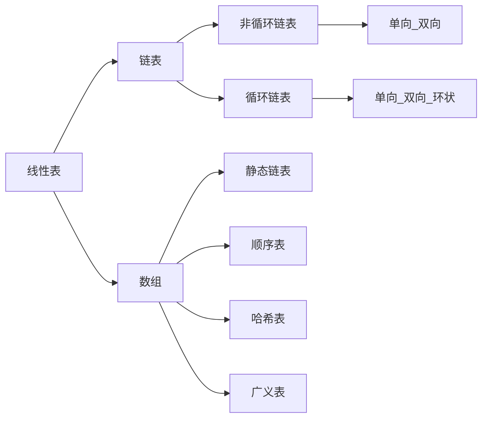

## 介绍



## 顺序表

```java
     
// 初始化
	InitList():
		初始化操作，建立一个空的线性表L。
// 增加
	// 前插
	// 后插
	// 中间插入            
	ListInsert (*L,i,e) :
		在线性表L中的第五个位置插入新元素e。
        
// 删除
    ClearList(*L) :
        游将线性表清空。   
	ListDelete(*L,1,*e) :
		删除线性表L中第i个位置元素，并用e返回其值。
	DateDelete(*L , data, *e)      
          删除元素值 data , 并返回该元素
// 修改
         
// 查询
	ListLength(L) :
		返回线性表L的元素个数。            
	GetElem(L,i,*e) :
		将线性表L中的第i个位置元素值返回给e。
	LocateElem(L,e) :
        在线性表L中查找与给定值e相等的元素，如果查找成功，返回
        该元素在表中序号表示成功;否则，返回0表示失败。         
	ListEmpty () :
		若线性表为空，返回true,否则返回false。
```

