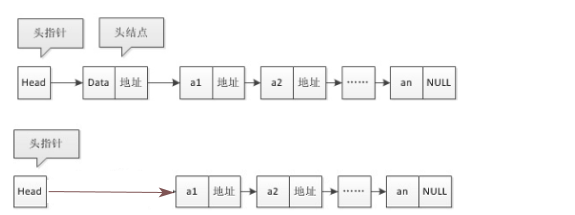

## 节点

* 指针域 ：存储后继结点的地址的域，
* 数据域 ：存储数据元素的域

## 单向节点链

### 介绍

、

```java
介绍
    由节点连接而成的链
首(头)结点 
	节点链的第一个结点  
     // 此结点的数据域通常用来存放数据链的长度，充当哨兵节点， 
    //  别处也叫头结点
头指针
    // 指向头结点的指针，存储头结点的位置信息
    通常用头指针冠以链表的名称，就是链表的名字
    无论链表是否为空，头指针均不为空。头指针是链表的必要元素
哨兵节点
    // 当头结点的数值域不存放数据，或者存放关于链长度的数据
    // 此时头结点就是哨兵节点
    就是一个不存放数据的结点，附加在原链表最前面用来简化边界条件的附加节点
    方便进行增删
    // 自我感觉
    	哨兵节点，完全可以随时使用随时设置，感觉没必要设置在头结点处
```

### java 实现

## 单向链表

* "单" 强调的仅仅是链表各个节点只能有一个指针 

## 单向循环链表

* 

## 1.相关概念



* 相关英语缩写

    ```go
    cur		current :当前的
    pre		prefix	:前面的   
    ```
