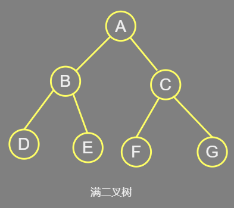
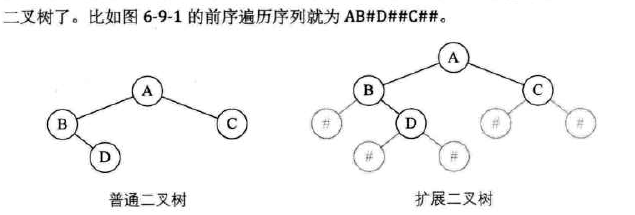

## 基础分类

### 基本形态

*   空二叉树
*   只有一个 根结点
*   左右树
    *   根结点只有左树
    *   根结点只有右树
    *   根结点既有左树又有右树

## 特殊二叉树

### 斜树

*   左斜树
    *   所有的结点都只有左子树的二叉树
*   右斜树
    *   所有的结点都只有右子树的二叉树
*   特点
    *   每一层只有一个结点
    *   结点的个数和二叉树的深度相同
*   注意
    *   线性表也可以理解为树的一种特殊形式

## 有序二叉树

### 满二叉树

*   概念
    *   所有结点都有左子树和右子树，
    *   并且所有的子叶都在同一层上
    *   两者缺一不可
*   特点
    *   子叶只能出现在最下层。出现在其它层就不能出现平衡
    *   非子叶结点的度一定是 2 
    *   同样深度的二叉树，满二叉树结点最多，叶子数最多



### 完全二叉树

*   所有分支结点都存在左子树和右子树

*   特点

    *   叶子结点只能出现在最下两层
    *   最下层的叶子一定集中在左部连续位置
    *   倒数第二层若有叶子结点，一定都在右部连续位置
    *   如果结点度为 1 ，则该结点只有左孩子，即不存在只有右子树的情况
    *   同样结点树的二叉树，完全二叉树的深度最小

*   判断

    *   按照层序进行编号，按照满二叉树的方式进行编号
    *   如果编号是连续的，那就是完全二叉树
        *   如果缺少结点 5，结点 6 人就是编号 6 ，缺档 编号 5 ，这就不是完全二叉树了

    

### 平衡二叉树

*    它是一棵空树或它的左右两个子树的高度差的绝对值不超过1，并且左右两个子树都是一棵平衡二叉树 

     ```js
     平衡二叉树 、 B树 、Trie 、 空间化分树 、 非二叉树 、 其它类型
     
     *   扩展二叉树
     *   线索二叉树 ： 但线索二叉树 、 双线索二叉树
     *   赫夫曼树，最优二叉树
     ```

     

     

## 

## 扩展二叉树

*   用于创建二叉树

*   扩展二叉树

    *   为了能让每个结点都有一个左右孩子，对二叉树进行扩展，
    *   用空指针引出一个虚节点，其值设为特殊符号 ：# 

    

## ==================


## 二叉树

二叉树  、 笛卡尔树 、 top tree 、 T 树 

*   满二叉树
    *   二叉查找树  ：二叉搜索树 、 有序二叉树 、排序二叉树


## 二分搜索树、查找树

*   二叉查找树

### B 树

B 树(B-树) 、 B+ 树 、B* 树(B乘树) 、 Bx树 、UB树  、

2-3树 、2-3-4 树

(a,b) 树 、Dancingtree 、H 树

### 自平衡二叉树

 平衡二叉树（AVL 树） 、 伸展树 、 树堆 、节点大小平衡树

红黑树、右倾红黑树(AA树)、左倾红黑树

### Trie

前缀树 、 后缀树 、 基数树

平衡二叉树

## 空间化分树

四叉树 、 八叉树 、 k-d树 、 vp 树

R树 、 R* 树 、 R+ 树 、 X 树 、M树

线段树 、 西伯尔特 R 树 、优先 R树

## 非二叉树

Exponential tree 

Fusion tree 

区间树

PQ tree

Range tree

SPQR tree

Van EmdeBoas tree

## 其他类型

堆 、 散列树 、 Finger tree 、 Metric tree 、 cover tree 、Bk-tree  、 Double - chained tree 、 iDistance 、Link-cut tree 、树状数组

*   哈夫曼树


## 类型

```js
动态查找树
	二叉查找树
    平衡二叉查找树
    红黑树
    B 树类
    
```


