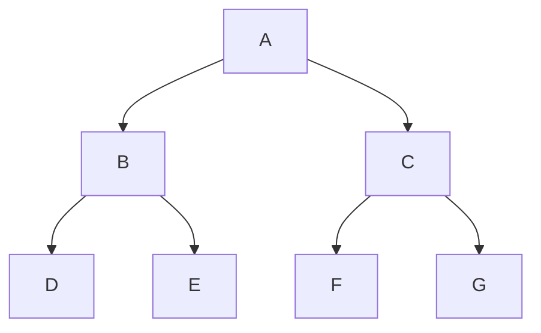
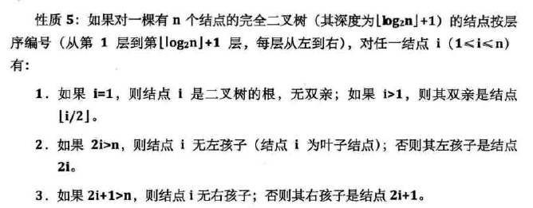

## 树概念

*   树 tree
    *   一种一对多的结构
    *   是 n ( n >= 0) 个节点的有限集合
    *   倒着看像树一样
*   空树
    *   没有节点的树 ，即 n=0
*   子树
    *   当 n >= 1时，其余节点分为 m (m>0) 个互不相交的有限集合，其中每一个集合本身就是一棵树，称为根的子树
    *   子树个数没有限制
    *   同一个根结点的子树不能有交集
    *   某结点位于第 a 层，其子树的根就在 第 a+1 层
*   森林
    *   是不相交的树（大于等于 0 个）的集合
    *   树中每个结点，其子树的集合即为森林

## 树层次

*   根结点所在的层是第一层
*   根的孩子所在的层是第二层
*   以此类推



```go 
// 有的树说是从 0 开始的
第一层 ： A 
第二层 ： B C
第三层 ： D E F G
```

## 节点

### 结点分类


````go
内部结点
      树内部结点 度不是 0 的结点， 
	  A B C
叶子结点
     没有子结点的结点， 度为 0 的点
	 D E F G 

别称
	分支结点 = 非终端结点 = 内部结点
	叶子结点 = 终端节点 
````


### 节点间的关系


```go
介绍
	节点间的关系都是相对关系，并不是绝对关系

根结点 ： root, 有且仅有一个  // A

// DE 的父节点是 B ， 
// B 的子结点是 D 和 E
// DE 是兄弟结点
子节点： 单个子结点也是一棵树，只不过他的根结点是他自己 // 
父节点： 当前节点的上一层节点	
兄弟结点：有同一父结点的结点之间

// A 的子孙结点 B C D E F G
// D 的祖先结点  B A 
祖先结点： 从根节点到达一个节点的路径上，通过的所有节点称为该节点的祖先节点。
子孙节点： 一个节点的所有子树中的节点称为该节点的子孙节点
	

// 习惯将左边的第一个孩子叫长子域，firstchild
D 是 B 的 firstchild
```


## 度


```go 
介绍
	深度 ：  到顶层数
	高度 ：  到底层数
	度   ： 子节点个数
分类
	节点
	    深度：  根结点 ----》  当前节点： 所经历的边的个数
		高度： 节点到叶子结点的最长路径(边数)
		度：  子节点的数目(不算空结点)
		层数 = 深度 + 1
	树 ： 
		按照其含有的节点的最大值

例子

    树的深度（层数） 3 
    树的度（结点最大度）  2

    结点的度（结点有几个分支） 
        A 的是 2
        B 的是 2
        D 的是 0
```


## N-叉树

```java
// 这是我自己总结的 N 叉树
介绍
    一棵树的一个节点，最多拥有的分支数量为 N ，则这棵树被称为 N 叉树
例子
    2-叉树： 一个节点最多有 2 个分支 ，即有两个孩子
    	搜索二叉树
    4-叉树： 树中一个节点最多有 4 个分支， 即最多有 4 个孩子
    	红黑树
树节点特点
    N 叉树的结点， 最多有 N 个孩子， 
        4-叉树，一个节点可以有 0 、1 、2 、3 、4 个孩子
    有 x 个孩子的结点，称为 x-节点
        2-节点：该节点有 2 个孩子
        3-节点：该节点有 3 个孩子
    每个节点中，最多有 N-1 个元素
    	// N 叉树中每个节点，可以暂时存储 N 个元素，但是最终要调整为 N-1 个元素
    	2-叉树中，每个节点做多只能有 1 个元素
    N-阶树
    	即 N - 叉树
    规律
    	// 违反规律就要被调整
    	1. N 叉树，一个节点
    		最多有 N - 1 个孩子
    		每个子节点 最多有 N-1 个元素
    	2. 根据节点元素判断
    研究
    	一般二叉树：完全二叉树， 内部节点无空， 叶子结点的孩子均空
```


## 二叉树

### 特点

* 每个结点最多有两个结点，即两颗子树

    *   称为左子树、右子树
    *   最多有两个，可以只有一个，也可以没有

* 本身是有序树

    *   左子树和右子树是有顺序的，次序不能任意颠倒
    *   通常说的二叉树都是有序树
### 形态

*   空二叉树
*   只有一个根结点
*   根结点只有左树
*   根结点只有右树
*   根结点既有左树又有右树


### 性质

```java
			  49
		  / 		\
		38 			65
       /   \        /   \ 
     97    76      13     69
    / \    / \    / \    / \   
   33 73 7 82 18 93 20 84
   
二叉树的第 i 层,
	最多有 1 2 4 8 16....
深度为 k                   
	k 层满二叉树，有多少个节点 ：(2^k) -1 
任何一颗二叉树
	叶子结点 = 度为 2 的结点树数 + 1；        
                  
// 1. 在二叉树的第 i 层上至多有  2^(i-1) 个结点                 
// 2. 深度为 k 的二叉树至多有  (2^k) -1 个结点  ( k >= 1 )                
// 3. 具有 n 个结点的完全二叉树的深度为  |log2n| - 1 ( |x| 表示不大于x 的最大整数 
// 4.         
```




### 二叉树种类数判断

*     每一棵普通树对应的都是一棵没有右子树的二叉树，所以对于 n 个结点的树来说，树的形态改变是因为除了根结点之外的其它结点改变形态得到的 
*     n 个结点构建的形态不同的树与之对应的是 n-1 个结点构建的形态不同的二叉树。
*     公式
      *    tn 表示 n 个结点构建的形态不同的树的数量，
      *    bn 表示 n 个结点构建的形态不同的二叉树的数量，
      *    两者间关系：`tn=b(n-1)`。
      *    计算方法
           *   没看懂........

## 7.构造树的数目

*    树相似
     *    两棵树中各个结点的位置都一一对应 
*    树等价
     *    两棵树不仅相似，而且对应结点上的数据也相同 
*    n 个节点可以构造多少个形态不同的树
     *    形态不同的树指的是互不相似的树 


