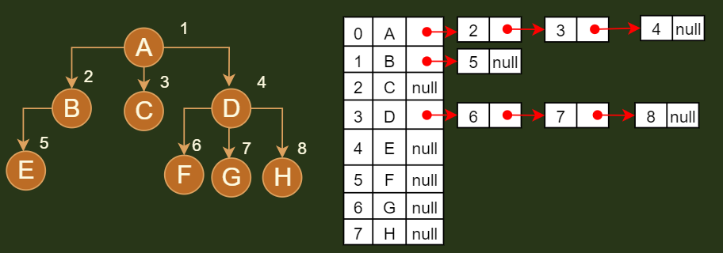

## 相关概念

### 前驱节点

```java
介绍
    二叉树：中序遍历的时候，要查节点前面的结点都是前驱节点
    多叉树：// 树节点从小到大排列，就是前一个比查询节点小的数
直接前驱节点
    中序遍历的时候，要查节点的前一个节点
    前驱在
```


## 存储结构

### 线性存储结构

```java
// 数组存储
介绍
    // 按照层次标号比较清晰，可以按照层级遍历进行复原
    对节点元素按照层的结构依次进行标序，序号就是节点对应的在数组中的位置
注意
	一般来说，线性存储结构用于完全二叉树存储，方便还原
    标序号 ： 只是你定义的一种规则，按照规则决定每个节点该存在什么地方，代码实现：记录根结点的下标
使用
    // 对于非完全二叉树补全， 参看完全二叉树
    一般用于完全二叉树，
    基本不用，因为你添加数据的时候，很有可能打破原有的标号顺序或者标号顺序比较混乱
    
双亲表示法
    // 详情见总和使用
    当前节点保存着父节点的下标
```


### 链表存储结构

```go
介绍
	就是当前节点保存着其他结点的地址（或者引用）：兄弟、父节点、孩子
典型类型
	孩子兄弟表示法：
		// 把树转换为二叉树
		当前节点保存了： 第一个孩子结点 ，以及第一个孩子的右节点
```

### 综合使用

#### 介绍

```java
    双亲表示法 ： 
    	// 线性表：数组
    	当前节点保留了：父节点的下标
    孩子兄弟表示法 ：
    	// 链表： 
    	当前节点保存了： 第一个孩子结点 ，以当前节点的直接右兄弟节点
    孩子表示法
    	// 数组 + 链表
    	数组： 保存了整个树，
    	链表： 孩子节点的链表，从左孩子开始，依次向右指向
        
注意
     这三种模式，可以应用于非二叉树，但是以后基本只研究二叉树，所以以二叉树微粒子
```


#### 1.双亲表示法 - 顺序表

```java
介绍
    各个节点存除了一个记录父节点位置的变量
下标
    对于不存在的结点，在记录的时候，下标记为 -1 （数组中最小的下标为 0）
追加成员
    在存储各个节点的时候，可以再追加存储其他结点，比如：当前节点的右节点、父节点的第一个孩子结点等
    将左边的孩子叫长子域：firstchild  右兄弟节点：rightSib
优势
    容易找到双亲，还容易找到祖先
    复杂度 O(1)
劣势
    不容易找到子结点，找的时候必须要遍历整个结构，可以追加其他结点成员，方便查找
    
例子
// 树节点定义
type PTNode struct {
    data int      // 节点元素类型
    parents int			// 父节点数组下标
}

// 树定义
type PTree struct {
   	nodes []PTNode   // 存储所有节点数据
    r int 			// 根结点下标
    n int  			// 结点总数   
}

// 约定根结点为 parent = -1 
	根节点没有父节点（父节点又称为双亲节点），因此根节点记录父节点位置的变量通常置为 -1。 
```


#### 2.孩子兄弟表示法 - 链式

```java
介绍
    // 直接右兄弟：拥有同一个父节点的右兄弟
    当前节点保存了： 自己的第一个孩子 、 自己的直接右兄弟
别称
    二叉树表示法、 二叉链表表示法
优势
    可以找到唯一一棵二叉树与之对应
    方便查找孩子结点
增加成员
    增加一个 parent 指针域来解决快速查找双亲的问题 
节点结构
    type CSNode struct {
        data 		interface{} 	// 数据域
        firstchild  *CSNode  		 // 指针域， 存储该结点的第一个孩子结点的存储地址
        rightsib 	*CSNOde  		// 指针域， 存储该结点的右兄弟结点的存储地址
    }
```


#### 3.孩子表示法- -顺序+链表

```java
介绍
    当前节点，记录其所有孩子结点
使用
	方式一： 直接记录孩子结点的地址（引用）
        因为无法断定孩子结点的个数，所以维护起来比较麻烦，尽管可以使用度实现，维护起来仍旧很麻烦
        // 对于确定子节点个数的树，可以直接使用,比如二叉搜索树
        type Node struct {
    		data int
            left *Node
            right *Node
        }
	方式二： 对每个结点的孩子建立一个单链表来体现他们的关系
        
        // 树结构
        type tree struct {
            node []CTBox 	// 结点数组
            r  int		// 根的位置 
            n  int		// 节点数
        }


        // 树节点
        type CTBox struct{
            data int	// 节点数据
            firstchild *CTNode	// firstchild  头指针域 ， 存储该结点的孩子链表的头指针: 就是长子域
        }

        // 子节点链表
        type CTNode struct{
            child int   	// 数据域(下标)，存储某个结点在表头数组中的下标(结点在数组中的下标)
            next *CTNode    // 指针域（其兄弟结点）， 存储指向某结点的下一个孩子结点的指针
        }

```




## 添加

### 插入元素

```java
添加的元素，都是添加到叶子结点上
```


### 二叉树添加

### N叉树添加


## 删除

```java

删除
    删除一个元素，都会转化为:
		删除其直接前驱元素
         删除其直接后继元素
节点删除
	叶子结点： 可以直接置为 null
	非叶子结点： 需要经过调整   
            
            
介绍
    12， 13， 14， 15
    13 的直接前驱元素： 12
    13 的直接后继元素： 14            
```


### 方式一

```java
分析案例
    左孩子 《 父节点 《 右孩子
直接前驱元素
    // 出现位置
    ： 左子树存在 ---  左子树的最大值
    ： 左子树不存在 --- 其父节点
直接后继元素    
    // 出现位置
    ： 右子树存在 --- 最小值
    ： 右子树不存在 --- 从父节点往上

    
节点删除
    叶子结点： 可以直接置为 null
    非叶子结点： 都要经过调整
父节点
    用来维持树的连续，用于树的查询
    
// 删除节点 + 删除节点的父节点
    删除节点： 
    	叶子结点： 直接置空
    	非叶子节点：  
    		将其直接前驱结点复制到这里，然后删除直接前驱节点
    		转化为： 删除直接前驱节点， 直到删除的是叶子结点
    父节点
    	是用来维持节点的连续性的，当删除节点是
// 直接前驱节点 + 直接前驱节点父节点		 
// 直接后继结点 + 直接后继结点父节点
	

```

### 方式二

```java
介绍
    利用节点的情况分类讨论
    因为直接删除直接前驱或者后续，会涉及到前驱或者后继是删除节点的父节点，会增加运算复杂度
    所以直接利用结点的情况，分类讨论
删除节点
    0 节点
        叶子结点
    1 节点
        只有左节点
        只有右节点
    2 节点
        既有左节点，又有右节点
    
// 二叉搜索树案例
    0 节点： 
    	叶子结点，可以直接删除
    1 节点： 
    	只有左子树： 删除其直接前驱节点
    	只有右子树： 删除其直接后继结点
    2节点：
    	既有左子树又有右子树

```


## 查询

### 遍历

```java
介绍
    // 
    traversing binary tree
    是指从根结点出发.按照某种次序依次访问二叉树中所有结点。使得每个结点被访问一次且仅被访问一次。
    本质就是将非线性结构的树， 转化为线性结构
分类
    二叉树： 前序、中序、后序 ||  深度、 层次
    普通树： 没有中序遍历（节点个数不确定）
    森林  ： 一棵树一棵树进行遍历
    
二叉树还原
    中序 + 前序
    中序 + 后序
```


## 树高度/最大深度

### 递归

```java
// 二叉树
    
```

### 非递归

```java
介绍
    使用层序遍历
```

## 节点比较

### 介绍

```java
基础类型： 直接比较就可以
其他类型： 需要有一个比较标准
```


### java 实现

```java 
// 比较， 初始化需要有一个包含比较器的构造函数
private Comparator<E> comparator;

// 节点比较
// 基础类型基本实现了 comparable
private int compare(E e1, E e2) {
    if (comparator != null) {
        return comparator.compare(e1,e2);
    }
    return ((Comparable<E>)e1).compareTo(e2);
}

// 注意在实现二叉搜索树的时候，需要实现 comparable 接口
```


## 二叉树展开为链表

## 对称二叉树