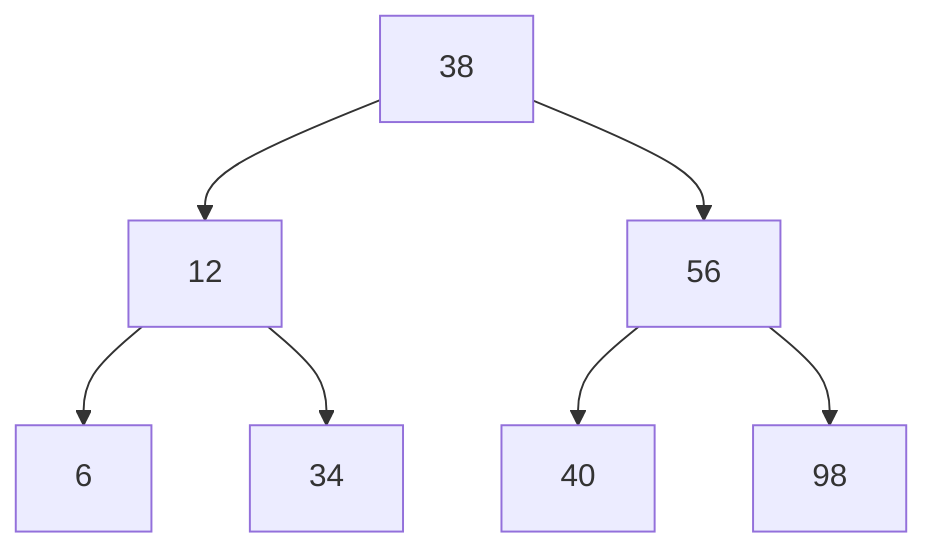

## 名称

*   二叉搜索树 ：

    *   二叉搜索树 ： binary search tree
        *   二叉查找树
    *   有序二叉树 ： order binary  tree
        *   排序二叉树

## 介绍

*   定义

    *   采用递归的方法

## 性能分析

### 优势

```java
1. 二叉搜索树集合了有序链表插入删除效率高和有序数组查询效率高的优点
    一个含有10000个数据项的有序链表，查找操作平均需要比较5000次，
    对于一个含有10000个节点的二叉搜索树，查找操作大约需要13次
```

### 复杂度

```java
取决于二叉树形状 ： O(log(2)n)  -  O(n)
```


​	

## 特点

* 中序遍历可以得到一个有序序列

* 只是一颗空树或者具有以下性质的二叉树

    ```go
    // （空的结点不参与比较，使用 nil 表示，根结点是相对而言的根结点）
    1. 左子树的所有结点的值 < 它的根结点  < 右子树上的所有结点的值  
    	相等的结点 ： times 值记录 ( 即树中没有重复的值 )
    2.左、右子树也都是 ：二叉搜索树。  // 这里就体现出来递归的定义
    	所有子树 ： 左子树结点 < 父节点 < 右子树结点 
    ```

    

    ```mermaid
    graph TB
    38 --> 12
    38 --> 56
    12 --> 6
    12 --> 34
    56 --> 40
    56 --> 98
    ```


## 增

### 转化构造

```java
介绍
	一个无序序列可以通过构造一棵二叉排序树而变成一个有序序列
    // 就是通过插入节点达到转化的效果， 参看插入节点
例子
    这个是给你一个数组 [1 , 2 , 3 , 5] 写成排序二叉树
	参看 插入节点
    
 
```


### 插入节点

```go
插入特点
    1.  新插入的结点必为一个新的叶子结点，插入位置由查找过程得到
    2.  插入新的位置后，不必移动其他结点，只需要修改某个节点的指针
    3.  新插入的结点没有破坏原有结点之间的关系

情况
    空树   ： 则新的结点为新节点
    非空树 ： 添加为新的叶子结点 
        这个地方，我之前我纠结了好久，才想明白为啥一定是叶子结点

例子
	26 73 4 83 57 45
// 初始化
	╭﹣﹣﹣ 26 ﹣﹣﹣╮ 
// 添加 73 : 比 26 大
	╭﹣﹣﹣ 26 ﹣﹣﹣╮
				  73
// 添加 4 ： 比26 小
	╭﹣﹣﹣ 26 ﹣﹣﹣╮
	4			  73
// 添加 83 ： 比26 大、 比 73 大
	╭﹣﹣﹣ 26 ﹣﹣﹣╮
	4	       ╭﹣ 73 ﹣╮
 					  83
// 添加 57
	╭﹣﹣﹣ 26 ﹣﹣﹣╮
	4	       ╭﹣ 73 ﹣╮
 			  57	   83

// 45 
	╭﹣﹣﹣ 26 ﹣﹣﹣╮
	4	       ╭﹣ 73 ﹣╮
 	       ╭﹣ 57	   83
		  45
```


## 删除

```go
介绍
	使用方拾二进行删除
	注意删除后需要找到删除节点的父节点，进行树的关系的连续维护

// 二叉搜索树案例
    0 节点： 
    	叶子结点，可以直接删除
    1 节点： 
    	只有左子树： 删除其直接前驱节点
    	只有右子树： 删除其直接后继结点
    2节点：
    	既有左子树又有右子树

例子
		   ╭﹣﹣﹣﹣﹣﹣﹣﹣ 70 ﹣﹣﹣﹣﹣﹣﹣╮ 
    ╭﹣﹣﹣ 55 ﹣﹣﹣╮                ╭﹣﹣﹣ 80 ﹣﹣﹣╮               
╭﹣ 50         ╭﹣ 60         ╭﹣ 75 ﹣╮             85 ﹣╮     
46 	      ╭﹣ 58 ﹣╮ 	       71        79           	    86    
	 ╭﹣ 57	  ╭﹣ 59										 
	 56		 58.5										 

// 删除叶子结点： 46
	叶子结点，直接删除
	其父节点为 50 ： 50.left = null;
// 删除只有左子树结点： 60
	60 的直接前驱节点为 59 ，60 被 59 覆盖，删除原节点 59
	59 非叶子结点， 其直接前驱元素 58.5 覆盖 59 ，删除节点 58.5
	58.5 为叶子节点， 可以直接置空
	关系维护： 58.5 的叶子节点的父节点的对应孩子结点进行置空
	
            ╭﹣﹣﹣ 55 ﹣﹣﹣╮                             
        ╭﹣ 50         ╭﹣ 59         
        46 	      ╭﹣ 58 ﹣╮ 	           
             ╭﹣ 57	  ╭﹣ 58.5										 
             56		 null							

// 删除只有右子树的结点： 85
	85 非叶子结点， 被其直接后继接节点 86 覆盖， 删除源节点 86
	86 是叶子结点， 可以直接置空
	关系维护： 被删除的叶子结点的父元素的对应孩子结点置为 null
     ╭﹣﹣﹣ 80 ﹣﹣﹣╮
                    86 ﹣╮
                         null
// 删除有左右子树的结点： 80
// 可以使用直接前驱节点或者后继结点，都可以， 这里选用前驱节点
	80 非叶子节点， 被其直接前驱节点 79 替代， 删除节点 79 
	79 是叶子结点， 可以直接置空

     ╭﹣﹣﹣ 79 ﹣﹣﹣╮ 
 ╭﹣ 75 ﹣╮         85 ﹣╮
71       null         	86 
```

## 查询



```go
特点 ： 左右子树查找过程与整个树上查找过程相同
    1. if root 是空树，则查找失败
    2. if root 非空
            if value > root.value 右子树查找
            if value < root.value 左子树查找
            if value = root.value 查找完成
    3. 重复 2 3

性能分析
	ASL （平均查找二叉树）  ：体现查找算法的关键吗的比较次数
	{ 1， 2， 3,} 
	二叉树 差值找 1 对比一次，查找 2 对比二次 ，查找 3 对比三次
	ASL = （1+2+3） / 3 = 2


	
	
流程
查找 100
1. 100 > 38 右子树查找
2. 100 > 56 右子树查找
3. 100 > 98 右子树查找
4. 98 的右子树为空，查找失败
```

