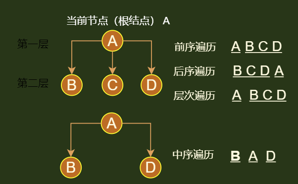
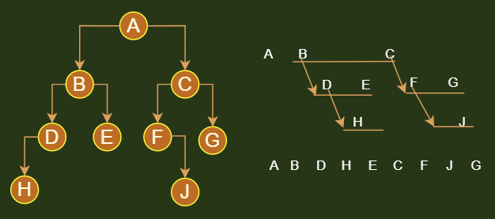
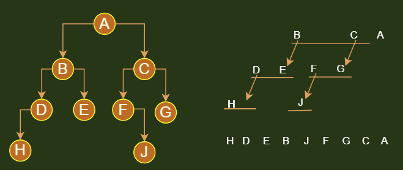
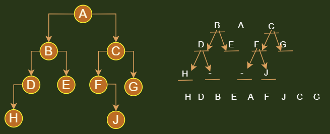
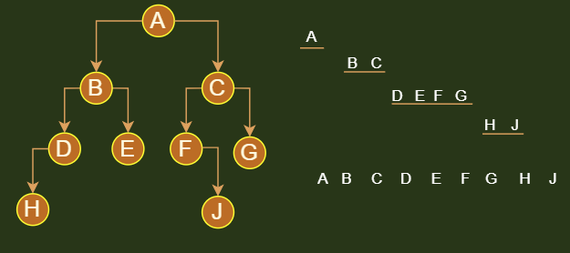

## 介绍

* 不管是 二叉树还是 N 叉树， 遍历的方式都是一样，只是有些方式比使用多叉树

## 遍历方式

```java
注意
    都是从根结点开始的
    根据根结点的位置来判断属于什么遍历方式
前序遍历
    // 先访问当前节点，然后从左到右遍历孩子节点
后续遍历
    // 先从左到右遍历孩子结点， 然后访问当前节点
中序遍历
    // 先遍历左孩子结点，然后访问当前节点， 最后遍历右孩子结点
    // 这个只有二叉树才有，其他的没有
层次遍历
    一层一层遍历节点，先遍历完一层，然后再遍历下一层
```



## 前序遍历

### 介绍

```java
// 从根结点进行遍历
当前节点为 A ，孩子结点为 B C  
    A B C
当前节点为 B ， 孩子结点为 D E
    A B D E C
当前节点为 D ， 孩子结点为 H _
    A B D H _ E C 
当前节点为 H ， 没有孩子结点，，直接进行下一个结点 _
当前节点为 _ ， 没有孩子结点，，直接进行下一个结点 E 
当前节点为 E ， 没有孩子结点，，直接进行下一个结点 C
当前节点为 C ， 孩子结点为 F G
    A B D H _ E C F G
当前节点为 F ， 孩子结点为 _ J
    A B D H _ E C F _ J G
当前节点为 _ ， 没有孩子结点，，直接进行下一个结点 J 
当前节点为 J ， 没有孩子结点，，直接进行下一个结点 G
当前节点为 G ， 没有孩子结点，，结束
```



### 递归遍历

```go
// 二叉树
func (t *Tree) predorTravelsal(){
	curNode = t.root
     PreOderTravel(curNode)    
}

func PreOrderTravel(Node curNnode){
    if curNnode != nil {
        fmt.Print(curNnode.element+"\t")
        PreOrderTravel(curNnode.left)
        PreOrderTravel(curNnode.right)
    }
    return   
}
```

### 迭代遍历

```java
// 栈实现，
// 压栈： 根结点 - 右孩子 - 左孩子
// 出栈:  根结点 - 左孩子 - 右孩子
```


## 后序遍历

### 介绍

```java
// 从根结点进行遍历
当前节点为 A ，孩子结点为 B C  
     B C A
当前节点为 B ， 孩子结点为 D E
    D E B C A
当前节点为 D ， 孩子结点为 H _
    H _ D E B C A
当前节点为 H ， 没有孩子结点，，直接进行下一个结点 _
当前节点为 _ ， 没有孩子结点，，直接进行下一个结点 D 
当前节点为 D ， 跳过，，直接进行下一个结点 E
当前节点为 E ， 没有孩子结点，，直接进行下一个结点 B
当前节点为 B ， 跳过，，直接进行下一个结点 C
当前节点为 C ， 孩子结点为 F G
    H _ D E B F G C A 
当前节点为 F ， 孩子结点为 _ J
当前节点为 _ ， 没有孩子结点，，直接进行下一个结点 J 
当前节点为 J ， 没有孩子结点，，直接进行下一个结点 G
当前节点为 G ， 没有孩子结点，，
// C A 之前都有过了， 直接略过，结束
```




### 递归遍历

```java
func (t *Tree) IndorTravelsal(){
	curNode = t.root
     PreOderTravel(curNode)    
}

func InOrderTravel(Node curNnode){
    if curNnode != nil {
        PreOrderTravel(curNnode.left)
        PreOrderTravel(curNnode.right)
        fmt.Print(curNnode.element+"\t")
    }
    return   
}
```


### 迭代遍历

## 中序遍历

### 介绍

```java
注意
    可以按照前序遍历的方式来分析
    这里是看别人方法，感觉方法比较好，就换了一种方法
// 先从根结点开始，补全模式，然后把补全进来的结点当成子树根结点，然后进行本模式补充
// 左孩子 - A - 右孩子
0. 当前节点  ： _ A _
1.根  _ A _ ： _ B _ A _ C _
2.然后将 B C 的 左孩子 右孩子填进去
	_ D_  B _E_  A  _F_  C  _G_ 
3.填进去 D E F G的左孩子 右孩子
	H D_  B _E_  A  _F J  C  _G_  
4 H J 没有左右孩子，删去占位符号 _ ，就可以得到中序排序的结果
	H D B E A F J C G
```



### 递归遍历

```go
func (t *Tree) IndorTravelsal(){
	curNode = t.root
     PreOderTravel(curNode)    
}

func InOrderTravel(Node curNnode){
    if curNnode != nil {
        PreOrderTravel(curNnode.left)
        fmt.Print(curNnode.element+"\t")
        PreOrderTravel(curNnode.right)
    }
    return   
}
```


### 迭代遍历

## 层序遍历

### 介绍



### 队列遍历

```go
介绍
	队列分析，参看遍历压栈分析

```


## 使用

### 随时终止遍历

```java
介绍
    
```

### 树状打印二叉树

```java
介绍
    使用前序遍历打印出来二叉树结构
```


## 二叉树还原

### 介绍

```go
介绍
	// 先找根结点，再找左右子树
	中序遍历：用来找子树根结点，左右树
	前后遍历：得到左右子树，在中序中找到左右子树的根结点
分类
	前 + 中： 唯一二叉树
	后 + 中： 唯一二叉树
	前 + 后： 不能唯一，只能找到根结点，左右混杂，可能左右子树有空

// 中 + 前 ：
根结点
	前序第一个，
根结点左子树：
	根：前序中的第一个元素
	树：中序中左边的全部
根结点的右子树
	树：在前序中抛弃左子树的全部元素，就是右子树
	根：右子树的第一个结点
// 迭代
	然后分别将左右子树进行以上分析


中 + 后 ：根在最后
```


### 中 + 后

### 中 + 前

## 打印二叉树