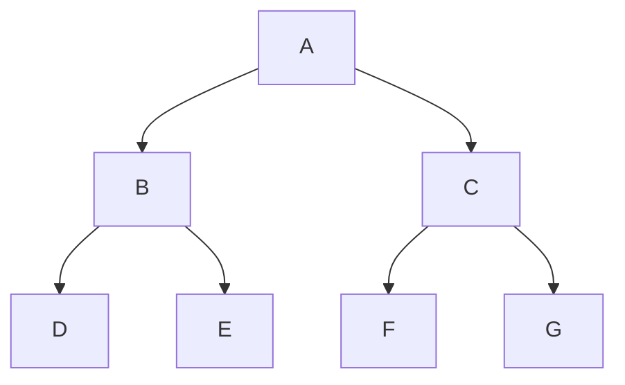
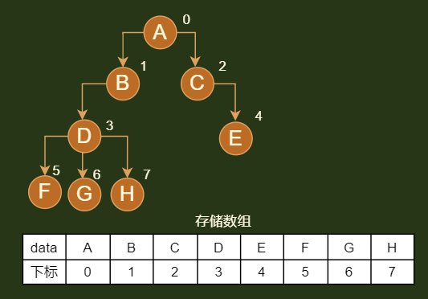
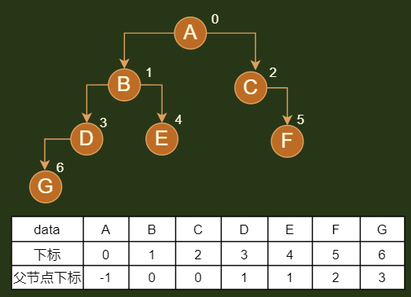
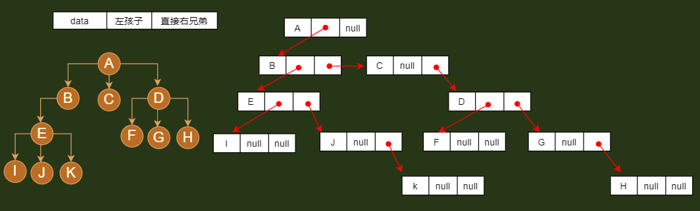
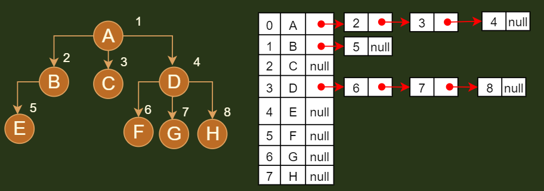
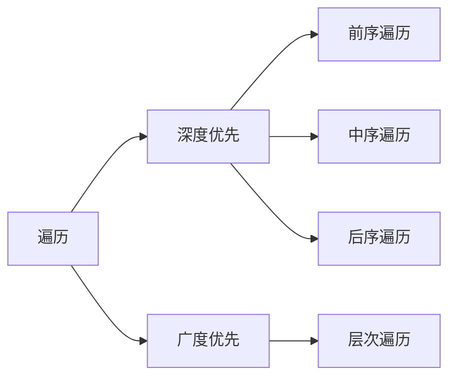

## 树基础

### 树概念

*   树 tree
    *   一种一对多的结构
    *   是 n ( n >= 0) 个节点的有限集合
    *   倒着看像树一样
*   空树
    *   没有节点的树 ，即 n=0
*   子树
    *   当 n >= 1时，其余节点分为 m (m>0) 个互不相交的有限集合，其中每一个集合本身就是一棵树，称为根的子树
    *   子树个数没有限制
    *   同一个根结点的子树不能有交集
    *   某结点位于第 a 层，其子树的根就在 第 a+1 层
*   森林
    *   是不相交的树（大于等于 0 个）的集合
    *   树中每个结点，其子树的集合即为森林

### 树层次

*   根结点所在的层是第一层
*   根的孩子所在的层是第二层
*   以此类推



```go 
// 有的树说是从 0 开始的
第一层 ： A 
第二层 ： B C
第三层 ： D E F G
```

### N-叉树

```java
// 这是我自己总结的 N 叉树
介绍
    一棵树的一个节点，最多拥有的分支数量为 N ，则这棵树被称为 N 叉树
例子
    2-叉树： 一个节点最多有 2 个分支 ，即有两个孩子
    	搜索二叉树
    4-叉树： 树中一个节点最多有 4 个分支， 即最多有 4 个孩子
    	红黑树
特点
    N 叉树的结点， 最多有 N 个孩子， 
        4-叉树，一个节点可以有 0 、1 、2 、3 、4 个孩子
    有 x 个孩子的结点，称为 x-节点
        2-节点：该节点有 2 个孩子
        3-节点：该节点有 3 个孩子
    每个节点中，最多有 N-1 个元素
    	// N 叉树中每个节点，可以暂时存储 N 个元素，但是最终要调整为 N-1 个元素
    	2-叉树中，每个节点做多只能有 1 个元素
```


## 节点

### 结点分类

*   分支结点 / 非终端结点 / 内部结点
    *   度不是 0 的结点
    *   内部结点
*   叶子结点 / 终端节点 
    *   度为 0 的点
    *   没有子结点的结点


````go
分支结点
	A B C
叶子结点
	D E F G 
````


### 节点间的关系

```go
既然是节点间的关系，就需要分清，谁是谁的谁
都是一个相对称谓
```

*   根  root
    *   有且只有一个，是唯一的
*   儿子结点 / 子结点
    *   单个子结点也是一棵树，只不过他的根结点是他自己
*   双亲结点  / 父节点
    *   上一层延伸过来的结点
*   兄弟结点
    *   有同一父结点的结点之间
    *   同一层的结点
*   子孙结点
    *   一个节点的所有子树中的节点称为该节点的子孙节点
*   祖先结点
    *   从根节点到达一个节点的路径上，通过的所有节点称为该节点的祖先节点。


```go
// 都是相对称谓
根结点 
	A
子结点 
	A 的子结点为 B C
	B 的子结点为 D E
父节点
	A 为 B 、C 的父节点
兄弟结点
	D E 互为兄弟结点
	F G 互为兄弟结点
子孙结点
	A 的子孙结点 B C D E F G
祖先结点
	D 的祖先结点  B A 

// 习惯将左边的孩子叫长子域，firstchild
D 是 B 的 firstchild
```


## 度

*   节点的深度/高度
    *   深度： 从根结点到当前节点的唯一一天路径上的结点总数
    *   高度： 从当前节点到最远叶子结点的路径上的节点总数
*   树的深度 / 高度
    *   树中节点的最大层数
    *   深度 ： 所有节点中深度的最大值
    *   高度： 所有子节点高度的最大值
*   节点的度 degree
       *   直接后继节点数
       *   结点拥有的子树数目 ： 结点有多少分支
*   树的度
    *   树内各结点的度的最大值


```go 
树的深度（层数） 3 
树的度（结点最大度）  2

结点的度（结点有几个分支） 
	A 的是 2
	B 的是 2
	D 的是 0
```


### 表示方法

*   上面的图示，还有下面的


*   图 A  : 嵌套的集合的形式 
    *    集合之间绝不能相交，即图中任意两个圈不能相交 
*   图 A : 广义表法
    *    (A , ( B ( E ( K , L ) , F ) , C ( G ) , D ( H ( M ) , I , J ) ) ) 
*   图 B :  凹入表示法 
    *    最长条为根结点 
    *    相同长度的表示在同一层次 
    *    


## 3.存储结构

### 线性存储结构

```java
// 数组存储
介绍
    // 按照层次标号比较清晰，可以按照层级遍历进行复原
    对节点元素按照层的结构依次进行标序，序号就是节点对应的在数组中的位置
注意
	一般来说，线性存储结构用于完全二叉树存储，方便还原
    标序号 ： 只是你定义的一种规则，按照规则决定每个节点该存在什么地方，代码实现：记录根结点的下标
使用
    // 对于非完全二叉树补全， 参看完全二叉树
    一般用于完全二叉树，
    基本不用，因为你添加数据的时候，很有可能打破原有的标号顺序或者标号顺序比较混乱
    
双亲表示法
    // 详情见总和使用
    当前节点保存着父节点的下标
```



### 链表存储结构

```go
介绍
	就是当前节点保存着其他结点的地址（或者引用）：兄弟、父节点、孩子
典型类型
	孩子兄弟表示法：
		// 把树转换为二叉树
		当前节点保存了： 第一个孩子结点 ，以及第一个孩子的右节点
```

### 综合使用

#### 介绍

```java
    双亲表示法 ： 
    	// 线性表：数组
    	当前节点保留了：父节点的下标
    孩子兄弟表示法 ：
    	// 链表： 
    	当前节点保存了： 第一个孩子结点 ，以当前节点的直接右兄弟节点
    孩子表示法
    	// 数组 + 链表
    	数组： 保存了整个树，
    	链表： 孩子节点的链表，从左孩子开始，依次向右指向
        
注意
     这三种模式，可以应用于非二叉树，但是以后基本只研究二叉树，所以以二叉树微粒子
```


#### 1.双亲表示法 - 顺序表

```java
介绍
    各个节点存除了一个记录父节点位置的变量
下标
    对于不存在的结点，在记录的时候，下标记为 -1 （数组中最小的下标为 0）
追加成员
    在存储各个节点的时候，可以再追加存储其他结点，比如：当前节点的右节点、父节点的第一个孩子结点等
    将左边的孩子叫长子域：firstchild  右兄弟节点：rightSib
优势
    容易找到双亲，还容易找到祖先
    复杂度 O(1)
劣势
    不容易找到子结点，找的时候必须要遍历整个结构，可以追加其他结点成员，方便查找
    
例子
// 树节点定义
type PTNode struct {
    data int      // 节点元素类型
    parents int			// 父节点数组下标
}

// 树定义
type PTree struct {
   	nodes []PTNode   // 存储所有节点数据
    r int 			// 根结点下标
    n int  			// 结点总数   
}

// 约定根结点为 parent = -1 
	根节点没有父节点（父节点又称为双亲节点），因此根节点记录父节点位置的变量通常置为 -1。 
```




#### 2.孩子兄弟表示法 - 链式

```java
介绍
    // 直接右兄弟：拥有同一个父节点的右兄弟
    当前节点保存了： 自己的第一个孩子 、 自己的直接右兄弟
别称
    二叉树表示法、 二叉链表表示法
优势
    可以找到唯一一棵二叉树与之对应
    方便查找孩子结点
增加成员
    增加一个 parent 指针域来解决快速查找双亲的问题 
节点结构
    type CSNode struct {
        data 		interface{} 	// 数据域
        firstchild  *CSNode  		 // 指针域， 存储该结点的第一个孩子结点的存储地址
        rightsib 	*CSNOde  		// 指针域， 存储该结点的右兄弟结点的存储地址
    }
```



#### 3.孩子表示法- -顺序+链表

```java
介绍
    当前节点，记录其所有孩子结点
使用
	方式一： 直接记录孩子结点的地址（引用）
        因为无法断定孩子结点的个数，所以维护起来比较麻烦，尽管可以使用度实现，维护起来仍旧很麻烦
        // 对于确定子节点个数的树，可以直接使用,比如二叉搜索树
        type Node struct {
    		data int
            left *Node
            right *Node
        }
	方式二： 对每个结点的孩子建立一个单链表来体现他们的关系
        
        // 树结构
        type tree struct {
            node []CTBox 	// 结点数组
            r  int		// 根的位置 
            n  int		// 节点数
        }


        // 树节点
        type CTBox struct{
            data int	// 节点数据
            firstchild *CTNode	// firstchild  头指针域 ， 存储该结点的孩子链表的头指针: 就是长子域
        }

        // 子节点链表
        type CTNode struct{
            child int   	// 数据域(下标)，存储某个结点在表头数组中的下标(结点在数组中的下标)
            next *CTNode    // 指针域（其兄弟结点）， 存储指向某结点的下一个孩子结点的指针
        }

```



## 4.树操作

### 介绍

```java
个性化操作
    添加、删除
通用操作
    遍历 

```


### 遍历

```java
介绍
    traversing binary tree
    是指从根结点出发.按照某种次序依次访问二叉树中所有结点。使得每个结点被访问一次且仅被访问一次。
    本质就是将非线性结构的树， 转化为线性结构
分类
    二叉树： 前序、中序、后序 ||  深度、 层次
    普通树： 没有中序遍历（节点个数不确定）
    森林  ： 一棵树一棵树进行遍历
    
二叉树还原
    中序 + 前序
    中序 + 后序
```




### 删除

```java

```


## 7.构造树的数目

*    树相似
     *    两棵树中各个结点的位置都一一对应 
*    树等价
     *    两棵树不仅相似，而且对应结点上的数据也相同 
*    n 个节点可以构造多少个形态不同的树
     *    形态不同的树指的是互不相似的树 


```go 
1. 其实树根链表差不多
	链表是 后面跟一个后继结点
	树  是 后面根多个后继结点
	都是可以细分成一个一个很小的后续
```


## 8.树的转换


*   将森林、树转化成二叉树
*   树的孩子兄弟法可以将一棵树转化成二叉链表

### 原因

```go
树的 			= 		其对应的二叉树
前序遍历	   =		前序遍历
后续遍历	   = 		中序遍历


太子继位，右兄右矬
根右独活，面父成魔
```


### 1. 树转化成二叉树

*   步骤

    ```go
    // 兄弟加线，太子继位 ，
    太子继位，兄弟分封（左上为尊，右下为卑）
    ```

    *   加线  ： 所有的兄弟结点之间加一条连线
    *   去线  ：对树中每个结点，只保留它与第一个孩子结点的连线，删除它与其他孩子结点的连线
    *   层次调整  ：以树的根结点为轴心，将整棵树顺时针旋转一定的角度，使之结构层次分明。
        *   注意第一个孩子是二叉树结点的左孩子
        *   兄弟转换过来的孩子是结点的右孩子

    


### 2. 森林转为二叉树

*   思路

    ```go
    1. 森林中的每棵树都是兄弟
    2. 森林  --    每棵树变二叉树    --- 森林变二叉树
    
    一同天下，兄弟分封（左上为尊，右下为卑）
    ```

    

*   步骤

    *   每棵树转化成二叉树
    *   第一棵树不动，从第二棵树开始，依次把后一棵树的根结点作为前一棵二叉树的根结点的右孩子，连起来
    *   链接所有的树

    


### 3. 二叉树转树

*   思路

    ```go
    // 树转二叉树反过来 ，这个是没结点的
    兄弟反目，进京面圣
    ```

*   步骤

    *   去线
        *   删除原二叉树所有结点和右孩子结点的连线
    *   加线
        *   将源二叉树的左孩子的 n 个右孩子结点都作为该结点的孩子，将这些结点和这些右孩子孩子结点连起来
    *   层次调整

    

### 4. 二叉树转森林

*   思路

    ```go
    根结点有右孩子 ：拆成一颗单独的二叉树 ， 然后二叉树转树
    ```

*   步骤

    *   根结点开始 ： 右孩子存在，则把右孩子结点连线删除，查看分离出来的二叉树

        *   分离出来的二叉树存在右孩子，则再次分离，
        *   一致分离到没有右孩子

    *   分离后的二叉树转化为树

        

### 5.普通二叉树转完全二叉树

*   增加虚节点，不全成完全二叉树，其内容为空


