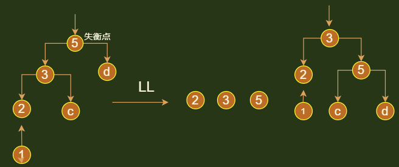

## 平衡二叉树

### 介绍

* balanced binary search tree
* 别称
    * 自平衡的二叉搜索树
    * AVL 树，这个名字是来自两个发明者的名字

### 定义

```go
是一棵空的二叉排序树，或者有下列性质的排序二叉树
1. 根结点的左子树和右子树的深度最多相差 1
2. 根结点的左子树和右子树也是平衡二叉树
```

## 平衡调节

### 介绍

```java
当节点数量固定的时候，左右子树的高度越接近，这棵二叉树就越平衡（高度越低越平衡）
    与平衡二叉树没有啥区别， 只是多了一条左右子树高度差不能超过 1 的限制而已，
```


### 平衡因子

* 该结点的左子树的深度和右子树的深度之差  ： 树的深度
* 平衡树中 ， 结点的平衡因子可以是 1 ， 0 ， -1

### 最小平衡子树

```go
              5                              5
            /   \                          /   \
           4      8                      4      8
        /                             /
      2                            2
                                /
                               1

结点平衡因子   ：左子树深度 - 右子树深度

// 问题点
问题产生者 ：1
    就是插入结点 1 导致的左树不平衡，所以结点 1 就是问题产生者

// 失衡节点
问题发现者 ：4
    离问题产生者最近的 |平衡因子| > 1 的结点
最小平衡树 ：以 4 为根结点的子树
    以失衡节点为根结点的子树

结点    左右子树深度差值
1        0 = 0 - 0 
2        1 = 1 - 0
4        2 = 2 - 0
5        2 = 3 - 1
8        0 = 0 - 0
```


## 复杂度

### 介绍

```java
搜索、添加、删除的时间复杂度 ： O(logn)
```

## 失衡调节

### 注意

```java
下面所有使用的例子都是
    左孩子 < 根结点 < 右孩子
```

### 失衡路径 

```java
失衡
// 添加导致的失衡
	因为添加之前，树是平衡的，所以你添加一个节点，必然：父节点不会失衡， 祖先结点开始失衡
失衡点
    距离插入节点最近平衡因子的绝对值大于 1 的结点 
失衡路径
    从失衡点往下找三个连续的点： 失衡点、失衡点的儿子 、失衡点的孙子
   
失衡路径确定
    失衡点 
    	A：最小平衡子树的根结点
    失衡点的儿子 B： 
    	A 的儿子中，高度最大的点
    失衡点的孙子： 
    	B 的儿子中，高度最大的点， 如果他的儿子是等高的，随意选一个即可（删除中会用）
```

### 调节方法

```java
方法
    将失衡点、儿子、孙子，按照从小到大排列
    	中间值为父节点， 最大值作为右孩子， 最小值作为左孩子，
	    最后将中间值接入原树即可
	中间值的左右孩子分配
    	比中间值大的，给最大值
    	比中间值小的，给最小值
    接入后树调整
    	高度更新
    	对于删除节点的，如果儿子节点不等高，就会导致接入点父节点失衡，甚至向上失衡
注意
    通常所说的 LL LR RR RL 都是按照这个套路来的，都能沿着失衡路径找到这三个点
    有可能插入节点就是失衡节点的孙子节点，

    
高度调整
    // 增加
    插入点导致树高度失衡，其实是失衡子树的高度增加了 1
    调整后把最小平衡子树的高度减一，所以除了最小子树以外，其他的树子树在调整后 vs 插入节点以前都是一样的
    // 删除
```


## 操作

### 创建

### 增加调整

```java
添加都是形成不同的高度的树，，添加的时候，一定会形成最高的两个子树
```




### 删除调整

```java
介绍
   找失衡节点、失衡节点的儿子、失衡节点的孙子
注意
    如果失衡节点儿子的两个儿子， 是高度相等的，孙子节点随意选择都行
    	// 调整后，最小平衡子树高度不变，不会造成失衡节点
 		这种情况下，失衡节点以上的结点，在调整以后，是不是出现失衡的
    如果失衡节点儿子的两个儿子，是高度不相等的，孙子节点选择高度大的
    	// 调整后，最小平衡树高度减一，可能会造成失衡节点以上的结点失衡
    	需要继续向上寻找不平衡点，
```

### 其他操作


