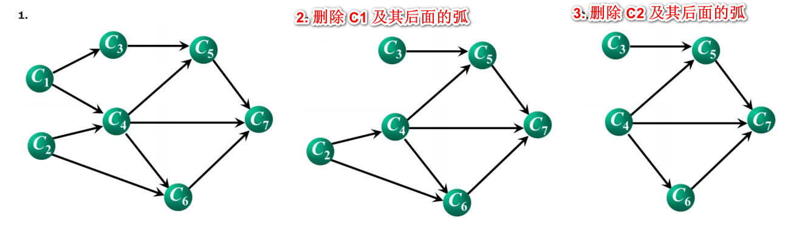
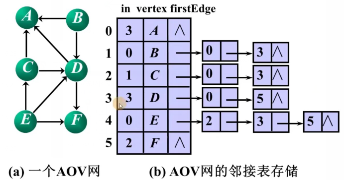

## AOV 网

*   概念
    *   在一个表示工程的有向图中，
        *   顶点 ： 表示活动
        
        *   弧     ： 活动之间的有限关系 ，表示活动之间存在的某种制约关系
        
        *   AOV 网 ： 有向图为顶点表示活动的网，简称 AOV 网
        
            
    
*   回路
    *   不能出现
    *   某项活动以自身作为作为先决条件，这是不允许存在的
    
*   拓扑排序

## aov 拓扑排序

### 基本思想

```go
1. 从 AOV 网中选择一个 没有 前驱的顶点并且输出
2. 删除该顶点 ，删除其后的弧

3. 重复以上两步，直到所有的结点都被输出，或者 AOV 中不存在没有前驱的顶点

//------------------------------------
1. 找到没有前驱的顶点 C1  , 删除该顶点以及其后面的弧。输出 C1  
2. 找到没有前驱的顶点 C2  , 删除该顶点以及其后面的弧。输出 C2
后面都是一样的操作（注意不能有环，先删除谁都可以，只要是没有前驱的点就行）
```




### 存储结构

```go
// 图存储
	使用 邻接表存储 ， 在顶点表中增加一个入度域 in
    顶点表结构  in  vertex firstEdge
// 栈 S 
	存储所有没有前驱的顶点 ， 也可以用队列

```


### 实际例子



```go
// 初始化
	扫描定点表，将堆栈初始化。将入度为 0 的点 B E 压入堆栈 [ B , E ]

1. 出栈 顶点 E  ：[ B ]
	根据 E 的 firstEdge 遍历所有边，并将其指向的各个顶点的入度值 减去 1
	处理的时候，发现某个顶点的入度值为 0 ，则压入堆栈
	C 的入度减去 1 ，得其入度为 0		// 压入堆栈   [ B , C ]
	D 的入度减去 1 ，得其入度为 2
	F 的入度减去 1 ，得其入度为 1

1. 出栈 顶点 C  [ B ]
	根据 C 的 firstEdge 遍历所有边，并将其指向的各个顶点的入度值 减去 1
	处理的时候，发现某个顶点的入度值为 0 ，则压入堆栈
	A 的入度减去 1 ，得其入度为 2		
	D 的入度减去 1 ，得其入度为 1		// 出栈 E 的时候，已经减去过 1 了 

1. 出栈 顶点 B  [  ]
	根据 B 的 firstEdge 遍历所有边，并将其指向的各个顶点的入度值 减去 1
	处理的时候，发现某个顶点的入度值为 0 ，则压入堆栈
	A 的入度减去 1 ，得其入度为 1		
	D 的入度减去 1 ，得其入度为 0		//  压入堆栈   [ D ]  

1. 出栈 顶点 D  [  ]
	根据 D 的 firstEdge 遍历所有边，并将其指向的各个顶点的入度值 减去 1
	处理的时候，发现某个顶点的入度值为 0 ，则压入堆栈
	// 点 B 已经处理过了
	A 的入度减去 1 ，得其入度为 0		//  压入堆栈   [ A ] 
	F 的入度减去 1 ，得其入度为 0		//  压入堆栈   [ A , F ]  
```


### 代码思路

```go
1.    栈 S 初始化，
        累加器 count 初始化 ： 有多少个顶点进行拓扑排序
2.    扫描顶点表 ， 将没有前驱的顶点压栈

 3.  for   {
        if 栈 S 空了 {
            return
        }

        vj = 退出栈顶的元素
            输出 vj , 累加器加 1
        将顶点 vj 的各个邻接点的入度减 1
        将新的入度为 0 的顶点入栈 

    }

4.    if count < vertexNum {
         输出 ： 存在回路信息
     }
```


