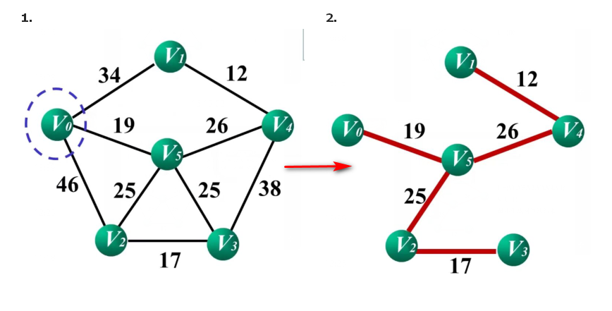
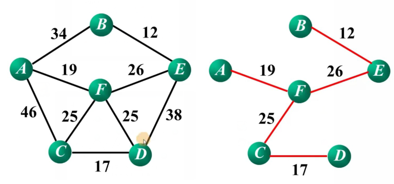
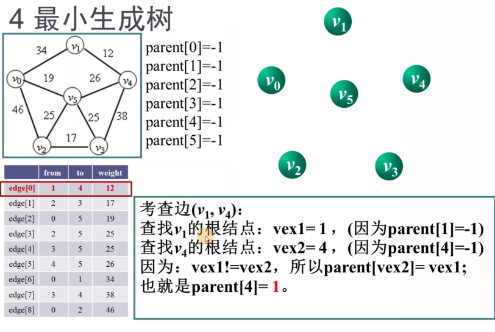

## 概念

*   名称
    *   最小生成树 ： minimal spanning tree
*   生成树的代价
    *   图 G = (V,E)是一个无向联通网。生成树上各边的权值之和，称为该树 的代价
*   最小生成树
    *   图 G所有生成树中，代价最小的生成树
    *   最小生成树不唯一


## 性质

*   性质 

    ```go
    无向连通网 	G = (V ,E)  ， 其中一个非空顶点集 U 
    	若（u,v）（其中 u∈U ，v∈ V-U ） 是一条有最小权值的边， ，则必存在一颗包含边(u,v)的最小生成树
    
    V 		// 所有的结点
    U		// 已经处理过的结点
    V-U		// 剩余没有处理过的结点
    
    就是从 U 和 V-U 两个顶点集合中找到一条可以连通的边，然后将附着在 V-U 中的顶点加入 U 中，直到 V-U 为空
    
    最下生成树不唯一
    ```

*   使用

    ```go
    // 利用两个点集之间最小权值的边，寻找最小生成树
    方法一
    	从一个点出发，依次加入点形成点集（prim）   ：对点操作
    方法二
    	从边出发，将点集合并，避免形成环（Kruskal）：对边操作
    
    ```


## 普里姆(prim)算法

### 方法

```go
将图的顶点分成两类 ： 一类处理过的，一类待处理的
然后
	待处理的顶点 -- 查找 -- 》 距离处理过的顶点权值最小的顶点
结束
	不存在待处理的顶点
```


### 实例




```go
V 		// 所有的结点
U		// 已经处理过的结点
V-U		// 剩余没有处理过的结点
cost{}	// 剩余结点到得到的最小生成树集合的最短路径，能连接到 U 组成图的边
∞ 	    // 没有直达边

// 开始
    U { v0 }
    U-V = {v1,v2,v3,v4,v5}
    cost{ (v0,v1)34 , (vo,v2)46 , (v0,v3)∞ ，(v0,v4)∞ ,(v0,v5)19 }
    所以
    选择代价最小的 (v0,v5)

U { v0 , v5}
    U-V = {v1,v2,v3,v4}
    cost{ (v0,v1)34 , (v0,v2)46 , (v5,v4)26 ，(v5,v2)25 ,(v5,v3)25 }
    所以
	选择代价最小的 (v5,v2) //也可以取(v5,v3) 取决于你的方法，选哪一个都一样

U { v0 , v5 ，v2}
    U-V = {v1,v3,v4}
	cost{ (v0,v1)34 , (v5,v4)26 , (v5,v3)25 , (v2,v3)17}
    所以
    选择代价最小的 (v2,v3) 

U { v0 , v5 ，v2 , v3}
    U-V = {v1,v4}
	cost{ (v0,v1)34 , (v5,v4)26 , (v4,v3)38}
    所以
    选择代价最小的 (v5,v4) 

U { v0 , v5 ，v2 , v3 , v4}
    U-V = {v1}
	cost{ (v0,v1)34 , (v1,v4)26 }
    所以
    选择代价最小的 (v1,v4) 

所以总的结果
	U { v0 , v5 ，v2 , v3 , v4，v1}
```

### 思路代码

```go
1. 初始化
	U = {V0} TE = {}
2. 循环
while ( U != V ) {
    在 cost 中寻找最短边(u,v) , 且满足 u ∈ U v ∈ V-U
    U = U + {v}
    TE = TE + {(u,v)}
}

```

### 邻接矩阵

```go
// 要查找一个顶点的所有邻接点 ： 邻接矩阵
adjvex     邻接域
lowcost    最小消耗权值
```


## Kruskal(克鲁斯卡尔）

### 方法




```go
选出最短边，
	如果它不和当前最小生成树构成回路，就将其加入最小生成树
	否则就删除
直到所有边都处理完全

//------------------------------------------------------------

将所有的结点看成一棵树
	连通分量 1 = {A}，{B}，{C}，{D}，{E}，{F}

没有处理的树间最短路径	 (B，E）12
	连通分量 2 = {A}，{B，E}，{C}，{D}，{F}

在没有处理的路径中最短路径 （C，D）17
	连通分量 3 = {A}，{B，E}，{C,D}，{F}
  
在没有处理的路径中最短路径 （A，F）19
    连通分量 4 = {A,F}，{B，E}，{C,D}
  
在没有处理的路径中最短路径 （F，C）25   // 计算机优先处理前面的点，其实 c ,d 没有区别
     连通分量 5 = {A,F,C,D}，{B，E}
在没有处理的路径中最短路径  （F，D）25   
      因为这两点已经存在连通分量 中，会构成回路，所以排除
在没有处理的路径中最短路径    （F，E）26 
      连通分量 5 = {A,F,C,D,B,E}      

 所有顶点连通起来，就生成了最小生成树

```


### 思路代码

```go
1. 初始化 U = V TE={}
2. while ( T 中的连通分量个数不为 1）{
    在  E 中找到最短边 (u,v)
    if 如果 顶点 u ，v 位于 T 的两个不同的连通分量 {  // 重点
        将边（u，v） 并入 TE
    } else {
        不加入
    }
    标记边(u,v) , 使得(u,v)不参加后续最短边的选取
}


1. 邻接矩阵或者邻接表都不好 
       要搜索所有的边才能找到最短边 （需改进）
       使用 边集数组 存储图中的边，为查找速度，数组中的边按照权排序
2. 排序
	插入
	堆排序或者快速排序
3. 判断两个顶点位于两个不同的连通分量中（判断有回路）
	连通分量看成树，所属树是否有相同根结点，
	实质是使生成树以一种随意的方式增长，初始时每个顶点构成一棵生成树，然后每生长一次就将两棵树合并，直到最后合并成一棵树
          
4. 连通分量判断
     用数组 parent[] 记录当前顶点的根结点, parent[i] 便是顶点 vi 的根结点
     边（u，v）分别对应该的 根结点的下标 为 vex1(u)  vex2(v)
          如果 vex1 != vex2 ,则顶点 u，v 丙丁处于不同的连通分量中，令 parent[vex2]=vex1,将两树合并
          parent[vex2]=vex1  : 将 vex2 的根结点设置为 vex1

          
          
 type  EdgeType struct {
    from	int	// 边起点
    to		int // 边终点
    weight	int // 边上的权值
}


type EdgeGraph struct {
    vertex	[]interface{}		// 存放顶点的数据
    edge	[]EdgeType		// 存放边的数组
    vertexNum	int				// 图顶点的数目
    edgeNum	int				// 图边的数目
}
         

```

### 实例




```go
先将各个边进行排序，存储入 边集数组中
	from to 对于无向图，你可以随意设置，但是最好是按照一定的方向

将所有的结点看成一棵树
	连通分量	  1 = {v0}，{v1}，{v2}，{v3}，{v4}，{v5}
	
	初始化 当各个顶点是根结点时，初始化为 -1 
	parent[0] parent[1]  parent[2]  parent[3]  parent[4]  parent[5]
	  -1		  -1		-1 		  -1		-1		   -1
	// parent[i] 中存储的是 顶点 vi 的根结点的下标
	// 通过操作根结点，来合并不同的树，就是将这个森林合成树（通过根结点）


没有处理的树间最短路径	 (v1，v4）12
	
    查 v1  ：parent[1] = -1	根结点 vex1=1
    查 v4  ：parent[4] = -1	根结点 vex2=4
    vex1 != vex2   ----->  parent[vex2] = vex1  parent[4] = 1
              
    连通分量 2 = {v0}，{v1，v4}，{v2}，{v3}，{v5}          
	parent[0] parent[1]  parent[2]  parent[3]  parent[4]  parent[5]
	  -1		  -1		-1 		  -1		1		   -1          
              
没有处理的树间最短路径	 (v2，v3）17
	连通分量 2 = {v0}，{v1，v4}，{v2，v3}，{v5}
    查 v2  ：parent[2] = -1	根结点 vex1=2
    查 v3  ：parent[3] = -1	根结点 vex2=3
    vex1 != vex2   ----->  parent[vex2] = vex1  parent[3] = 2
              
	parent[0] parent[1]  parent[2]  parent[3]  parent[4]  parent[5]
	  -1		  -1		-1 		  2 		1		   -1  

没有处理的树间最短路径	 (v0，v5）19
    查 v0  ：parent[2] = -1	根结点 vex1=0
    查 v5  ：parent[5] = -1	根结点 vex2=5
    vex1 != vex2   ----->  parent[vex2] = vex1  parent[5] = 0
              
    连通分量 2 = {v0,v5}，{v1，v4}，{v2，v3}
	parent[0] parent[1]  parent[2]  parent[3]  parent[4]  parent[5]
	  -1		  -1		-1 		  2 		1		   0   
              
没有处理的树间最短路径	 (v2，v5）25
    查 v2  ：parent[2] = -1					   根结点的值 vex1=2
    查 v5  ：parent[5] = 0  parent[0] = -1		根结点的值 vex2=0
    vex1 != vex2   ----->  parent[vex2] = vex1  parent[0] = 2
              
    连通分量 2 = {v0,v5,v2，v3}，{v1，v4}
	parent[0] parent[1]  parent[2]  parent[3]  parent[4]  parent[5]
	  2		  -1		-1 		  2 		1		   0 
              
没有处理的树间最短路径	 (v3，v5）25
    查 v3 ：parent[3] = 2  parent[2] = -1			 			根结点的值 vex1=2
    查 v5 ：parent[5] = 0  parent[0] = 2		parent[2] = -1	 根结点的值 vex2=0
    vex1 == vex2   ----->  构成回路 ，故舍去这条边
              
    连通分量 2 = {v0,v5,v2，v3}，{v1，v4}
	parent[0] parent[1]  parent[2]  parent[3]  parent[4]  parent[5]
	  2		  -1		-1 		  2 		1		   0 

没有处理的树间最短路径	 (v4，v5）26
    查 v4 ： parent[4] = 1  parent[1] = -1  					根结点的值 vex1=1
    查 v5 ： parent[5] = 0  parent[0] = 2		parent[2] = -1   根结点的值 vex2=2 ：
    vex1 ！= vex2  ----->  parent[vex2] = vex1  parent[2] = 1
              
    连通分量 2 = {v0,v5,v2，v3，v1，v4}  // 已经完全了。可以结束了 边数 = 顶点树 - 1 已经生成最小生成树
	parent[0] parent[1]  parent[2]  parent[3]  parent[4]  parent[5]
	  2		  -1		1 		  2 		1		   0 
    // 注意 parent[2] = 1 ,这个顺序可以随意设置，但是按照一定的顺序设置即可
    // parent 里面的树 和 最小生成树 是不一样的 ， parent 里面的树只是一个标识作用，
              
```


### golang 实现

```go
// 没有写 有序的边集数组 


type  EdgeType struct {
    from	int	// 边起点
    to		int // 边终点
    weight	int // 边上的权值
}


type EdgeGraph struct {
    vertex	[]interface{}		// 存放顶点的数据
    edge	[]EdgeType		// 存放边的数组
    vertexNum	int				// 图顶点的数目
    edgeNum	int				// 图边的数目
}
    
func (g EdgeGraph) Kruskal() {
    
    parent := make([]int)
    for  i:=0; i<g.vertexNum; i++ {
        parent[i] = -1
    }
    
    num := 0    // 记录已经描述了几个边
    for i:=0; i<g.vertexNum; i++ {
        vex1 := findRoot(parent,g.edge[i].from)  // 找到所在生成树的根结点
        vex2 := findRoot(parent,g.edge[i].to)	// 找到所在生成树的根结点
        if vex1 != vex2 { //根结点不相同，才不会构成环
 			// 输出加入的边 格式 （edg[i].from , edg.[i].to）
            g.outputMST()
            parent[vex2] = vex1  // 合并生成树
            num++
            if num == g.vertexNum-1{ // 循环了“图顶点个数-1”次，提前返回
            	return
            }
         }
    }
}

func findRoot(parent []int,v int) (v int) {
    t := v
    for  {
        if parent[t] == -1 { // 求顶点 t 上的双亲直到根结点
            return t
        }
        t = parent[t]
    }
}

func (g  EdgeGraph) outputMST() {
    fmt.Printf("连接 %d 到 %d ",g.edge[i].from,g.edge[i].to)
}
```


### 