## 1.术语

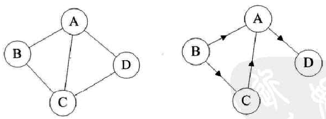

*   图

    ```go
    图右顶点又穷非空集合和顶点之间边的集合组成
    表示 ： G=(V,E)
    	V vertex  图中顶点(数据元素)的集合
    	E  图中顶点之间边的集合
    特性
    	顶点个数不能为 0 ，但是可以没有边
    	没有空图的概念
    
    顶点间的关系
    	邻接
    ```

    

*   子图

    *    指的是由图中一部分顶点和边构成的图，称为原图的子图 
    *    图中图

*   路径

    *    概念
         *    从一个顶点到另一顶点途径的所有顶点组成的序列（包含这两个顶点），称为一条路径 
    *    路径长度
         *    带权图 ： 路径上边得个数
         *    带权图 ： 路径上各边的权和
    *    环 、回路
         *   路径第一个顶点和最后一个顶点相同，则此路径称为"回路"（或"环"） 
    *    简单路径
         *    路径中各顶点都不重复，此路径又被称为"简单路径 
    *    简单环
         *    除第一个和最后一个顶点外，路中的其他顶点互不重复 

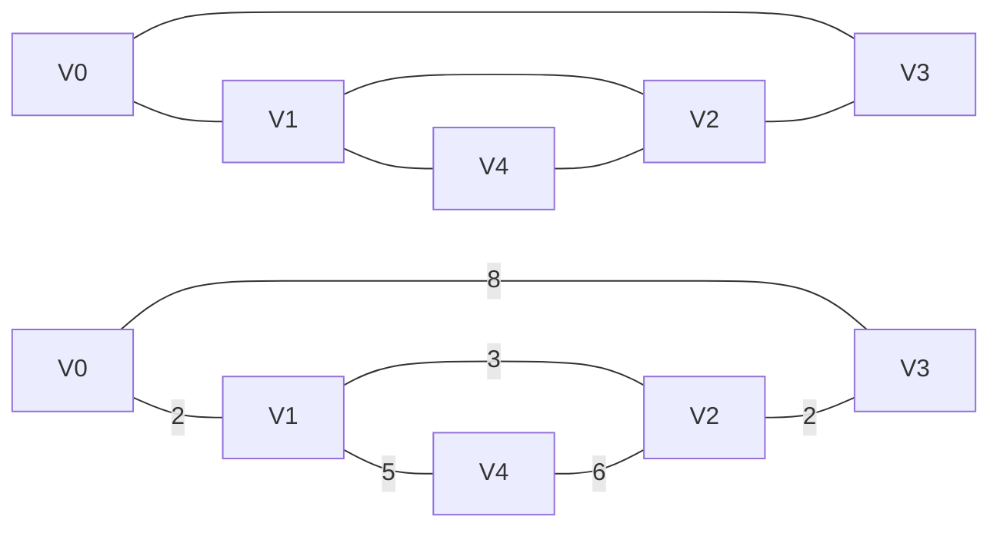

```go
v0 到 v3 路径
	v0v3  无向图长度 ：1  有向图长度 8
	v0v1v2v3   
	v0v1v4v2v3
```

*   边 ：两个顶点之间的连线，

    *   有方向 ： 弧
    *   无方向 ： 边
*   邻接、依附
    *   无向图中
        *   两个顶点存在边，则称这两个顶点互为邻接点，两点间的边依附于两个顶点
    *   有向图
        *   两个顶点间有弧 `<vi,vj>` ，则称 vi 依附于 vj , 两点间的弧依附于两个顶点
        *   有方向性
*   邻接点 

    *    在图中，如果两个点相互连通，即通过其中一个顶点，可直接找到另一个顶点，则称它们互为邻接点 

*   权
    *    每条边（或弧）会赋予有意义的数值量
*   网图
    *   边(弧)带权的图
*   顶点的度
    *   无向图
        *   值依附在该顶点的边数，通常即为 TD(v)
        *   2 * 边数 = 所有顶点的度之和
    *   有向图
        *   入度ID(v)    : 以该顶点为 弧头 的弧的数目
        *   出度OD(v)  : 以该节点为 弧尾 的弧的数目
        *   各顶点入度之和 = 各顶点出度之和 = 边数

### 类型

*   有向图
    *   顶点之间的连线均无方向
    *   组成 ： 顶点 + 弧
    *   边数 ：度
    *   表示 ：'G2 = ( V2 , { E2 } ) '
        *   顶点集合 V2 = { A , B , C , D} 
        *   弧集合 ' E2 = {< A ,D > , < B , A > , < C , A > , < B , C >} '
    *   有向边 ： 有方向 的矢量,称为 弧
        *   表示`< 弧头D , 弧尾A> `  ：由 D 指向 A
        *   有箭头的一端：弧尾A
            *    指向 Vi 的弧的数量为 V 的入度（InDegree，记为 ID(V)） 
        *   无箭头的一端 ：弧头D
            *    箭头远离 V 的弧的数量为 V 的出度（OutDegree，记为OD(V) 

*   无向图
    *   顶点之间的连线有方向。相当于矢量连接，
    *   组成 ： 顶点 + 边
    *   表示 ：'G1 = ( V1 , { E1 } ) '
        *   顶点集合 V1 = { A , B , C , D} 
        *   边集合 ' E1 = { ( A, B ) , ( B , C ) , ( C , D ) , ( D , A ) ,( A , G ) } '
    *   无向边(egde) ： 无方向 
        *   表示 ： 无序偶对（D ; A）或者 （A ; D）

### 逻辑结构

*   简单图

    *   图中不存在顶点到其自身的边 + 同一条边不重复出现 
    *   （数据结构中讨论的都是简单图）

    ```mermaid
    graph TB
    0[非简单]
    
    1[V1] --- 2[V2]
    1[V1] --- 3[V3]
    1[V1] --- 1[V1]
    
    1-0[非简单]
    
    1-1[V1] --- 1-2[V2]
    1-1[V1] --- 1-3[V3]
    1-2[V1] --- 1-1[V1]
    
    ```

    

    


## 2.图存储结构分类

### 完全图

*   概念
    *   任意两个顶点之间都存在边的图
    *   若图中各个顶点都与除自身外的其他顶点有关系 
*   方向分类
    *   有方向的 ：有向完全图 (这个是双向的弧)
    *   无方向的 ： 无向完全图
*   特点
    *    具有 n 个顶点的完全图，图中边的数量为 n(n-1)/2；
    *    具有 n 个顶点的有向完全图，图中弧的数量为 n(n-1)。 

### 稀疏图、稠密图

*   概念
    *    两种图是相对存在的，
    *    稀疏图 ：边（或弧）数很多
    *    稠密图 ：边（或弧）数很少
*   判断条件
    *   e<nlogn  ： 如果式子成立，则为稀疏图；反之为稠密图。 
        *    e 表示图中边（或弧）的数量，
        *    n 表示图中顶点的数量。

### 连通图

*   连通

    *   存在路径(边)，说明顶点是连通的（不一定是最短的）

    *    从一个顶点到达另一顶点，若存在至少一条路径，则称这两个顶点是连通着的 

*   连通图
    *   无方向  ：连通图
        *    如果任意两个顶点之间都能够连通（能连通，没说要经过几个边）
    *   有方向 ： 强连通图
        *   这个是双向的
        *   若任意两个顶点 Vi 和 Vj，满足从 Vi 到 Vj 以及从 Vj 到 Vi 都连通，也就是都含有至少一条通路 
    
*   连通分量

    ```go
    *    若无向图不是连通图，但图中存储某个子图符合连通图的性质  则称该子图为连通分量。 
    *    但这里的子图指的是图中"最大"的连通子图（也称"极大连通子图"）。 
    ```

    *   概念
        *   非连通图的极大连通子图 ，是对无向图的一种划分
        *   极大连通子图 ：含有极大顶点数（最多的定点），依附于这些定点的所有边
    *   无方向的叫 ： 连通分量
        *    如果无向图是连通图，则其无法分解出多个最大连通子图，因为图中所有的顶点之间都是连通的。 
    *   有方向的  ：强连通分量
        *    有向图本身不是强连通图，但其包含的最大连通子图具有强连通图的性质，则称该子图为强连通分量。  

*   总结
    *    连通图是在无向图的基础上对图中顶点之间的连通做了更高的要求，
    *    而强连通图是在有向图的基础上对图中顶点的连通做了更高的要求。 

## 3.遍历

### 1.生成树

*   使用

    *   连通图

*   概念

    *   是包含图中所有顶点的一个极小连通子图 ，就是生成树
        *   极小连通子图（n个定点的图）：含有 n-1 条边
        *   成树中`边的数量 = 顶点数 - 1`。

    *   对连通图进行遍历，过程中所经过的边和顶点的组合可看做是一棵普通树，通常称为生成树。 
    
*   条件
    *    包含连通图中所有的顶点；
    *    任意两顶点之间有且仅有一条通路
    
*   个数

    *   由于任意两顶点之间可能含有多条通路，遍历连通图的方式有多种，往往一张连通图可能有多种不同的生成树与之对应。 


### 2.生成森林

*    对应非连通图来说 
*    非连通图可分解为多个连通分量，而每个连通分量又各自对应多个生成树（至少是 1 棵），因此与整个非连通图相对应的，是由多棵生成树组成的生成森林。  

## 3.抽象数据类型

```go
data : 顶点的又穷非空集合 + 边的集合
```


## 4.存储方式

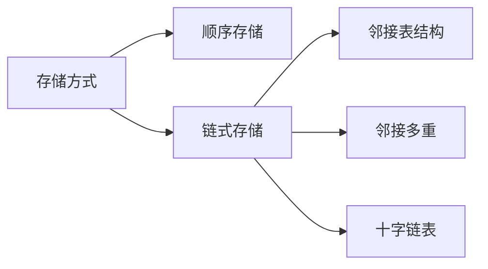


### 1.顺序存储结构

#### 邻接矩阵 - 无向

*   介绍

    *    使用数组有效地存储图
    *    主要是无向图

*   思想

    ```go
    两个数组
    
    一维数组 ： 存放顶点自身数据
    	data
    二维数组 ： 存储各顶点间的邻接关系，存储的值如下
        // 有边(弧) 
            相应位置用 1  （图）
            相应的权重表示，（网）
        // 不存在 
            用 0	表述
    ```

*   分类

##### 无向图邻接矩阵

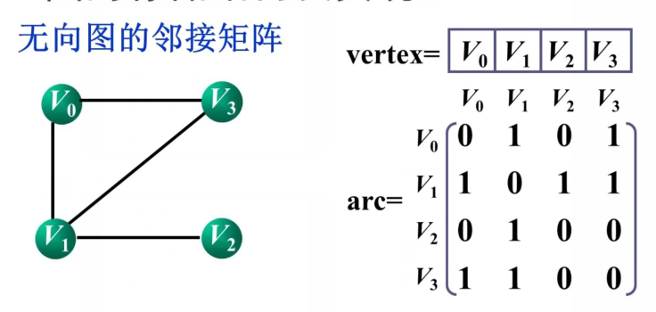

```go
1. 主对角线 为 0 且一定是对称矩阵
2. 判断两个顶点之间是否存在边 
	测邻接矩阵中响应的位置的元素 arc[i][j] 是否为 1 
3. 求顶点 i 的所有邻接点
	i 行扫描 arc[i][j] == 1 的点


// ------------------------------------------------------

// 图存储的最大顶点数
var max_vertex int = 10
type MGraph struct {
    
    vertex []int                      // 一维数组
    arc [max_vertex][max_vertex]int   // 二维数组
    vertexNum int					// 实际顶点个数
    arcNum int						// 边的个数
    
}


```

##### 有向图邻接矩阵

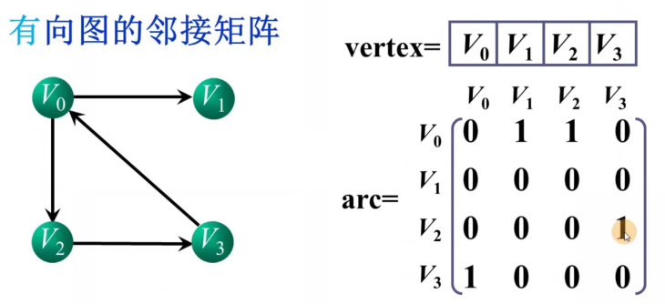

```go
1. 邻接矩阵是否对称
	有向完全图示对称的
2. 顶点 i 出度
	对应行元素之和
3. i 到 j 存在 边
	相应位置 arc[i][j] == 1
4.
```

##### 网图的邻接矩阵

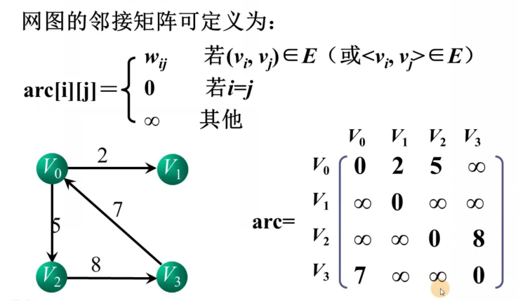


    *   demo
    
        ```go
            #include <stdio.h>
            #define MAX_VERtEX_NUM 20                   //顶点的最大个数
            #define VRType int                          //表示顶点之间的关系的变量类型
            #define InfoType char                       //存储弧或者边额外信息的指针变量类型
            #define VertexType int                      //图中顶点的数据类型
            typedef enum{DG,DN,UDG,UDN}GraphKind;       //枚举图的 4 种类型
            typedef struct {
                VRType adj;                             //对于无权图，用 1 或 0 表示是否相邻；对于带权图，直接为权值。
                InfoType * info;                        //弧或边额外含有的信息指针
            }ArcCell,AdjMatrix[MAX_VERtEX_NUM][MAX_VERtEX_NUM];
            typedef struct {
                VertexType vexs[MAX_VERtEX_NUM];        //存储图中顶点数据
                AdjMatrix arcs;                         //二维数组，记录顶点之间的关系
                int vexnum,arcnum;                      //记录图的顶点数和弧（边）数
                GraphKind kind;                         //记录图的种类
            }MGraph;
            //根据顶点本身数据，判断出顶点在二维数组中的位置
            int LocateVex(MGraph * G,VertexType v){
                int i=0;
                //遍历一维数组，找到变量v
                for (; i<G->vexnum; i++) {
                    if (G->vexs[i]==v) {
                        break;
                    }
                }
                //如果找不到，输出提示语句，返回-1
                if (i>G->vexnum) {
                    printf("no such vertex.\n");
                    return -1;
                }
                return i;
            }
            //构造有向图
            void CreateDG(MGraph *G){
                //输入图含有的顶点数和弧的个数
                scanf("%d,%d",&(G->vexnum),&(G->arcnum));
                //依次输入顶点本身的数据
                for (int i=0; i<G->vexnum; i++) {
                    scanf("%d",&(G->vexs[i]));
                }
                //初始化二维矩阵，全部归0，指针指向NULL
                for (int i=0; i<G->vexnum; i++) {
                    for (int j=0; j<G->vexnum; j++) {
                        G->arcs[i][j].adj=0;
                        G->arcs[i][j].info=NULL;
                    }
                }
                //在二维数组中添加弧的数据
                for (int i=0; i<G->arcnum; i++) {
                    int v1,v2;
                    //输入弧头和弧尾
                    scanf("%d,%d",&v1,&v2);
                    //确定顶点位置
                    int n=LocateVex(G, v1);
                    int m=LocateVex(G, v2);
                    //排除错误数据
                    if (m==-1 ||n==-1) {
                        printf("no this vertex\n");
                        return;
                    }
                    //将正确的弧的数据加入二维数组
                    G->arcs[n][m].adj=1;
                }
            }
            //构造无向图
            void CreateDN(MGraph *G){
                scanf("%d,%d",&(G->vexnum),&(G->arcnum));
                for (int i=0; i<G->vexnum; i++) {
                    scanf("%d",&(G->vexs[i]));
                }
                for (int i=0; i<G->vexnum; i++) {
                    for (int j=0; j<G->vexnum; j++) {
                        G->arcs[i][j].adj=0;
                        G->arcs[i][j].info=NULL;
                    }
                }
                for (int i=0; i<G->arcnum; i++) {
                    int v1,v2;
                    scanf("%d,%d",&v1,&v2);
                    int n=LocateVex(G, v1);
                    int m=LocateVex(G, v2);
                    if (m==-1 ||n==-1) {
                        printf("no this vertex\n");
                        return;
                    }
                    G->arcs[n][m].adj=1;
                    G->arcs[m][n].adj=1;//无向图的二阶矩阵沿主对角线对称
                }
            }
            //构造有向网，和有向图不同的是二阶矩阵中存储的是权值。
            void CreateUDG(MGraph *G){
                scanf("%d,%d",&(G->vexnum),&(G->arcnum));
                for (int i=0; i<G->vexnum; i++) {
                    scanf("%d",&(G->vexs[i]));
                }
                for (int i=0; i<G->vexnum; i++) {
                    for (int j=0; j<G->vexnum; j++) {
                        G->arcs[i][j].adj=0;
                        G->arcs[i][j].info=NULL;
                    }
                }
                for (int i=0; i<G->arcnum; i++) {
                    int v1,v2,w;
                    scanf("%d,%d,%d",&v1,&v2,&w);
                    int n=LocateVex(G, v1);
                    int m=LocateVex(G, v2);
                    if (m==-1 ||n==-1) {
                        printf("no this vertex\n");
                        return;
                    }
                    G->arcs[n][m].adj=w;
                }
            }
            //构造无向网。和无向图唯一的区别就是二阶矩阵中存储的是权值
            void CreateUDN(MGraph* G){
                scanf("%d,%d",&(G->vexnum),&(G->arcnum));
                for (int i=0; i<G->vexnum; i++) {
                    scanf("%d",&(G->vexs[i]));
                }
                for (int i=0; i<G->vexnum; i++) {
                    for (int j=0; j<G->vexnum; j++) {
                        G->arcs[i][j].adj=0;
                        G->arcs[i][j].info=NULL;
                    }
                }
                for (int i=0; i<G->arcnum; i++) {
                    int v1,v2,w;
                    scanf("%d,%d,%d",&v1,&v2,&w);
                    int m=LocateVex(G, v1);
                    int n=LocateVex(G, v2);
                    if (m==-1 ||n==-1) {
                        printf("no this vertex\n");
                        return;
                    }
                    G->arcs[n][m].adj=w;
                    G->arcs[m][n].adj=w;//矩阵对称
                }
            }
            void CreateGraph(MGraph *G){
                //选择图的类型
                scanf("%d",&(G->kind));
                //根据所选类型，调用不同的函数实现构造图的功能
                switch (G->kind) {
                    case DG:
                        return CreateDG(G);
                        break;
                    case DN:
                        return CreateDN(G);
                        break;
                    case UDG:
                        return CreateUDG(G);
                        break;
                    case UDN:
                        return CreateUDN(G);
                        break;
                    default:
                        break;
                }
            }
            //输出函数
            void PrintGrapth(MGraph G)
            {
                for (int i = 0; i < G.vexnum; i++)
                {
                    for (int j = 0; j < G.vexnum; j++)
                    {
                        printf("%d ", G.arcs[i][j].adj);
                    }
                    printf("\n");
                }
            }
            int main() {
                MGraph G;//建立一个图的变量
                CreateGraph(&G);//调用创建函数，传入地址参数
                PrintGrapth(G);//输出图的二阶矩阵
                return 0;
            }
        ```

​        


### 2.链式存储结构

#### 1.邻接表  - 有向

*   使用

    *   有向图(更适合)
    *   无向图

*   思想

    ```go
    顶点
    	有邻接点的顶点组成一个单链表 ：
    		无向图 ：边表
    		有向图 ：出边表
    顶点表
    	所有边表的头指针存储顶点信息的一维数组
    ```

*   结点

    ```go
    顶点表 ： vertex firstEdge
    边  表 ： adjvex next
    
    
    // 边表
    type ArcNode struct {
        adjvex int 			// 邻接点域		边的终点在顶点表中的下标
        next   *ArcNode		 // 指针域		指向边表中的下一个结点
    }
    
    // 定点表
    type VertexNode struct {
        vertex 		interface{}		//  数据域 		存放顶点信息
        firstEdge	*ArcNode		//  指针域  	 	指向边表中第一个结点
    }
    ```

*   无向图

    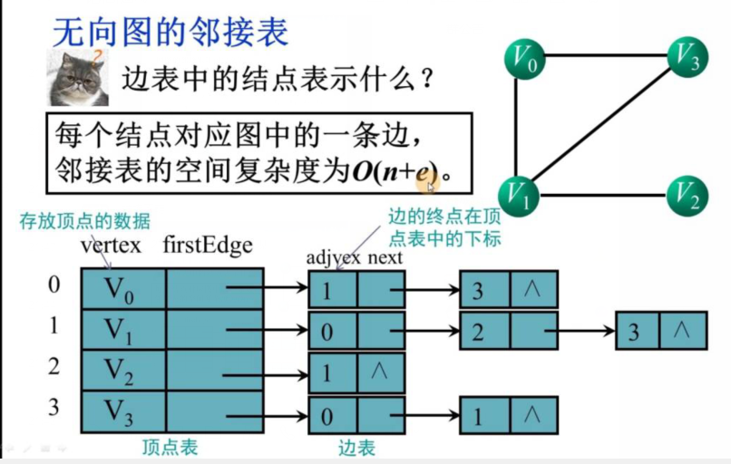

    ```go
    意思 ：比如下标为 1 的
    	V1 有三个相邻结点 ，数组中下标为{0,2,3} V0 V2 v3
    1. 求 Vi 的度
    	V1 边表中节点的个数就是
    2. 判断顶点 i j 是否有边
    	看顶点 i 的边表中是否有顶点 j 的结点
    ```

*   有向图

    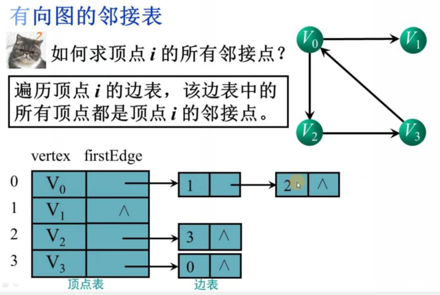

    ```go
    1. 求顶点 i 的出度
    	看顶点 i 的边表的结点个数
    2. 求顶点 i 的入度
    	从头开始，一行一行找，
    	看有以顶点 i 为终点的结点个数
    3. 顶点 i 的邻接点
    	注意方向
    
    // 图最大顶点树
    var max_vertex int = 10
    
    // 利用顶点表 的元素的 next 元素，可以找到边表
    type ALGraph struct{
        adjList		[max_vertex]VertexNode	  // 顶点表
        arcNum 		int						// 边个数个数
        vertexNum	int						// 顶点个数
    }
    
    //构造函数
    func (a AlGraph) InitAlgraph(v []datatype,n , e int) {
        a.vertexNum = n
        a.arcNum = e
        for i:=0; i<m.vertexNum; i++ {
            // 输入顶点信息，初始化顶点表
            m.adjList[i].vertex = v[i]
            m.adjList[i].firstedge= nil
        }
        for i:=0; i<arcNum; i++ {
            // 输入边的信息存储在边表中
            cin >> vi >> vj; 输入边依附的两个顶点的编号
            s=newArcNode;
            s->adjvex = vj
            s->next = adjlist[vi].firstEdge
            adjList[vi].firstEdge =s
        }
    }
    ```

*   网图的邻接表

    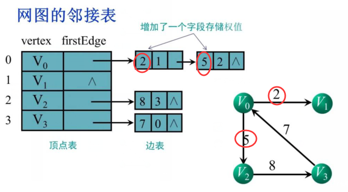

*    实现方式

     *   给图中的各个顶点独自建立一个链表，用节点存储该顶点，用链表中其他节点存储各自的临界点。 
     *   对于具有 n 个顶点和 e 条边的无向图，邻接表中需要存储 n 个头结点和 2e 个表结点。 
     *   在图中边或者弧稀疏的时候，使用邻接表要比前一节介绍的邻接矩阵更加节省空间。 
     
*   顶点

    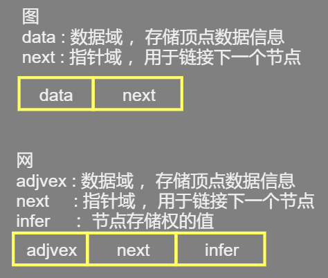

*   demo

    ```go
    #define  MAX_VERTEX_NUM 20//最大顶点个数
    #define  VertexType int//顶点数据的类型
    #define  InfoType int//图中弧或者边包含的信息的类型
    typedef struct ArcNode{
        int adjvex;//邻接点在数组中的位置下标
        struct ArcNode * nextarc;//指向下一个邻接点的指针
        InfoType * info;//信息域
    }ArcNode;
    typedef struct VNode{
        VertexType data;//顶点的数据域
        ArcNode * firstarc;//指向邻接点的指针
    }VNode,AdjList[MAX_VERTEX_NUM];//存储各链表头结点的数组
    typedef struct {
        AdjList vertices;//图中顶点的数组
        int vexnum,arcnum;//记录图中顶点数和边或弧数
        int kind;//记录图的种类
    }ALGraph;
    ```

*   邻接表计算顶点的出度和入度

    *    无向图中

         *   只需从数组中找到该顶点然后统计此链表中节点的数量即可 

    *    有向图 

         *    常各个顶点的链表中存储的都是以该顶点为弧尾的邻接点，因此通过统计各顶点链表中的节点数量，只能计算出该顶点的出度，
         *    而无法计算该顶点的入度。 

    *   求法

        *   遍历整个邻接表中的节点，统计数据域与该顶点所在数组位置下标相同的节点数量，即为该顶点的入度；

        *   建立一个逆邻接表，该表中的各顶点链表专门用于存储以此顶点为弧头的所有顶点在数组中的位置下标。

            *    建立一张对应的逆邻接表 

            

#### 2.邻接多重表 - 五香

*   适用

    *    仅适用于存储无向图或无向网 

*    存储无向图 

     *    可看作是邻接表和十字链表的结合 
     *    独自为图中各顶点建立一张链表，存储各顶点的节点作为各链表的首元节点，同时为了便于管理将各个首元节点存储到一个数组中 

*   各首元结点

    

    *   data : 存储此顶点的数据
    *   firstedge : 指针域， 用于指向同该顶点有直接关联的存储其他顶点的节点。

 *   其他结点

     *    与十字链表中相同 

          

     *    mark：标志域，用于标记此节点是否被操作过，

          *    例如在对图中顶点做遍历操作时，为了防止多次操作同一节点，
          *    mark 域为 0 表示还未被遍历；
          *    mark 为 1 表示该节点已被遍历；

     *    ivex 和 jvex：数据域，分别存储图中各边两端的顶点所在数组中的位置下标；

     *    ilink：指针域，指向下一个存储与 ivex 有直接关联顶点的节点；

     *    jlink：指针域，指向下一个存储与 jvex 有直接关联顶点的节点；

     *    info：指针域，用于存储与该顶点有关的其他信息，比如无向网中各边的权；

     

*   demo

    ```go
        #define MAX_VERTEX_NUM 20                   //图中顶点的最大个数
        #define InfoType int                        //边含有的信息域的数据类型
        #define VertexType int                      //图顶点的数据类型
        typedef enum {unvisited,visited}VisitIf;    //边标志域
        typedef struct EBox{
            VisitIf mark;                           //标志域
            int ivex,jvex;                          //边两边顶点在数组中的位置下标
            struct EBox * ilink,*jlink;             //分别指向与ivex、jvex相关的下一个边
            InfoType *info;                         //边包含的其它的信息域的指针
        }EBox;
        typedef struct VexBox{
            VertexType data;                        //顶点数据域
            EBox * firstedge;                       //顶点相关的第一条边的指针域
        }VexBox;
        typedef struct {
            VexBox adjmulist[MAX_VERTEX_NUM];//存储图中顶点的数组
            int vexnum,degenum;//记录途中顶点个数和边个数的变量
        }AMLGraph;
    ```

    


#### 3.十字链表 - 有向 

*   适用

    *    仅适用于存储有向图和有向网 
    *    改善了邻接表计算图中顶点入度的问题 

*   图

    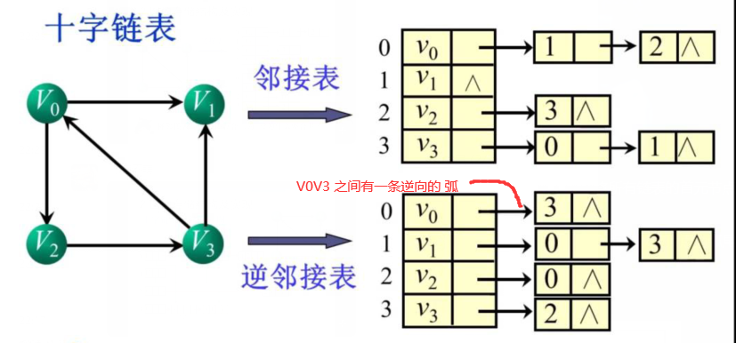

    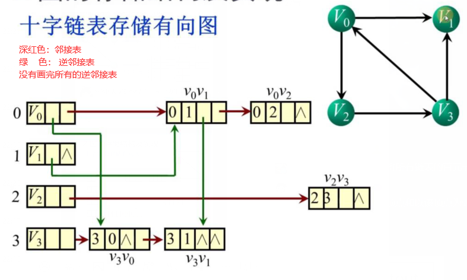

*   原理

    *    以图（网）中各顶点为首元节点建立多条链表，同时为了便于管理，还将所有链表的首元节点存储到同一数组（或链表）中。
    *    实质上就是为每个顶点建立两个链表，分别存储以该顶点为弧头的所有顶点和以该顶点为弧尾的所有顶点。  

*   首元结点

    *    各个链表中用于存储顶点的首元节点结构 

         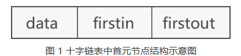

    *   data :  存储该顶点中的数据 

    *   firstin :  针用于连接以当前顶点为弧头的其他顶点构成的链表 

    *   firstout :  指针用于连接以当前顶点为弧尾的其他顶点构成的链表 


*   其他结点

    

    *    tailvex 		用于存储以首元节点为弧尾的顶点位于数组中的位置下标；

    *    headvex      用于存储以首元节点为弧头的顶点位于数组中的位置下标；

    *    hlink 指针： 用于链接下一个存储以首元节点为弧头的顶点的节点；

    *    tlink 指针：  用于链接下一个存储以首元节点为弧尾的顶点的节点；

    *    info 指针：   用于存储与该顶点相关的信息，例如量顶点之间的权值；

         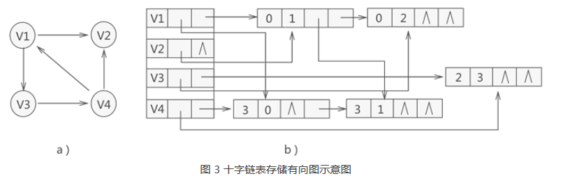


### 3.存储方式比较

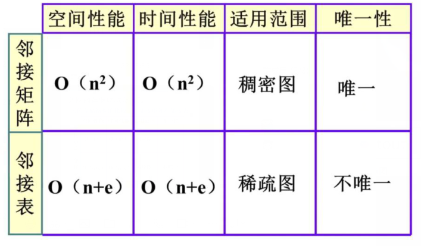

## 5.遍历方式

*   从某一顶点触发，对图中所有顶点访问一次且仅访问一次

*   问题

    ```go
    1. 图中存在回路，某偶写顶点会被重复访问，避免遍历不会因为回路而陷入死循环
    	附设标志数组visited[n]
    2. 顶点访问过后，如何选取下一个要访问的顶点
    	深度遍历优先 、 广度遍历优先
    3.
    ```

    

### 1. 深度优先搜索

*   别称
    *   深搜 ， DFS
    *   优先深入处理其中一个分支，该分支处理完全，返回 ，才处理其他的
    
*   介绍
    
    ```go
    1. 访问顶点 v
    2. 从 v 为被访问的邻接点中选取一个顶点 w , 从 w 出发进行深度优先遍历
    	可以优先从标号小的开始遍历
    3. 重复以上两步，直到所有和 v 有路径形相同的顶点都被访问到
    
    // 就相当把没有没有深入完全的结点，存储起来，
    // 某种条件 ：
    	造成递归的深入，触发当前现场的入栈（当前现场只执行一个方向,剩余的方向未执行）
    // 一直到固定方向的底层
    	遍历经过的标记
    	底层的所有分支执行完全，触发出栈（继续执行没有执行的方向）
    
    ```
    
*   实例

    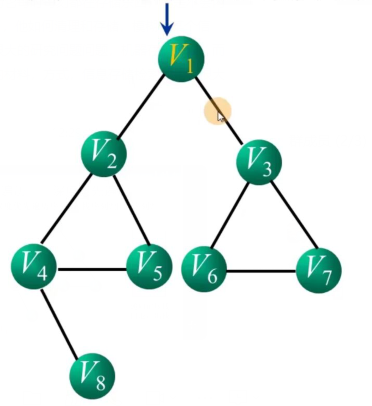

    ```go
    // 初始化指针指向 第一个结点
    访问的时候就输出结果
    
    访问 v1 
    	v1 输出， 设置访问过的标志 visited=1 
    	深入：访问其分支(有分支 v2 v3，访问小的，即v2) 指针指向 v2
    	v1 压栈保存现场，进行深入。栈{v1}
    
    访问 v2
    	v2 输出， 设置访问过的标志 visited=1 
    	深入：访问其分支(v1 v4 v5 ,访问小的且未访问的，v4)  指针指向 v4
    	v2 压栈保存现场，进行深入。栈{v1,v2}
    访问 v4
    	v4 输出， 设置访问过的标志 visited=1 
    	深入 ：访问其分支(v2 v5 v8 ,访问小的且未访问的，v5)
    	v4 压栈保存现场，进行深入。栈{v1,v2,v4}
    访问 v5
    	v5 输出， 设置访问过的标志 visited=1 
    	深入 ： 访问其分支(v2 v4)，但是两者都访问过，所有深入失败
    	失败 ： v4 出栈，还原现场，指针退回 v4 这个顶点  栈{v1,v2}
    // 就相当把没有没有深入完全的结点，存储起来，
    // 一旦某个方向分支深入完全了，触发出栈条件，然后就出栈没有深入完全的结点
    
    // 指向 v4  , 进行深入 ，访问其分支（v2,v5,v8,访问小的且没有访问过的，v8）指针指向 v8
    访问 v8
    	v8 输出， 设置访问过的标志 visited=1 
    	深入 ： 访问其分支(v4)，但是访问过，所以深入失败
    	失败 ： v2 出栈，还原现场，指针退回 v2 这个顶点  栈{v1}
    // 指向 v2  , 进行深入 ，访问其分支（v1,v4,v5,均已经访问过，深入失败，进行出栈 v1）指针指向 v1
    // 指向 v1  , 进行深入 ，访问其分支（v2,v3,访问小的且没有访问过的，v3）指针指向 v3
    	// v1 压栈保存现场，进行深入。栈{v1}
    指向 v3
    	v3 输出， 设置访问过的标志 visited=1 
    	深入 ： 访问其分支(v6,v7访问小的且没有访问过的，v6）指针指向 v6
    	v3 压栈保存现场，进行深入。栈{v1,v3}
    指向 v6
         v6 输出， 设置访问过的标志 visited=1 
    	深入 ： 访问其分支(v3,v7访问小的且没有访问过的，v7）指针指向 v7
    	v6 压栈保存现场，进行深入。栈{v1,v3,v6}
                   
    指向 v7
         v7 输出， 设置访问过的标志 visited=1 
    	深入 ： 访问其分支(v3,v6 均已经访问过，深入失败，进行出栈 v6）指针指向 v6
     
    // 指向 v6  , 进行深入 ，访问其分支（v3,v7,均已经访问过，深入失败，进行出栈 v3）指针指向 v3 
    // 指向 v3  , 进行深入 ，访问其分支（v1,v6,v7,均已经访问过，深入失败，进行出栈 v1）指针指向 v1
    // 指向 v1  , 进行深入 ，访问其分支（v2,v3,均已经访问过，深入失败，进行出栈,此时栈为空，遍历结束
                   
    ```

    

*   伪代码

    ```go
    1. 访问顶点 v ; visited[v] = 1
    2. w = 顶点 v 的未曾访问过的最小邻接点 // 条件
    3. while ( w 存在){
        if ( w 未被访问 ){
            从顶点 w 出发递归执行该算法
        } else {
            w = 顶点 v 的下一个邻接点
        }
     
    // 邻接矩阵的深度优先遍历
        func (m *MGraph) DFSTraverse(v int) {
            ...//初始化 visited 数组为 0 
            count << vertex[v] // 输出访问过的顶点信息
            visited[v] =1
            for (w=...) { // 所有顶点扫描一遍
                ...// 乳沟存在边，且没有访问过，则递归调用此函数
            }
        }
        
     // 邻接表的深度优先遍历
        func (a *ALGraph) DFSTraverse(int v) {
            ...// 初始化 visited 数组为 0
            count << adjList[v].vertex // 输出访问过的顶点信息
            visited[v] = 1
            // 工作指针 p 指向顶点 v 的边边表
            // 用工作指针 p 依次搜索顶点 v 的邻接点，如果没有被访问过，则递归调用此函数
        }
    ```

    

    *    从图中的一个顶点出发，每次遍历当前访问顶点的临界点，一直到访问的顶点没有未被访问过的临界点为止。然后采用依次回退的方式，查看来的路上每一个顶点是否有其它未被访问的临界点。访问完成后，判断图中的顶点是否已经全部遍历完成，如果没有，以未访问的顶点为起始点，重复上述过程。 
    *    类似于树的先序遍历，首先从例子中体会深度优先搜索 

*   实质
    
    *    一个不断回溯的过程 


### 2. 广度优先搜索

*   思路

    ```go
    // 结点的多个分支通水入队
    想当把子结点的孩子处理延迟到出栈的时候去处理 
    ```

    

*   实例

    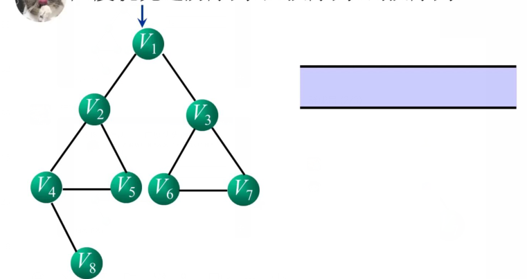

    ```go
    // 指针指向第一个顶点（相当于根节点）,最好使用循环队列
    
    // 初始化
    访问 v1
    	输出 v1 :{v1}  访问过的标记 v1.visited = 1
        V1 进入队列 [v1]
    
    // 循环
    对首元素出队 ,变量指向 出队元素 v1 :[]
    	访问出队元素 v1 的邻接顶点 v2 , v3
    	先访问 v2 
    		输出 v2 :{v1,v2} 访问过的标记 v2.visited = 1
            v2 放入队列 [v2]
    	在访问 v3
    		输出 v3 :{v1,v2,v3} 访问过的标记 v3.visited = 1
            v3 放入队列	[v2,v3]	
    
    队首元素出队 ， 变量指向出队元素 v2:[v3]
    	访问出队元素 v2 的邻接顶点 v1 , v4 , v5
    	访问 v1
    		已经访问过了，不再访问
    	先访问 v4
    		输出 v4 :{v1,v2，v3,v4} 访问过的标记 v4.visited = 1
             v4 放入队列 [v3,v4]
    	在访问 v5
    		输出 v5 :{v1,v2，v3,v4,v5} 访问过的标记 v5.visited = 1
            v5 放入队列	[v3,v4,v5]	
    	出队的元素的邻接点访问完毕
    
    队首元素出队 ， 变量指向出队元素 v3 :[v4,v5]
    	访问出队元素 v3 的邻接顶点 v1 , v6 , v7
    	访问 v1
    		已经访问过了，不再访问
    	先访问 v6
    		输出 v6 :{v1,v2，v3,v4,v5,v6} 问过的标记 v6.visited = 1
             v6 放入队列 [v4,v5,v6]
    	在访问 v7
    		输出 v7 :{v1,v2，v3,v4,v5,v6,v7} 访问过的标记 v7.visited = 1
            v7 放入队列	[v4,v5,v6,v7]	
    	出队的元素的邻接点访问完毕
    
    队首元素出单队 ，便令指向出队元素 v4 :[v5,v6,v7]
    	访问出队元素 v4 的邻接顶点 v2 , v5 , v8
        访问 v2  : 已经访问过了，不再访问
        访问 v5  : 已经访问过了，不再访问
    	访问 v8
    		输出 v7 :{v1,v2，v3,v4,v5,v6,v7,v8} 访问过的标记 v8.visited = 1
            v8 放入队列	[v5,v6,v7,v8]	
    	出队的元素的邻接点访问完毕
    
    队首元素出单队 ，便令指向出队元素 v5 :[v6,v7,v8]
    	访问出队元素 v5 的邻接顶点 v2 , v4
        访问 v2  : 已经访问过了，不再访问
        访问 v4 : 已经访问过了，不再访问
    
    队首元素出单队 ，便令指向出队元素 v6 :[v7,v8]
    	访问出队元素 v6 的邻接顶点 v3 , v7
        访问 v3  : 已经访问过了，不再访问
        访问 v7 : 已经访问过了，不再访问
    
    队首元素出单队 ，便令指向出队元素 v7 :[v8]
    	访问出队元素 v7的邻接顶点 v3 , v6
        访问 v3  : 已经访问过了，不再访问
        访问 v6 : 已经访问过了，不再访问
    
    队首元素出单队 ，便令指向出队元素 v8 :[]
    	访问出队元素 v8 的邻接顶点 v4
        访问 v4  : 已经访问过了，不再访问
    
    整个队列已经空了，没法进行出栈操作，所有真个遍历过程结束
    输出 {v1,v2，v3,v4,v5,v6,v7,v8}
    ```

*   伪代码

    ```go 
    初始化队列 Q
    访问顶点 V 。v.visited = 1 ,顶点 v 入队列 Q
    while (队列 Q 非空) {
    	v = 队列Q的队头元素出队
    	w = 顶点 v 的第一个邻接点
    	whie ( w 存在 ) {
    		if ( w未被访问 ) {
    			访问顶点 w
    			w.visited = 1
    			顶点 w 进入队列 Q
    		} else if (w 被访问) {
    			w = 顶点 v 的下一个邻接点
    		}
    	}
    }
    
    // 邻接矩阵的广度优先遍历
    func (m *MGrap) BFSTraverse( n int ) {
        ... // 初始化 visited 数组，定义队列数组 Q
        count << vertex[v]    // 输出访问过的顶点信息
        visited[v] = 1
        ... // 顶点 v 入队列 Q
        for (w:=0;w<vertexNumlw++) {
            if (arc[v][w] == 1 && visited[w] == 0 ) {
                count << vertex[w]
                visited[w] = 1
                ... // 将 w 入队列 Q
            }
        }
    }
    
    // 邻接表的广度优先遍历
    func (a *ALGraph) BFSTraverse(n int) {
        ... // 初始化 visited 数组，定义队列数组 Q
        count << vertex[v]    // 输出访问过的顶点信息
        visited[v] = 1
        ... // 顶点 v 入队列 Q    
        
        while (队列非空) {
            ... // 队头元素出队，存入 v 中
            p = adjList[v].firstEdge
            while(p) {
                ... // 如果 v  未被访问，则访问顶点 w visited[w] = 1 ,顶点 w 入队列 Q
                ... // p 指向顶点 v 的下一个邻接点
            }
        }
    }
    ```

    

    


 