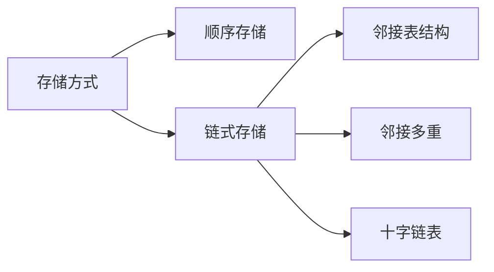
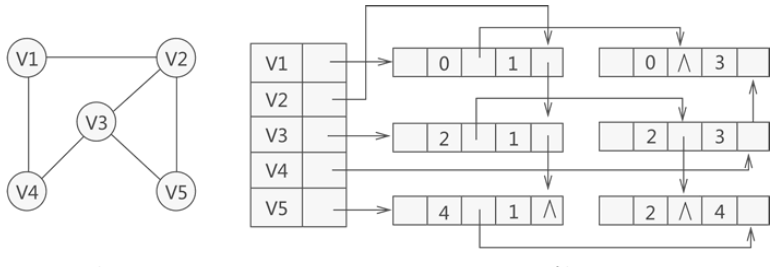

##  4.存储方式




### 1.顺序存储结构

#### 邻接矩阵

##### 无向图邻接矩阵


*   结构体

```go
vertext  顶点
// 图存储的最大顶点数
var max_vertex int = 10
type MGraph struct {
    
    vertex []int                      // 一维数组
    arc [max_vertex][max_vertex]int   // 二维数组
    vertexNum int					// 实际顶点个数
    arcNum int						// 边的个数
    
}
```

*   构造函数

```go
// 思路

1. 确定图中顶点的个数和边的个数
2. 输入顶点信息存储在一维数组 vertex 中
3. 初始化邻接矩阵 arc
4. 依次输出每条边存储在邻接矩阵 arc 中
	4.1 输边依附的两个顶点序号 i , j
	4.2 邻接矩阵的第 i 行 ， 第 j 列的元素设置为 1 
	4.3 邻接矩阵的第 j 行 ， 第 i 列的元素设置为 1

func MGraph( v []Datatype , n int , e int) {
    
    // 实际顶点个数
    vertexNum = n
    // 边的个数
    arc = e
    // 顶点值，存入一维数组
    for i:= 0; i<vertexNum; i++ {
        vertex[i] = v[i]
    }
    
    // 初始化二维数组
    // var Arc arc  初始化就是默认值，二维数组就是 0 值
    for i:=0; i<vertexNum; i++ {
        for i:=0; i<vertexNum; i++{
            arc[i][j] = 0
        }
    }
    
    // 二维数组存值
    for i:=0; i<arcNum; i++ {  // 遍历每一条边
        cin >> vi >> vj  // 输入边依附的两个顶点的编号,最好自己设置个函数，进行输入
        arc[vi][vj] = 1
        arc[vj][vi] = 1
    }
    
}
```


##### 有向图邻接矩阵


```go

```

##### 网图的邻接矩阵


    *   demo
    
        ```go
            #include <stdio.h>
            #define MAX_VERtEX_NUM 20                   //顶点的最大个数
            #define VRType int                          //表示顶点之间的关系的变量类型
            #define InfoType char                       //存储弧或者边额外信息的指针变量类型
            #define VertexType int                      //图中顶点的数据类型
            typedef enum{DG,DN,UDG,UDN}GraphKind;       //枚举图的 4 种类型
            typedef struct {
                VRType adj;                             //对于无权图，用 1 或 0 表示是否相邻；对于带权图，直接为权值。
                InfoType * info;                        //弧或边额外含有的信息指针
            }ArcCell,AdjMatrix[MAX_VERtEX_NUM][MAX_VERtEX_NUM];
            typedef struct {
                VertexType vexs[MAX_VERtEX_NUM];        //存储图中顶点数据
                AdjMatrix arcs;                         //二维数组，记录顶点之间的关系
                int vexnum,arcnum;                      //记录图的顶点数和弧（边）数
                GraphKind kind;                         //记录图的种类
            }MGraph;
            //根据顶点本身数据，判断出顶点在二维数组中的位置
            int LocateVex(MGraph * G,VertexType v){
                int i=0;
                //遍历一维数组，找到变量v
                for (; i<G->vexnum; i++) {
                    if (G->vexs[i]==v) {
                        break;
                    }
                }
                //如果找不到，输出提示语句，返回-1
                if (i>G->vexnum) {
                    printf("no such vertex.\n");
                    return -1;
                }
                return i;
            }
            //构造有向图
            void CreateDG(MGraph *G){
                //输入图含有的顶点数和弧的个数
                scanf("%d,%d",&(G->vexnum),&(G->arcnum));
                //依次输入顶点本身的数据
                for (int i=0; i<G->vexnum; i++) {
                    scanf("%d",&(G->vexs[i]));
                }
                //初始化二维矩阵，全部归0，指针指向NULL
                for (int i=0; i<G->vexnum; i++) {
                    for (int j=0; j<G->vexnum; j++) {
                        G->arcs[i][j].adj=0;
                        G->arcs[i][j].info=NULL;
                    }
                }
                //在二维数组中添加弧的数据
                for (int i=0; i<G->arcnum; i++) {
                    int v1,v2;
                    //输入弧头和弧尾
                    scanf("%d,%d",&v1,&v2);
                    //确定顶点位置
                    int n=LocateVex(G, v1);
                    int m=LocateVex(G, v2);
                    //排除错误数据
                    if (m==-1 ||n==-1) {
                        printf("no this vertex\n");
                        return;
                    }
                    //将正确的弧的数据加入二维数组
                    G->arcs[n][m].adj=1;
                }
            }
            //构造无向图
            void CreateDN(MGraph *G){
                scanf("%d,%d",&(G->vexnum),&(G->arcnum));
                for (int i=0; i<G->vexnum; i++) {
                    scanf("%d",&(G->vexs[i]));
                }
                for (int i=0; i<G->vexnum; i++) {
                    for (int j=0; j<G->vexnum; j++) {
                        G->arcs[i][j].adj=0;
                        G->arcs[i][j].info=NULL;
                    }
                }
                for (int i=0; i<G->arcnum; i++) {
                    int v1,v2;
                    scanf("%d,%d",&v1,&v2);
                    int n=LocateVex(G, v1);
                    int m=LocateVex(G, v2);
                    if (m==-1 ||n==-1) {
                        printf("no this vertex\n");
                        return;
                    }
                    G->arcs[n][m].adj=1;
                    G->arcs[m][n].adj=1;//无向图的二阶矩阵沿主对角线对称
                }
            }
            //构造有向网，和有向图不同的是二阶矩阵中存储的是权值。
            void CreateUDG(MGraph *G){
                scanf("%d,%d",&(G->vexnum),&(G->arcnum));
                for (int i=0; i<G->vexnum; i++) {
                    scanf("%d",&(G->vexs[i]));
                }
                for (int i=0; i<G->vexnum; i++) {
                    for (int j=0; j<G->vexnum; j++) {
                        G->arcs[i][j].adj=0;
                        G->arcs[i][j].info=NULL;
                    }
                }
                for (int i=0; i<G->arcnum; i++) {
                    int v1,v2,w;
                    scanf("%d,%d,%d",&v1,&v2,&w);
                    int n=LocateVex(G, v1);
                    int m=LocateVex(G, v2);
                    if (m==-1 ||n==-1) {
                        printf("no this vertex\n");
                        return;
                    }
                    G->arcs[n][m].adj=w;
                }
            }
            //构造无向网。和无向图唯一的区别就是二阶矩阵中存储的是权值
            void CreateUDN(MGraph* G){
                scanf("%d,%d",&(G->vexnum),&(G->arcnum));
                for (int i=0; i<G->vexnum; i++) {
                    scanf("%d",&(G->vexs[i]));
                }
                for (int i=0; i<G->vexnum; i++) {
                    for (int j=0; j<G->vexnum; j++) {
                        G->arcs[i][j].adj=0;
                        G->arcs[i][j].info=NULL;
                    }
                }
                for (int i=0; i<G->arcnum; i++) {
                    int v1,v2,w;
                    scanf("%d,%d,%d",&v1,&v2,&w);
                    int m=LocateVex(G, v1);
                    int n=LocateVex(G, v2);
                    if (m==-1 ||n==-1) {
                        printf("no this vertex\n");
                        return;
                    }
                    G->arcs[n][m].adj=w;
                    G->arcs[m][n].adj=w;//矩阵对称
                }
            }
            void CreateGraph(MGraph *G){
                //选择图的类型
                scanf("%d",&(G->kind));
                //根据所选类型，调用不同的函数实现构造图的功能
                switch (G->kind) {
                    case DG:
                        return CreateDG(G);
                        break;
                    case DN:
                        return CreateDN(G);
                        break;
                    case UDG:
                        return CreateUDG(G);
                        break;
                    case UDN:
                        return CreateUDN(G);
                        break;
                    default:
                        break;
                }
            }
            //输出函数
            void PrintGrapth(MGraph G)
            {
                for (int i = 0; i < G.vexnum; i++)
                {
                    for (int j = 0; j < G.vexnum; j++)
                    {
                        printf("%d ", G.arcs[i][j].adj);
                    }
                    printf("\n");
                }
            }
            int main() {
                MGraph G;//建立一个图的变量
                CreateGraph(&G);//调用创建函数，传入地址参数
                PrintGrapth(G);//输出图的二阶矩阵
                return 0;
            }
        ```

​        


### 2.链式存储结构

#### 1.邻接表 

*   使用

    *   有向图和无向图

*    邻接

     *   指的是图中顶点之间有边或者弧的存在 

*    邻接点 

     *    在图中，如果两个点相互连通，即通过其中一个顶点，可直接找到另一个顶点，则称它们互为邻接点 

*    实现方式

     *   给图中的各个顶点独自建立一个链表，用节点存储该顶点，用链表中其他节点存储各自的临界点。 
     *   对于具有 n 个顶点和 e 条边的无向图，邻接表中需要存储 n 个头结点和 2e 个表结点。 
     *   在图中边或者弧稀疏的时候，使用邻接表要比前一节介绍的邻接矩阵更加节省空间。 
     *   

*   顶点

    

*   demo

    ```go
    #define  MAX_VERTEX_NUM 20//最大顶点个数
    #define  VertexType int//顶点数据的类型
    #define  InfoType int//图中弧或者边包含的信息的类型
    typedef struct ArcNode{
        int adjvex;//邻接点在数组中的位置下标
        struct ArcNode * nextarc;//指向下一个邻接点的指针
        InfoType * info;//信息域
    }ArcNode;
    typedef struct VNode{
        VertexType data;//顶点的数据域
        ArcNode * firstarc;//指向邻接点的指针
    }VNode,AdjList[MAX_VERTEX_NUM];//存储各链表头结点的数组
    typedef struct {
        AdjList vertices;//图中顶点的数组
        int vexnum,arcnum;//记录图中顶点数和边或弧数
        int kind;//记录图的种类
    }ALGraph;
    ```

*   邻接表计算顶点的出度和入度

    *    无向图中

         *   只需从数组中找到该顶点然后统计此链表中节点的数量即可 

    *    有向图 

         *    常各个顶点的链表中存储的都是以该顶点为弧尾的邻接点，因此通过统计各顶点链表中的节点数量，只能计算出该顶点的出度，
         *    而无法计算该顶点的入度。 

    *   求法

        *   遍历整个邻接表中的节点，统计数据域与该顶点所在数组位置下标相同的节点数量，即为该顶点的入度；

        *   建立一个逆邻接表，该表中的各顶点链表专门用于存储以此顶点为弧头的所有顶点在数组中的位置下标。

            *    建立一张对应的逆邻接表 

            

#### 2.邻接多重表

*   适用

    *    仅适用于存储无向图或无向网 

*    存储无向图 

     *    可看作是邻接表和十字链表的结合 
     *    独自为图中各顶点建立一张链表，存储各顶点的节点作为各链表的首元节点，同时为了便于管理将各个首元节点存储到一个数组中 

*   各首元结点

    

    *   data : 存储此顶点的数据
    *   firstedge : 指针域， 用于指向同该顶点有直接关联的存储其他顶点的节点。

 *   其他结点

     *    与十字链表中相同 

          

     *    mark：标志域，用于标记此节点是否被操作过，

          *    例如在对图中顶点做遍历操作时，为了防止多次操作同一节点，
          *    mark 域为 0 表示还未被遍历；
          *    mark 为 1 表示该节点已被遍历；

     *    ivex 和 jvex：数据域，分别存储图中各边两端的顶点所在数组中的位置下标；

     *    ilink：指针域，指向下一个存储与 ivex 有直接关联顶点的节点；

     *    jlink：指针域，指向下一个存储与 jvex 有直接关联顶点的节点；

     *    info：指针域，用于存储与该顶点有关的其他信息，比如无向网中各边的权；

     

*   demo

    ```go
        #define MAX_VERTEX_NUM 20                   //图中顶点的最大个数
        #define InfoType int                        //边含有的信息域的数据类型
        #define VertexType int                      //图顶点的数据类型
        typedef enum {unvisited,visited}VisitIf;    //边标志域
        typedef struct EBox{
            VisitIf mark;                           //标志域
            int ivex,jvex;                          //边两边顶点在数组中的位置下标
            struct EBox * ilink,*jlink;             //分别指向与ivex、jvex相关的下一个边
            InfoType *info;                         //边包含的其它的信息域的指针
        }EBox;
        typedef struct VexBox{
            VertexType data;                        //顶点数据域
            EBox * firstedge;                       //顶点相关的第一条边的指针域
        }VexBox;
        typedef struct {
            VexBox adjmulist[MAX_VERTEX_NUM];//存储图中顶点的数组
            int vexnum,degenum;//记录途中顶点个数和边个数的变量
        }AMLGraph;
    ```

    


#### 3.十字链表 

*   适用

    *    仅适用于存储有向图和有向网 
    *    改善了邻接表计算图中顶点入度的问题 

*   原理

    *    以图（网）中各顶点为首元节点建立多条链表，同时为了便于管理，还将所有链表的首元节点存储到同一数组（或链表）中。
    *    实质上就是为每个顶点建立两个链表，分别存储以该顶点为弧头的所有顶点和以该顶点为弧尾的所有顶点。  

*   首元结点

    *    各个链表中用于存储顶点的首元节点结构 

         

    *   data :  存储该顶点中的数据 

    *   firstin :  针用于连接以当前顶点为弧头的其他顶点构成的链表 

    *   firstout :  指针用于连接以当前顶点为弧尾的其他顶点构成的链表 


*   其他结点

    

    *    tailvex 		用于存储以首元节点为弧尾的顶点位于数组中的位置下标；

    *    headvex      用于存储以首元节点为弧头的顶点位于数组中的位置下标；

    *    hlink 指针： 用于链接下一个存储以首元节点为弧头的顶点的节点；

    *    tlink 指针：  用于链接下一个存储以首元节点为弧尾的顶点的节点；

    *    info 指针：   用于存储与该顶点相关的信息，例如量顶点之间的权值；

         

    *   demo

        ```go
            #define  MAX_VERTEX_NUM 20
            #define  InfoType int//图中弧包含信息的数据类型
            #define  VertexType int
            typedef struct ArcBox{
                int tailvex,headvex;//弧尾、弧头对应顶点在数组中的位置下标
                struct ArcBox *hlik,*tlink;//分别指向弧头相同和弧尾相同的下一个弧
                InfoType *info;//存储弧相关信息的指针
            }ArcBox;
            typedef struct VexNode{
                VertexType data;//顶点的数据域
                ArcBox *firstin,*firstout;//指向以该顶点为弧头和弧尾的链表首个结点
            }VexNode;
            typedef struct {
                VexNode xlist[MAX_VERTEX_NUM];//存储顶点的一维数组
                int vexnum,arcnum;//记录图的顶点数和弧数
            }OLGraph;
            int LocateVex(OLGraph * G,VertexType v){
                int i=0;
                //遍历一维数组，找到变量v
                for (; i<G->vexnum; i++) {
                    if (G->xlist[i].data==v) {
                        break;
                    }
                }
                //如果找不到，输出提示语句，返回 -1
                if (i>G->vexnum) {
                    printf("no such vertex.\n");
                    return -1;
                }
                return i;
            }
            //构建十字链表函数
            void CreateDG(OLGraph *G){
                //输入有向图的顶点数和弧数
                scanf("%d,%d",&(G->vexnum),&(G->arcnum));
                //使用一维数组存储顶点数据，初始化指针域为NULL
                for (int i=0; i<G->vexnum; i++) {
                    scanf("%d",&(G->xlist[i].data));
                    G->xlist[i].firstin=NULL;
                    G->xlist[i].firstout=NULL;
                }
                //构建十字链表
                for (int k=0;k<G->arcnum; k++) {
                    int v1,v2;
                    scanf("%d,%d",&v1,&v2);
                    //确定v1、v2在数组中的位置下标
                    int i=LocateVex(G, v1);
                    int j=LocateVex(G, v2);
                    //建立弧的结点
                    ArcBox * p=(ArcBox*)malloc(sizeof(ArcBox));
                    p->tailvex=i;
                    p->headvex=j;
                    //采用头插法插入新的p结点
                    p->hlik=G->xlist[j].firstin;
                    p->tlink=G->xlist[i].firstout;
                    G->xlist[j].firstin=G->xlist[i].firstout=p;
                }
            }
        ```


## 5.遍历方式

### 1. 深度优先搜索

*   别称
    *   深搜
    *   DFS
*   介绍
    *    从图中的一个顶点出发，每次遍历当前访问顶点的临界点，一直到访问的顶点没有未被访问过的临界点为止。然后采用依次回退的方式，查看来的路上每一个顶点是否有其它未被访问的临界点。访问完成后，判断图中的顶点是否已经全部遍历完成，如果没有，以未访问的顶点为起始点，重复上述过程。 
    *    类似于树的先序遍历，首先从例子中体会深度优先搜索 
*   实质
    *    一个不断回溯

### 2. 广度优先搜索


## demo

```go
type MNode struct {
    data 	    interface{} 	// 顶点数据
    isVisited 	bool			// 是否被访问过
}
type MMap struct {
    capacity	int		// 容量
    vertexCount	int		 // 已添加的顶点数
    vertexArry	[]MNode  // 一维数组
    arcNum		[][]int  // 二维数组
    
}

// 初始化一个图
func MakeMap(size int) MMap {
    var m MMap
    m.Capacity = size
    m.vertexArry = make([]MNode,size)
    m.arcNum = make([][]int,size)
}

// 添加节点
func (m *MMap) AddNode(node MNode) bool {
    m.vertexArry[t.vertexCount].data = node.data
    t.vertexCount++
    return ture
}

// 重置节点装填为未访问
func (m *MMap) ResetNode() {
    for i:=t.nodeCount-1; i>=0; i-- {
        t.vertexArray[i].isVisited = false
    }
}

// 为有向图设置邻接矩阵

func (m *MMap) SetValueGraph(row,col,val int) bool {
    if row <0 ||row >= m.Capacity || col < 0 || col > m.Capacity {
        return false
    }
    // 这个需要改进
    t.matrix[row * m.Capacity+col] = val
    t.matrix[row * m.Capacity+Col] = val
}

 https://www.imooc.com/article/20595

```


