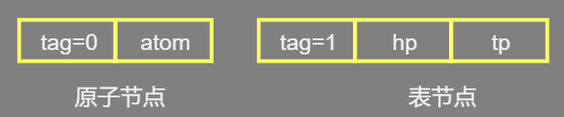
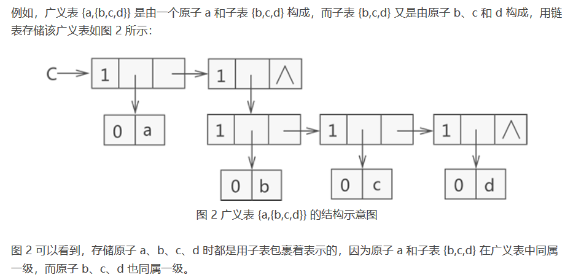
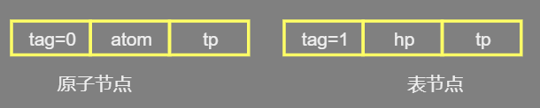
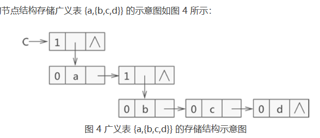
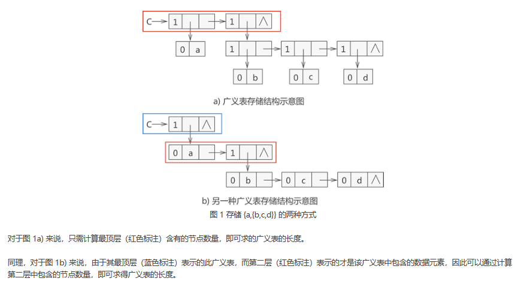

## 介绍

*     列表，
*     一种线性存储结构
*     存储不可再分的元素，也可以存储广义表， 
*     数组不适合用来存储类似 {1,{1,2,3}}  , 使用  二维数组来存储 ，  在存储上确实可以实现，但无疑会造成存储空间的浪费。 

## 相关术语

*   广义表

    ```go
    LS = (a1,a2,…,an)
    LS 代表广义表的名称，
    an 表示广义表存储的数据
    每个 ai 既可以代表单个元素，也可以代表另一个广义表。
    ```

*   原子

    *    广义表中存储的单个元素 

*   子表

    *    存储的广义表 

*   表头

    *    第一个数据（原子或子表） 

*   表尾

    *    剩下的数据构成的新广义表 

*   注意

    *    强调一下，除非广义表为空表，否则广义表一定具有表头和表尾，且广义表的表尾一定是一个广义表。 
    *    广义表中 LS={1,{1,2,3},5} 中，
         *   表头为原子 1，
         *   表尾为子表 {1,2,3} 和原子 5 构成的广义表，即 {{1,2,3},5}。 
    *    广义表 LS = {1} 中，
         *   表头为原子 1 ，
         *   广义表中无表尾元素，因此该表的表尾是一个空表，用 {} 表示。 


## 常见广义表

```go
A = ()：A 表示一个广义表，只不过表是空的。
B = (e)：广义表 B 中只有一个原子 e。
C = (a,(b,c,d)) ：广义表 C 中有两个元素，原子 a 和子表 (b,c,d)。
D = (A,B,C)：广义表 D 中存有 3 个子表，分别是A、B和C。这种表示方式等同于 D = ((),(e),(b,c,d)) 。
E = (a,E)：广义表 E 中有两个元素，原子 a 和它本身。这是一个递归广义表，等同于：E = (a,(a,(a,…)))。
广义表 LS = {1,{1,2,3}}，构成：广义表 LS 存储了一个原子 1 和子表 {1,2,3}。
```

## 存储结构

### 顺序表

*     既可存储原子（不可再分的数据元素），也可以存储子表，因此很难使用顺序存储结构]表示 
*     不仅需要操作 n 维数组（例如 {1,{2,{3,4}}} 就需要使用三维数组存储），还会造成存储空间的浪费。 

### 链表

*   节点类型一

    

    *    tag 标记 

         *    区分此节点是原子还是子表
         *    原子的 tag 值为 0 
         *    子表的 tag 值为 1 

    *   atom

        *    原子的值 

    *    hp 

         *    用于连接本子表中存储的原子或子表 

    *   tp

        *    用于连接广义表中下一个原子或子表。 

    *   图示

        

    ```c
    //广义表的节点结构
    typedef struct Gen_node{
        //1.标志（类型）  int char list head
        Node_type          n_type;
        //2.实际存储的值   int  char  (Gen_node *)
        union {
            int         int_value;
            char       char_value;
            int         head_flag;  
            struct Gen_node *head;
        } value;    //根据节点类型选取不同的值
        //3.next指针
        struct Gen_node     *next;    //指向广义表的下一个元素
    }Gen_node;
    
    typedef struct Gen_node *Gen_list;
    ```

*   节点类型二

    

    *   图示

        

    *   demo

        ```c
            typedef struct GLNode{
                int tag;//标志域
                union{
                    int atom;//原子结点的值域
                    struct GLNode *hp;//子表结点的指针域，hp指向表头
                };
                struct GLNode * tp;//这里的tp相当于链表的next指针，用于指向下一个数据元素
            }*Glist;
        ```

        

    

### 注意

*    无论采用以上哪一种节点结构存储广义表，都不要破坏广义表中各数据元素之间的并列关系。
     *    {a,{b,c,d}} 来说，原子 a 和子表 {b,c,d} 是并列的，
     *    子表 {b,c,d} 中原子 b、c、d 是并列的。 

## 表长度

*    指的是广义表中所包含的数据元素的个数。 

     *    每个原子算作一个数据，同样每个子表也只算作是一个数据。

     

## 表深度

*    可以通过观察该表中所包含括号的层数间接得到 

     *    广义表 {{1,2},{3,{4,5}}} 中，子表 {1,2} 和 {3,{4,5}} 位于同层，此广义表中包含 3 层括号，因此深度为 3。 
     *    往下迭代了几层

*   计算方法

    *   采用递归的方法

        ```go
        1. 依次遍历广义表 C 的每个节点，若当前节点为原子（tag 值为 0），则返回 0；若为空表，则返回 1；反之，则继续遍历该子表中的数据元素。
        2. 设置一个初始值为 0 的整形变量 max，每次递归过程返回时，令 max 与返回值进行比较，并取较大值。这样，当整个广义表递归结束时，max+1 就是广义表的深
        3. 每次递归返回的值都是当前所在的子表的深度，原子默认深度为 0，空表默认深度为 1。
        ```

## 表复制

*    只要确定的一个广义表的表头和表尾，那么这个广义表就可以唯一确定下来。 

*    复制一个广义表，也是不断的复制表头和表尾的过程 

*   实质

    *    其实就是不断的递归 
    *    复制广义表中表头和表尾的过程。 

*   递归出口

    *    如果当前遍历的数据元素为空表，则直接返回空表。
    *    如果当前遍历的数据元素为该表的一个原子，那么直接复制，返回即可

    