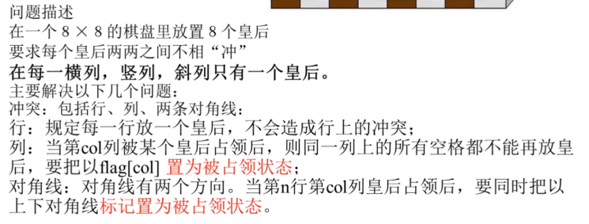

## 问题


 


## 思路

```go

```


## 例子

```go
// 棋盘横坐标 i ,纵坐标 j ，7>=i>=0 且 7>=j>=0 ，皇后摆法位置(i,j)

结果     pos[i]  	记录第 i 个皇后放的位置
行      a[i]		第 i 行是否放了皇后
列      b[j]		第 j 列是否放了皇后
上对角线 d1[j-i+7] 	上对角线（右下）是否摆放了皇后
下对角线 d2[i+j]		下对角线（左下）是否摆放了皇后
```


## golang实现

```go
var (
	pos []int
    b	[]int	// 行
   d1	[]int	// 上对角线
   d2	[]int	// 下对角线
)

// 设置状态
func Setn(i,j ,flag int) {
    b[j],c[j-i+7],d[i+j] = flag , flag , flag
}


func CheckPos(i,j int) int {
    // 如果 行   ，上对角线 ，下对角线
    if b[j]== 1 || d1[j-i+7] == 1 || d2[i+j] == 1 {
        return 1
    }
    return 0
}

func backTrackQueen(n int) int {
    count := 0	// 统计摆法
    i := 0 		// 已经存放了多少个皇后，也就是处理了多少行
    conflict := 0 // 是否冲突，默认 0 没有冲突
    for {
        if conflict == 0 {
            // 没有冲突
            if i == n {
                // 搜索到一个解
                count++
                // 开始回溯，重新开始
                for pos[i] == n {
                    i--
                    Setn(i,pos[i],0)
                }
                pos[i]++
            } else {
                
            }
        }
    }
}
```


