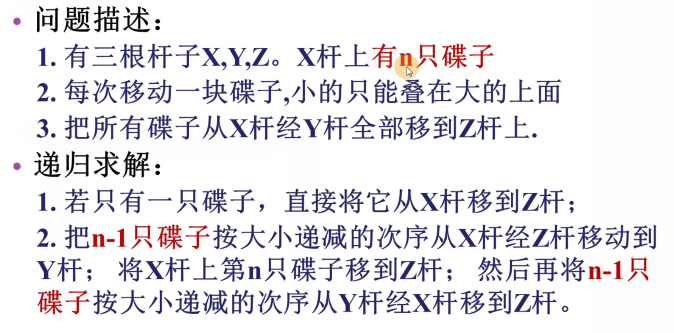

## 问题



## 思路

```go
// 不知道怎么归纳，只当是分析
1. 递归移动上方的 n-1 个圆盘到一根合适的柱子上
2. 接着，移动底盘到另一根合适的柱子上
3. 最后把 n-1 个圆盘叠加到地盘上
```

## 实例

```go
// 移动圆盘颇像出栈进栈操作，所以这里就用栈模型模拟圆盘移动过程，默认的都是栈操作
// 为什么用以下解法：
	因为这个数最优的解，是试出来的。主要是理解递归如何处理，2333...

// 杆子  X:[]  Y:[] Z:[]

// 一个 X:[1]  Y:[] Z:[]	
只用 move(x,z)

// 两个 X:[2，1]  Y:[] Z:[]
1. mov(x，y)  X:[2]  Y:[1] Z:[]
2. mov(x,z)   X:[]  Y:[1] Z:[2]
2. mov(y,z)   X:[]  Y:[] Z:[2,1]


// 三个 X:[3，2，1]  Y:[] Z:[]
1. mov(x，z)  X:[3，2]  Y:[] Z:[1]
	2. mov(x,y)   X:[3]  Y:[2] Z:[1]
3. mov(z,y)   X:[3]  Y:[2,1] Z:[]
	4. mov(x,z)   X:[]  Y:[2,1] Z:[3]
5. mov(y,x)   X:[1]  Y:[2] Z:[3]
	6. mov(y,z)   X:[1]  Y:[] Z:[3,2]
7. mov(x,z)   X:[1]  Y:[] Z:[3,2,1]


// 四个 X:[4，3，2，1]  Y:[] Z:[]
1. mov(x，y)  X:[4,3,2]  Y:[1] Z:[]
	2. mov(x，z)  X:[4,3]  Y:[1] Z:[2]
		3. mov(y，z)  X:[4,3]  Y:[] Z:[2,1]
4. mov(x,y)   X:[4]  Y:[3] Z:[2,1]
	5. mov(z,x)   X:[4,1]  Y:[3] Z:[2]
		6. mov(z,y)   X:[4,1]  Y:[3,2] Z:[]
7. mov(x,y)   X:[4]  Y:[3,2,1] Z:[]
	8. mov(x,z)   X:[]  Y:[3,2,1] Z:[4]
		9. mov(y,z)   X:[]  Y:[3,2] Z:[4,1]
10. mov(y,x)   X:[2]  Y:[3] Z:[4,1]
	11. mov(z,x)   X:[2,1]  Y:[3] Z:[4]
		12. mov(y,z)   X:[2,1]  Y:[] Z:[4,3]
13. mov(x,y)   X:[2]  Y:[1] Z:[4,3]
	14. mov(x,z)   X:[]  Y:[1] Z:[4,3,2]
		15. mov(y,z)   X:[]  Y:[] Z:[4,3,2,1]

```

## golang 实现

```go
func hanoi(n int, x ,y ,z string){
    if n == 1 {
        mov(x,z)
    } else {
        hanoi(n-1,x,z,y)
        mov(x,z)
        hanoi(n-1,y,z,x)
    }
}

func mov(a,b string){
    // 应该怎么移动
    fmt.Printf("%c -> %c\n", a, b)
}

// 保存栈的函数      停顿行数    执行的 n 的值   停到正在处理的行，一旦出栈，说明该行执行完全，要执行下一行了
// hanoi(2，x,z,y)   5 行，	  n = 2 , 	   现场 二

开始 n = 3 
	n != 1 ,需要调用 自身，所以调用自身之前把自身压入栈,保存现场
	{
        hanoi(3，x,z,y) ，5 行，n = 3   现场一
    }
	开始调用自身，执行 hanio(2,x,z,y)

n = 2
	n != 1 ,需要调用自身，所以调用自身之前把自身压入栈,保存现场 
	{
       hanoi(2，x,z,y) 5 行，n = 2    现场 二
       hanoi(3，x,z,y) 5 行，n = 3    现场 一
    }
	开始调用自身，执行 hanio(1,x,z,y)

n = 1 
	n == 1 到底了，不需要进行调用自身 ，执行 move(x,z) , 当前现场结束
	出栈现场   { hanoi(2，x,z,y) 5 行，n = 2    现场 二}

现场 二	
	往下执行没有执行的操作 mov（x,z） 
	随后需要调用自身，调用之前需要把当前场景压栈，保存现场
	{
        hanoi(2，y,x,z) 7 行，n = 2 ,   现场 三
        hanoi(3，x,z,y) 5 行，n = 3    现场 一
    }
	开始调用自身，执行 hanio(1,x,y,z)
n = 1 
	n == 1 到底了，不需要进行调用自身 ，执行 move(x,z) , 当前现场结束
	出栈回复现场   { hanoi(2，y,x,z) 7 行，n = 2 ,   现场 三 }

现场三 
	往下执行，现场 三 执行结束
	出栈回复现场   { hanoi(3，x,z,y) 5 行，n = 3    现场 一 }

// 开始往下执行了
// 等于说在最开始执行到第 5 行停止的代码，又往下运行第六行、第七行
现场一
	往下执行没有执行的操作 mov（x,z） 
	随后需要调用自身，调用之前需要把当前场景压栈，保存现场
	{
        hanoi(3，y,x,z) 7 行，n = 3 ,   现场 四
    }
	开始调用自身，执行 hanio(2,x,y,z)

n = 2
	n != 1 ,需要调用自身，所以调用自身之前把自身压入栈,保存现场 
	{
        hanoi(2，x,z,y) 5 行，n = 2 ,   现场 五
        hanoi(3，y,x,z) 7 行，n = 3 ,   现场 四
    }
	开始调用自身，执行 hanio(1,x,z,y)

n = 1
	n == 1 到底了，不需要进行调用自身 ，执行 move(x,z) , 当前现场结束
	出栈回复现场   {  hanoi(2，x,z,y) 5 行，n = 2 ,   现场 五 }

现场五
	执行剩余的 mov  
	调用 7 行的自身 ，调用之前需要把自身压栈，保存现场
	{
        hanoi(2，y,x,z) 7 行，n = 2 ,   现场 六
        hanoi(3，y,x,z) 7 行，n = 3 ,   现场 四
    }
	开始调用自身，执行 hanio(1,x,z,y)

n = 1
	n == 1 到底了，不需要进行调用自身 ，执行 move(x,z) , 当前现场结束
	出栈回复现场   {  hanoi(2，y,x,z) 7 行，n = 2 ,   现场 六 }

现场六 
	往下执行，就直接结束当前现场
	出栈回复现场   {  hanoi(3，y,x,z) 7 行，n = 3 ,   现场 四 }

现场四
	往下执行，就直接结束当前现场
	栈空，
结束

```


