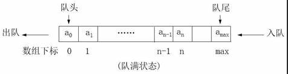

## 思想

*   queque
*   只允许一端进行插入操作，另一端进行删除操作
*   先进先出
*   其实这就是一种模式，只要实现先进先出，就可以说是队列了

## 相关概念

*   队列

    （a1 a2 a3 ... an）

*   操作

    *   和线性表一样

    *   除了添加元素和删除元素有特定要求

*   队首
    *   a1
    *   允许删除的一端
*   队尾
    *   an
    *   允许插入的一端

## 分类 

### 1. 顺序存储

```java
介绍
    这里有两种方法
    一种 ：元素移动
    	取元素后，需要把后面的元素依次往前移动，保证队头（a[0]）的位置不为空，时间复杂度 O(n)
    	删除前面元素，话费较大
    一种 ： 移动指针，
    	数据不动 ，不让访问取出的数据，让头指针随着取数据不断往队尾移动
    	会出现数组使用一次就不能使用了
处理
    最后的办法是，指针往后移动，数据控制访问，让后来添加的元素覆盖掉前面已经不让访问的数据
```

#### 2. 循环队列

### 2. 链式存储

*   就是单链表，只不过只能尾进头出
*   队头
    *   头节点 front
*   队尾 
    *   终端节点 rear
*   空队列 
    *   font  和 rear 都指向头节点

### 3.对比

|        | 数组队列（循环）                                       | 链队列                                             |
| ------ | ------------------------------------------------------ | -------------------------------------------------- |
| 时间上 | O(1)                                                   | O(1)                                               |
|        | 实现申请好空间，使用期间不释放                         | 每次申请和释放节点会有开销                         |
| 空间   | 必须有一个固定的长度，存在存储元素个数和空间浪费的问题 | 需要一个指针域，会产生一些开销，可以接收，也更灵活 |
| 使用   | 知道队列长度最大值                                     | 无法预估队列长度                                   |


## 思路

### 数组模拟队列



```java
尾指针
    往后移： rear + 1 ; 
	rear == max+1 ； // 对列满了
队列为空
	font == rear

```


