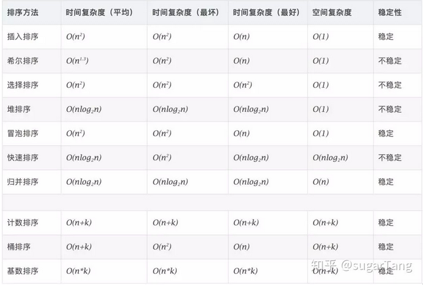
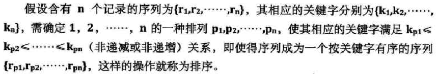

## 知识体系

* 比较排序

    * 插入排序：  希尔排序、 直接插入排序
    * 交换排序： 快速排序 、 冒泡排序
    * 选择排序： 堆排序、 选择排序
    * 归并排序： 

    
    
* 非比较排序

    * 桶式排序
        * 基数排序
        * 计数排序

    ```java
    冒泡 vs 选择
    	1. 从结果上来说，都是选择一个最小(大)的数，放到一端有序
            冒泡排序：  后面是排好的序列
            选择排序：  前面是排好的序列
        2. 不同
        	冒泡排序： 
        		会改变相邻位置元素，
        		与输入有关，时间复杂度平最好时可以达到N，最坏约N^2/2
        	选择排序： 
        		是通过下标，通过下标直接找到需要交换的元素
        		与输入无关，每次选择都要遍历待排序序列，时间复杂度固定约为N^2/2
    
    // 冒泡排序
    	(直接)插入排序	：步长为 1 的从后向前的冒泡
    	希尔排序	 ： 步长为 n-1 的从后向前的冒泡 
        快速排序	  ： 分段的冒泡排序
        
        
        
    // 比较排序，在于比较的方式有何不同
    冒泡排序
        未排序序列： 相邻元素比较，一直交换
        有序序列： 尾部止步 —— 交换到挨着有序序列尾部
        循环：两轮循环 ——  一套一
    选择排序
        未排序序列： 记录最小元素的下标，一直记录但是不交换
        有序序列： 尾部止步 —— 直接和有序序列尾部的元素比较交换交换
        循环：两轮循环 ——  一套一
    插入排序    
        未排序序列： 不动，选一个元素
        有序序列：  尾部起步 —— 一直后移（覆盖），复合位置
        循环：两轮循环 ——  一套一
        
        
        
    快速排序
        冒泡排序的升级版本
        确定的是中间值，三轮循环：一拖二
        
    归并排序
        分区间，三轮循环：三平行
        
        
    堆排序
        两平行：一行有序堆，一行排序
        
    桶排序
        // 三平行： 一装二排三还原
        将数据分成不同的组，
        对不同的组使用不同的算法
    基数排序
        // 一拖二: 一装一还
      
    ```


## 排序算法的性能

*   基本操作
    *   内排序在排序过程中的基本操作
    *   比较 ：关键码之间的比较
    *   移动 ： 记录从一个位置移动到另一个位置
*   辅助存储空间
    *   是指在一定的条件下，除了存放待排序记录占用的存储空间外，还需要其他的存储空间 
*   算法本身复杂度



## 介绍

### 1.概念



## 2.稳定

*   稳定：如果 a 原本在 b 前面，而 a=b，排序之后 a 仍然在 b 的前面。
*   不稳定：如果 a 原本在 b 的前面，而 a=b，排序之后 a 可能会出现在 b 的后面。 


## 查找

*   分类
    *   静态查找
        *   不涉及插入和删除操作
        *   顺序查找、折半查找
    *   动态查找
        *   涉及插入和删除操作
        *   二叉排序树
*   性能分析
    *   ASL （平均查找二叉树）  ：体现查找算法的关键吗的比较次数
*   例子
    *   线性表 ：静态查找
    *   树表    ：动态查找
    *   散列表 ：两者均可

```
    
    


​```java
­­­­┐			  49
		  / 		\
		38 			65
       /   \        /   \ 
     97    76      13     69
    / \    / \    / \    / \   
   33 73 7 82 18 93 20 84
		┌﹣﹣
┌ㅡ 55 ∞∞∞┐        ┌­­­­ 55 ­­­­┐        
67 		  94 	  74 	        9 

    
    ╭﹣ 55 ﹣╮     
╭﹣ 55 ﹣╮        ╭­­ 55 ㅡ╮     
67 	    94 	    74 	     9     
```


```java


		   ╭﹣﹣﹣﹣﹣﹣﹣﹣ 55 ﹣﹣﹣﹣﹣﹣﹣╮ 
    ╭﹣﹣﹣ 55 ﹣﹣﹣╮                ╭﹣﹣﹣ 55 ﹣﹣﹣╮               ╭﹣﹣﹣ 55 ﹣﹣﹣╮
╭﹣ 55 ﹣╮      ╭﹣ 55 ﹣╮       ╭﹣ 55 ﹣╮       ╭﹣ 55 ﹣╮      ╭﹣ 55 ﹣╮       ╭﹣ 55 ﹣╮    
67 	    94     67 	    94     67 	    94     67 	    94     67 	    94     67 	    94    
               
               
               
		   ╭﹣﹣﹣﹣﹣﹣﹣﹣ 55 ﹣﹣﹣﹣﹣﹣﹣╮ 
    ╭﹣﹣﹣ 55 ﹣﹣﹣╮                ╭﹣﹣﹣ 55 ﹣﹣﹣╮               
╭﹣ 55 ﹣╮      ╭﹣ 55 ﹣╮       ╭﹣ 55 ﹣╮       ╭﹣ 55 ﹣╮     
67 	    94     67 	    94     67 	    94     67 	    94                     
```

