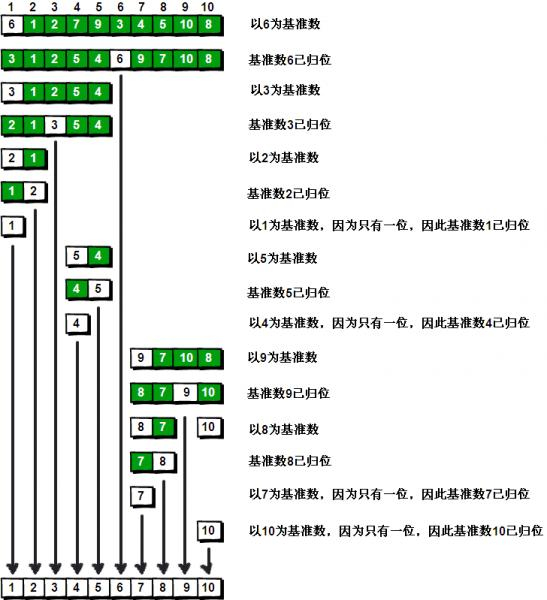

## 介绍

```java
个人理解就是
    创建有序二叉树：左子树 《 父节点 《 右子树
个人理解
   利用一种方法，模仿二叉树的前序遍历，来建立有序二叉树
    先调节，再进行前序遍历
```


## 业务思路

```go
概述
    1.  先从数列中取出一个数作为基准数。一般取第一个数。
    2.  分区过程，将比这个数大的数全放到它的右边，小于或等于它的数全放到它的左边。
    3.  再对左、右分区根被选择一个基准数，重复2
    4.  重复3，直到各区间只有一个数


// 一般取第一个数 5 作为基准，从它左边和最后一个数使用[]进行标志，
如果左边的数比基准数大，那么该数要往右边扔，也就是两个[]数交换，这样大于它的数就在右边

	// 开始选择第一个基准数字  5
    left 左边的[]	right 右边的[]
    [5] 9 1 3 [8]	因为 8 > 5，不交换，右边的[] 左移
    [5] 9 1 [3] 8	因为 3 < 5，两个[]的数据交换 ，交换后 ，左边的[] 右移
    3 [9] 1 [5] 8	因为 9 > 5，两个[]的数据交换 ，交换后 ，左边的[] 右移
    3 [1] [5] 9 8	因为 1 《 5，两个[]的数据交换 ，交换后 ，左边的[] 右移
    3 1 [[5]] 9 8    此时两边的 [] 重合，此时停止比较交互
        5 的左边为 3 1 ，都比 5 小
        5 的右边为 9 8 ，都比 5 大
	// 5 左边
        选择一个基数 3
        3 > 1  所以1 放 3  左边
	// 5 右边
	 选择一个结束
```



## java业务实现

```java
public class Quick{
   public void quickSort(int[] arr, int start, int end) {
		// 返回找到中间值的下标
       	int tempIndex = adjust(arr, start, end);

        // 最后 tempIndex start end 都是在一个位置
        // 递归处理左边
        quickSort(arr,start, tempIndex-1);
        // 递归处理右边
        quickSort(arr,tempIndex+1, end);

    }
	
    
    private int adjust(int[] arr, int start, int end) {        


        int tempIndex = start; // 基准值

        // 在比较过程中，是需要不停来回切换，碰到一个就需要返回另一端
        while (start < end) {
            

            // 右指针移动
            // 右侧进行循环，使用 start < end 是防止自减越界: end--
            while (start < end) {  // 有指针防止越界
                if (temp > arr[end]) {
                    // arr[temp] > arr[end] 进行交换, 记录下新的
                    swap(arr[tempIndex], arr[end]);
                    tempIndex = end;
                    start++;  // 每次跳回,都是和跳回位置的下一个位置比较
                    break; // 碰到第一个符合条件的就跳出，回到左指针移动
                } else {   // temp <= arr[end]
                    end--;
                }
            }
			
            // 左指针移动
            // 左侧一侧进行循环，使用 start < end 是防止自增越界: start++
            while (start < end) {
                if (temp < arr[start]) {
                    swap(arr[tempIndex], arr[start]);
                    tempIndex = start;
                    end--; // 每次跳回,都是和跳回位置的下一个位置比较
                    break;
                } else {
                    start++;
                }
            }
        }
        
         // 递归跳出条件: 可以跳出单个元素和空元素的
        // 前面的循环已经保证， start 一定小于 右边， 
        // 如果传进来的是   等于， 则返回中间的值的边表
        // 不可能出现大于的情况
        // if (start == end)  return start;
        return tempIndex;
    }
    
    
    public void swap(int a, int b) {
        if (a > b) {
            int temp = a;
            a = b;
            b= temp;
        }
    }
}    
```


## 性能分析

### 时间复杂度计算

#### 最好情况计算

```go
最好情况，每一轮都能平均分切，这样只要 n/2 次就可以把数列分成两部分，每一轮的时间复杂度都是 O(n)
问题每次折半，折半的数列继续切分，也就是总的时间复杂度计算公式为 T(n) = 2*T(n/2) + O(n)

T(n) = 2*T(n/2) + n/2
T(n/2) = 2*T(n/4) + n/4
T(n/4) = 2*T(n/8) + n/8
T(n/8) = 2*T(n/16) + n/16
...
T(4) = 2*T(2) + 4
T(2) = 2*T(1) + 2
T(1) = 1

T(n) = 2*T(n/2) + n/2
     = 2^2*T(n/4)+ n/2 + n/2
     = 2^3*T(n/8) + n/2 + n/2 + n/2
     = 2^4*T(n/16) + n/2 + n/2 + n/2 + n/2
     = ...
     = 2^logn*T(1) + logn * n/2
     = 2^logn + 1/2*nlogn
     = n + 1/2*nlogn

因为当问题规模 n 趋于无穷大时 nlogn 比 n 大，所以 T(n) = O(nlogn)。

最好时间复杂度为：O(nlogn)。
```

#### 最坏情况

```go
每次都不能平均地切分，每次切分都因为基准数是最大的或者最小的，不能分成两个数列，这样时间复杂度变为了 T(n) = T(n-1) + O(n)，按照主定理计算可以知道时间复杂度为：O(n^2)


我们来分析最差情况，每次切分遍历元素的次数为 n

T(n) = T(n-1) + n
     = T(n-2) + n-1 + n
     = T(n-3) + n-2 + n-1 + n
     = ...
     = T(1) + 2 +3 + ... + n-2 + n-1 + n
     = O(n^2)

最差时间复杂度为：O(n^2)。
```


## 改进

### 组合插入排序

*   在小规模数组的情况下，直接插入排序的效率最好，
    *   当快速排序递归部分进入小数组范围，可以切换成直接插入排序。

### 三向切分

*   排序数列可能存在大量重复值，使用三向切分快速排序，
    *   将数组分成三部分，大于基准数，等于基准数，小于基准数，这个时候需要维护三个下标。
*   当序列是正序或者逆序时，每次选到的枢轴都是没有起到划分的作用。快排的效率会极速退化
    *   在序列的第一，中间，最后三个值里面选一个中间值出来作为枢轴，保证每次划分接近均等。

### 尾递归

*   使用伪尾递归减少程序栈空间占用，使得栈空间复杂度从 `O(logn)~log(n)` 变为：`O(logn)`


## 需要总结

```go
https://zhuanlan.zhihu.com/p/119079995
```


## 参考

```go
1. https://zhuanlan.zhihu.com/p/119079995
```


