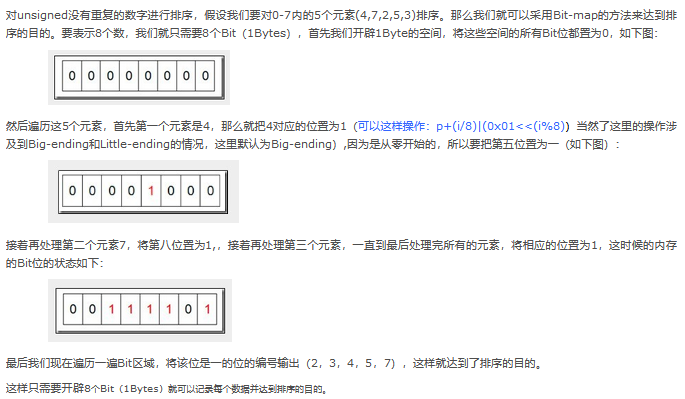

## 介绍

* 位图排序
    * 称为bitmap排序，它主要用于海量数据去重和海量数据排序
    * 位图排序即利用位图或者位向量来表示集合。

```java
假如说有10 亿个int类型且全部不相同的数据，给1G内存让你排序，你怎么排，
    如果全部加载到内 存中，相当于40亿个字节，大概约等于4G内存。所以全部加载到内存肯定不行，
    如果我 们使用位图排序的话，我们用long类型表示，一个long占用8个字节也就是64位，
    所以 如果我们使用位图排序的话只会占用约0.125G内存,内存占用大大减少。
    但位图排序有 个缺点就是数据不能有重复的，如果有重复的会覆盖掉，这也是位图能在海量数据中去 重的原因
```



