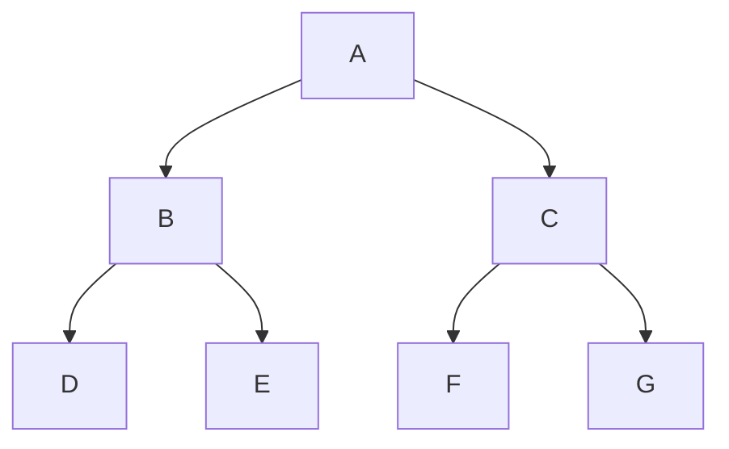
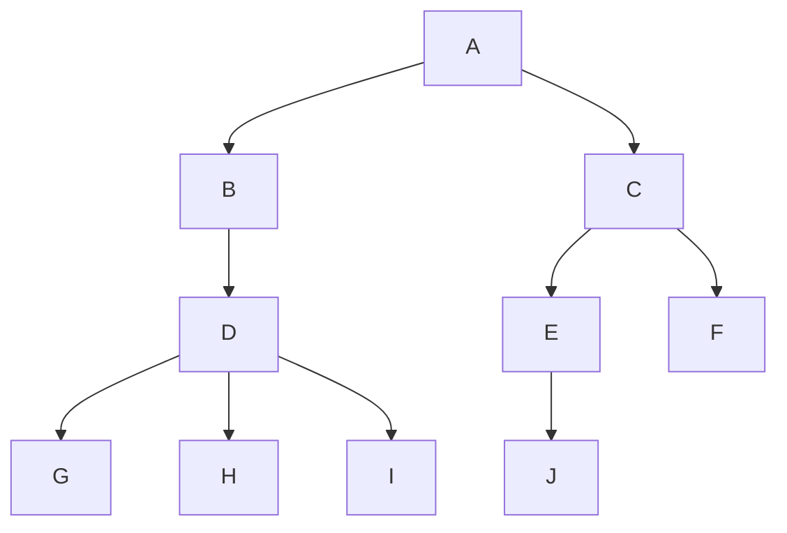

## 1.树基础

### 树概念

*   树 tree
    *   一种一对多的结构
    *   是 n ( n >= 0) 个节点的有限集合
    *   倒着看像树一样
*   空树
    *   n = 0
*   子树
    *   当 n >= 1时，其余节点分为 m (m>0) 个互不相交的有限集合，其中每一个集合本身就是一棵树，称为根的子树
    *   子树个数没有限制
    *   同一个根结点的子树不能有交集
    *   某结点位于第 a 层，其子树的根就在 第 a+1 层
*   森林
    *   是不相交的树（大于等于 0 个）的集合
    *   树中每个结点，其子树的集合即为森林

### 树层次

*   根结点所在的层是第一层
*   根的孩子所在的层是第二层
*   以此类推



```go 
第一层 ： A 
第二层 ： B C
第三层 ： D E F G
```


### 结点分类

*   分支结点 / 非终端结点 / 内部结点
    *   度不是 0 的结点
    *   内部结点
*   叶子结点 / 终端节点 
    *   度为 0 的点
    *   没有子结点的结点


````go
分支结点
	A B C
叶子结点
	D E F G 
````


### 节点间的关系

```go
既然是节点间的关系，就需要分清，谁是谁的谁
都是一个相对称谓
```

*   根  root
    *   有且只有一个，是唯一的
*   儿子结点 / 子结点
    *   单个子结点也是一棵树，只不过他的根结点是他自己
*   双亲结点  / 父节点
    *   上一层延伸过来的结点
*   兄弟结点
    *   有同一父结点的结点之间
    *   同一层的结点
*   子孙结点
    *   一个节点的所有子树中的节点称为该节点的子孙节点
*   祖先结点
    *   从根节点到达一个节点的路径上，通过的所有节点称为该节点的祖先节点。


```go
// 都是相对称谓
根结点 
	A
子结点 
	A 的子结点为 B C
	B 的子结点为 D E
父节点
	A 为 B 、C 的父节点
兄弟结点
	D E 互为兄弟结点
	F G 互为兄弟结点
子孙结点
	A 的子孙结点 B C D E F G
祖先结点
	D 的祖先结点  B A 

// 习惯将左边的孩子叫长子域，firstchild
D 是 B 的 firstchild
```


### 度

*   树的深度 / 高度
    *   树中节点的最大层数
*   树的度
    *   树内各结点的度的最大值
*   节点的度 degree
       *   直接后继节点数
       *   结点拥有的子树数目 ： 结点有多少分支


```go 
树的深度（层数） 3 
树的度（结点最大度）  2

结点的度（结点有几个分支） 
	A 的是 2
	B 的是 2
	D 的是 0
```


### 表示方法

*   上面的图示，还有下面的


*   图 A  : 嵌套的集合的形式 
    *    集合之间绝不能相交，即图中任意两个圈不能相交 
*   图 A : 广义表法
    *    (A , ( B ( E ( K , L ) , F ) , C ( G ) , D ( H ( M ) , I , J ) ) ) 
*   图 B :  凹入表示法 
    *    最长条为根结点 
    *    相同长度的表示在同一层次 


## 2.抽象数据类型

```go
树是由一个根结点和若千棵子树构成。树中结点具有相同数据类型及层次关系

1. 构造空树 T 	inittree
2. 销毁树 T	destorytree
3. 若树存在，将树清空为空树	cleartree
4. 若树为空 返回 true ,否则返回 false treeempty
5. 返回树的深度 treedepth
6. 返回根节点 root
7. 返回结点的值 value
8. 给输的结点赋值 assign
9. 非根节点，返回双亲 parents
10. 非叶结点，返回其最左孩子 ，否则为空 leftchild
11.返回右兄弟	rightsibing
12. insertChild
13. deleteChild
```


## 3.存储结构

```go
// 不同的存储方法，是根据研究对象的不同来区分的 
双亲表示 ： 双亲的角度
孩子表示 ： 孩子的角度
    孩子双亲表示法
兄弟表示 ： 结点兄弟的角度

其实还是 Node 包含的下一个节点的指针是什么
```





### 1.双亲表示法 - 顺序表

*    采用顺序表（也就是数组）存储普通树 
*    核心思想是：
     *   顺序存储各个节点的同时，给各节点附加一个记录其父节点位置的变量。 


```go
// 树的双亲表示法节点结构定义 
// 类似于静态链表
type PTNode struct{
    data interface{}      // 树节点的数据类型，目前暂定为整型
    parents int			// 其双亲位置(双亲在数组中的下标)，相当于顺序表下一个节点的下标
}

// 其实也可以直接写成 ： type Tree []Node
// 树结构
type PTree struct{
   	nodes []PTNode   // 结点数组  PTNode []Node
    r int 			// 根位置
    n int  			// 结点总数   
}

// 约定根结点为 parent = -1 
	根节点没有父节点（父节点又称为双亲节点），因此根节点记录父节点位置的变量通常置为 -1。 
```

*   容易找到双亲

    *   根据节点的 parent 就可以找到他的双亲节点
    *   复杂度 O(1)

*   不容易找到子结点

    *   必须遍历整个结构

*   优化

    *   Node 里面可以记录更多的信息，扩充 PTNode 结构体

    *   设计结构体，要看存储结构运算是否合适、方便、复杂度 等限制，并不是越多越好

        

```go
// 将左边的孩子叫长子域，firstchild
// sib n.胞亲

场景一 :
	想知道结点的长子域是什么，就将 PTNode  扩充一个
	type PTNode struct{
        data interface{}      // 树节点的数据类型，目前暂定为整型
        parents int			// 其双亲位置(双亲在数组中的下标)，相当于顺序表下一个节点的下标
        firstchild int       // 长子结点的下标(其在数组中的下标)，不存在就设置为 -1
    }

场景二 ：
	想知道兄弟们之间的关系，就可以增加一个 rightSib 
	每一个结点：存在右兄弟，则记录右兄弟的下标，不存在，则设置为 -1
	type PTNode struct{
        data interface{}      // 树节点的数据类型，目前暂定为整型
        parents int			 // 其双亲位置(双亲在数组中的下标)，相当于顺序表下一个节点的下标
        rightSib int       	  // 右兄弟结点的下标(其在数组中的下标)，不存在就设置为 -1
    }
```


### 2.孩子表示法 -顺序+链表

```go
方法三才是孩子表示法
```

*   方法

    *    "顺序表+链表" 的组合结构 
    *    一个节点记录他的孩子结点

*    存储过程

     *   从树的根节点开始，使用顺序表依次存储树中各个节点，
     *   与双亲表示法不同，孩子表示法会给各个节点配备一个链表，用于存储各节点的孩子节点位于顺序表中的位置。 

*   多重链表

    *   即每个结点有多个指针域，其中每个指针指向一棵子树的根结点

*   优化

    *   孩子法和双亲法结合起来

*   方法一

    *   指针域的个数等于树的度

    *   树中各结点的度相差很大时，

        *   显然是很浪费空间的，因为有很多的结点，他的指针域都是空的

    *   不过如果树的各结点度相差很小时

        *   开辟的空间都被利用了，缺点就变成了优点

    *   结点设置

        *   data 数据域
        *   child  指针域，指向该结点的孩子结点

        

        *   实现

        

*   方案二：

    *   方法
        *   每个结点指针域的个数等于该结点的度数
        *   专门取一个位置存放结点的个数

    

    *   data 数据域
    *   degree   该结点的孩子结点的个数
    *   child  指针域，指向该结点的孩子结点

    

    

*   实现

    

    

*   优化

    *   给 表头数组的表头结点 加上 parent 
    *   可以快速知道某个结点的双亲

*   优点

    *   克服了浪费空间的缺点，对空间利用率是很高了
    *   要查找某个节点的某个孩子或者兄弟，只需要找这个结点的孩子单链表即可
    *   遍历树很方便，对头结点的数组循环即可

*   缺点

    *   各个结点的链表是不同的机构，加上要维护结点的度的值，运算上会有时间的消耗

*   方案三

    *   思路

        *   对每个结点的孩子建立一个单链表来体现他们的关系

    *   方法

        *   把每个结点的孩子结点排列起来，以单链表作存储结构，
        *   有 n 个结点有 n 个孩子链表，如果是叶子结点则此单链表为空， n 个头指针又组成一个线性表
        *   采用顺序存储结构，存放进一个一维数组中

        

    ```go
    // 表头数组的表头结点 
    // 按照顺序记录树中额所有结点
    type CTBox struct{
        data interface{}	// 数据域 ， 存储某结点的数据信息
        firstchild *CTNode	// firstchild  头指针域 ， 存储该结点的孩子链表的头指针: 就是长子域
    }
    
    // 孩子链表的孩子结点 
    // 记录其孩子结
    type CTNode struct{
        child int   	// 数据域(下标)，存储某个结点在表头数组中的下标(结点在数组中的下标)
        next *CTNode    // 指针域（其兄弟结点）， 存储指向某结点的下一个孩子结点的指针
    }
    
    
    
    // 树结构
    type tree struct {
        node []CTBox 	// 结点数组
        r  int		// 根的位置 
        n  int		// 节点数
    }
    ```

    

### 3.孩子兄弟表示法 - 链式

*   链式存储结构

*   别称

    *    "二叉树表示法"
    *    "二叉链表表示法"

*   思想

    *    从树的根节点开始，依次用链表存储各个节点的孩子节点和兄弟节点。
    *    将普通树转化为二叉树的最有效方法

*   任意一棵树，它的结点的第一个孩子如果存在孰是唯一的，它的右兄弟如果存在也是唯一的.

*   结点结构

    


```go
type CSNode struct {
    data 		interface{} 	// 数据域
    firstchild  *CSNode  		 // 指针域， 存储该结点的第一个孩子结点的存储地址
    rightsib 	*CSNOde  		// 指针域， 存储该结点的右兄弟结点的存储地址
}
```

* 实现示意图

    

    

* 优点

    *   给找某个孩子带来了方便，只需要通过 firstchild 找到此结点的长子，然后再通过长子结点的 rightsib 找到它的二弟，一直下去，直到找到

    *    找到唯一的一棵二叉树与之对应 

* 改进

    *   增加一个 parent 指针域来解决快速查找双亲的问题 

## 4. 树的遍历

*   本质就是将 非线性结构（树） --》 线性结构
*   参考二叉树的遍历
    *   先序、后序、层次 （树没有中序遍历）

## 5.森林的遍历

1.  前序遍历
    *   与二叉树前序遍历是一样的
    *   森林中每棵树按照前序遍历的方法依次遍历
2.  后序遍历
    *   与二叉树的中序遍历一样
    *   森林中每棵树按照后续遍历的方法依次遍历

## 7.构造树的数目

*    树相似
     *    两棵树中各个结点的位置都一一对应 
*    树等价
     *    两棵树不仅相似，而且对应结点上的数据也相同 
*    n 个节点可以构造多少个形态不同的树
     *    形态不同的树指的是互不相似的树 


```go 
1. 其实树根链表差不多
	链表是 后面跟一个后继结点
	树  是 后面根多个后继结点
	都是可以细分成一个一个很小的后续
```


## 8.树的转换


*   将森林、树转化成二叉树
*   树的孩子兄弟法可以将一棵树转化成二叉链表

### 原因

```go
树的 			= 		其对应的二叉树
前序遍历	   =		前序遍历
后续遍历	   = 		中序遍历


太子继位，右兄右矬
根右独活，面父成魔
```


### 1. 树转化成二叉树

*   步骤

    ```go
    // 兄弟加线，太子继位 ，
    太子继位，兄弟分封（左上为尊，右下为卑）
    ```

    *   加线  ： 所有的兄弟结点之间加一条连线
    *   去线  ：对树中每个结点，只保留它与第一个孩子结点的连线，删除它与其他孩子结点的连线
    *   层次调整  ：以树的根结点为轴心，将整棵树顺时针旋转一定的角度，使之结构层次分明。
        *   注意第一个孩子是二叉树结点的左孩子
        *   兄弟转换过来的孩子是结点的右孩子

    


### 2. 森林转为二叉树

*   思路

    ```go
    1. 森林中的每棵树都是兄弟
    2. 森林  --    每棵树变二叉树    --- 森林变二叉树
    
    一同天下，兄弟分封（左上为尊，右下为卑）
    ```

    

*   步骤

    *   每棵树转化成二叉树
    *   第一棵树不动，从第二棵树开始，依次把后一棵树的根结点作为前一棵二叉树的根结点的右孩子，连起来
    *   链接所有的树

    


### 3. 二叉树转树

*   思路

    ```go
    // 树转二叉树反过来 ，这个是没结点的
    兄弟反目，进京面圣
    ```

*   步骤

    *   去线
        *   删除原二叉树所有结点和右孩子结点的连线
    *   加线
        *   将源二叉树的左孩子的 n 个右孩子结点都作为该结点的孩子，将这些结点和这些右孩子孩子结点连起来
    *   层次调整

    

### 4. 二叉树转森林

*   思路

    ```go
    根结点有右孩子 ：拆成一颗单独的二叉树 ， 然后二叉树转树
    ```

*   步骤

    *   根结点开始 ： 右孩子存在，则把右孩子结点连线删除，查看分离出来的二叉树

        *   分离出来的二叉树存在右孩子，则再次分离，
        *   一致分离到没有右孩子

    *   分离后的二叉树转化为树

        

### 5.普通二叉树转完全二叉树

*   增加虚节点，不全成完全二叉树，其内容为空


