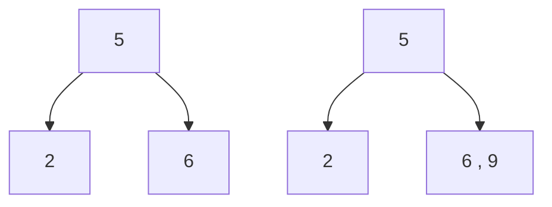

## 概念

*   [百度百科](https://baike.baidu.com/item/2-3%E6%A0%91/3484656)

*   介绍

    ```js
    1. 严格自平衡的多路查找树 , 
    2. 3 阶的 B 树，最简单的B-树（或-树）结构，是一个三叉树
    
    // 所有平衡树的核心都在于插入和删除逻辑
    ```
    
    ## 性质. 
    
    *   平衡、有序、三叉树，其子树也是完美平衡的
        *   节点的值都是有序的，注意值大小的有序性
    
    ## 结点规律
    
    ```js
    // 主要是根据节点内的元素个数 ， 来判断该节点属于什么节点
    // 具体为什么，可以参考操作的插入里的解释，只是参考。。。。我也有点儿不明白
    节点内数据元素个数
        内部节点
            1 个 ： 两个子树			2-节点
            2 个 ： 三个子树叶子结点    3-节点
        叶子节点
            1 个 ： 				   2-节点
            2 个 ：                   3-节点
    // 注意 ：
       1. 就是说一个节点内含有的数据元素个数为 1 2  （空树为 0） ，只有这三种情况
       2. 除了叶子节点外，内部结点都没有空儿子
       
    // 核心
    	一个节点有 n 个元素，就叫 （n+1）-节点，就要对应 n+1 个子节点，叶子节点没有
    	这种对应关系不能被破坏，破坏的话就需要被调整
    ```
### 内部结点

*   2-节点

    ```go
    此结点
    	只有 1 个元素数据，有两个子节点（子树），但处于叶子节点是没有子节点的
         2,3,4 均为 2-节点，但只有 3 有两个子节点
    有序 ：
    	左子树 < 父节点 < 右子树  { 2 < 3 <4 } 
    ```

    ```mermaid
    graph TB
    3 --> 2
    3 --> 4
    
    ```

    

*   3 - 节点

    ```go
    此结点
    	有 2 个元素数据，有 3 个子节点（子树），但处于叶子节点是没有子节点
    	[5,8] 和 [6,7] 都是 3-节点 ， [5,8]有2个子节点， [6,7] 没有
    有序 ：
    	左子树 < 父节点左值 < 中子树 < 父节点右值 < 右子树 （中子树所有元素的值都位于父节点两个元素之间）
    ```

    ```mermaid
    graph TB
    4[5,8] --> 1
    4[5,8] --> 6[6,7]
    4[5,8] --> 9
    
    ```

### 叶子结点

```go
1. 所有的叶子都在同一级别，即：所有叶子节点到根节点的长度一致
	这个特征保证了完全平衡，非常完美的平衡
```


## 操作

### 查找

*   类似二分搜索树的查找，根据元素的大小来决定查找的方向。
*   要判断一个元素是否存在，我们先将待查找元素和根节点比较，如果它和其中任意一个相等，那查找命中；否则根据比较的结果来选择查找的方向。

### 插入

*   规则
    
    ```go
    先查找是否存在，
    	存在
    		不插入，或者支持重复的元素则将这个元素对象添加一个属性count
    	不存在
    		在叶子结点中插入这个元素（叶子结点）
    
    
    
    // 这个要注意一下，你插入元素始终都是从叶子节点添加的，这个你自己试一下就行
    2-节点插入 ：变成 3-节点
    3-节点插入 ：变成 4-节点
    	此时，超过了2-3树每个节点最多2个元素的限制，所以需要调整
    
    // 调整
     红线
         叶子结点
            2-3树每个节点最多2个元素，超过了，就需要调整
         内部节点
         	要严格对应 一个节点 {n个元素、n+1个子节点}
     自底向上
        分调 ：将3-节点分裂为2个只有一个元素节点的结点，左右兄弟结点变为中间元素节点的子节点 ,原树增长一层
        插入 ：插入数据到具体的位置
        合并 ：中间元素所在的根节点插入其父节点
        	 若插入后，其父节点违背红线，就在先分调，载进行插入操作，直到树达到完美
        注意 ： 内部节点拆分过程中，其子节点从中间按照大小顺序，分给两边的元素节点
        结束标志 ：
        	进行过分调的父元素插入元素后，不需要调整，就完成树调整（我自己总结的）
    
     自上向下
     	
    ```
    
*   插入方式
    *   空树
        
        *   创建一个节点即可
        
    *   2-节点插入元素

        ```go
        // 因为 2-3树允许节点存在的数据元素的个数最大值为 2
        直接插入就可以来了，节点就变成 3- 节点
    	下面插入 9 ， 是直接插到 6 后面， 6 是 2-结点，所以直接插入，变成[6,9]即 3-节点
        	如果：[6,9]分裂，其父元素就变成有 3 个子节点了
        ```
    




*   3 -节点插入
    
        *   父节点为 2 - 节点
        
            ```go
            1. 找到目的结点，插入元素
            	3-结点里面就有了 3 个数据元素,（形成了4-节点）
        2. 插入结点分裂 
            	3-结点，分裂为三个只有一个数据元素的节点，
        3. 向上合并调整一次: 
        	将 3-结点 中间的元素合并到其父元素中去
            4. 父节点此时的元素个数如果仍旧大于 2 的话，父节点还要进行和上面一样的分裂合并
        ```
    
    

### 删除

```js
// 2-3树是完美平衡的，就算是删除了，也要保证其完美性质
	内部节点
		即结点只有一个数据元素，其后必有两个子节点，有两个数据元素，其后必有三个子节点
    叶子结点
    	叶子结点删除一个，可能会就会导致其父节点只有一个子节点，完美平衡被破坏
        
// 元素删除
// 注意一个元素的最小后继元素，一定在叶子结点上：其子结点上或者右分支树的最左边
1.任何一个数据元素删除，都可以归结为后继数据元素的删除，
	即把直接(最小)后继元素替换要删除的元素，然后删除这个最小后继元素
    这个最小后继元素一定是在叶子节点上，就转化成了叶子结点的删除

  
2. 叶子结点
  	叶子节点是 3 节点，那么直接变成2-节点即可。不影响平衡
	叶子节点是 2 节点，删除后父节点会缺失一个儿子，破坏了满孩子的2-3树特征，需要按照非叶子节点调整
    
// 调整
满足条件
   有 1 个数据元素的节点，要有 2 个子节点
   有 2 个数据元素的节点，要有 3 个子节点     
调整
   从兄弟结点哪里借元素
   		1. 借的到 ：就进行有序调整
         2. 借不到 ： 
    	如果兄弟借不到值，合并节点（与父亲的元素），再向上递归处理
```

```go
// 删除非子叶点
1. 该节点一定有两棵或者三棵子树
2. 从子树找到其最小后继结点，

```

*   删除节点的兄弟结点：是 3-结点

    ```go
    从兄弟结点哪里接一个值填补被删除的叶子子结点，然后兄弟和父亲的结点重新调整分布位置
    借不到的话，就合并父节点
    ```

    ```mermaid
    graph TB
    
    0[P] --> 1[S , L]
    0[P] --> 2[Q]
    1[S , L] -->3[a]
    1[S , L] -->4[b]
    1[S , L] -->5[c]
    2[Q] --> 6[d]
    
    02[2 删除Q]
    1-0[P] --> 1-1[S , L]
    1-0[P] --> 1-2[-]
    1-1[S , L] -->1-3[a]
    1-1[S , L] -->1-4[b]
    1-1[S , L] -->1-5[c]
    1-2[-] --> 1-6[d]
    
    ```

    ```mermaid
    graph TB
    02[3 借位]
    1-0[P] --> 1-1[S]
    1-0[P] --> 1-2[L]
    1-1[S ] -->1-3[a]
    1-1[S ] -->1-4[b]
    
    1-2[L] -->1-5[c]
    1-2[L] --> 1-6[d]
    
    04[4 重构]
    
    2-0[L] --> 2-1[S]
    2-0[L] --> 2-2[R]
    2-1[S ] -->2-3[a]
    2-1[S ] -->2-4[b]
    
    2-2[P] -->2-5[c]
    2-2[P] --> 2-6[d]
    
    ```

    

*   被删除节点的兄弟结点：是 2-结点

    ```go
    1. 合并节点 ：将父亲结点和兄弟结点和合并
    	如果父亲节点是 2-结点，那么父亲节点就留空了
    		留空后，继续递归处理，像前面一样进行重新调整分布：借兄弟，重排
    		直到根结点，如果此时存在空的根结点，就可以直接把空结点删除即可，此时树的高度减少以
    ```

    ```mermaid
    graph TB
    
    0[P] --> 1[S]
    0[P] --> 2[Q]
    1[S] -->3[a]
    1[S] -->4[b]
    2[Q] --> 6[c]
    
    02[删除Q]
    1-0[P] --> 1-1[S]
    1-0[P] --> 1-2[-]
    1-1[S] -->1-3[a]
    1-1[S] -->1-4[b]
    1-2[-] --> 1-6[c]
    
    03[重拍]
    2-0[-] --> 2-1[S , P]
    2-1[S , P] -->2-3[a]
    2-1[S , P] -->2-4[b]
    2-1[S , P] --> 21-6[c]
    
    04[遇到根结点]
    3-1[S , P] -->3-3[a]
    3-1[S , P] -->3-4[b]
    3-1[S , P] --> 3-6[c]
    
    ```

    ```mermaid
    graph TB
    0[80 , 90] --> 1[60]
    0[80 , 90] --> 3[85]
    0[80 , 90] --> 2[100]
    i[删去85]
    01[80 , 90] --> 11[60]
    01[80 , 90] --> 31[-]
    01[80 , 90] --> 21[100]
    
    i1[为了达到平衡进行转换]
    02[90] --> 12[60 , 80]
    02[90] --> 22[100]
    
    ```

    


