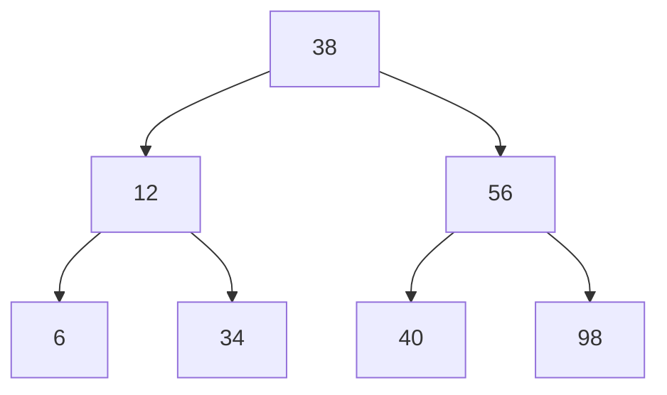
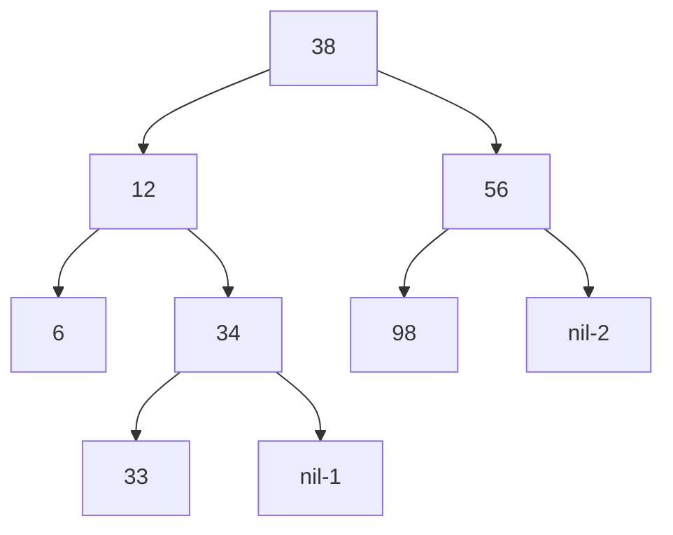

## 概念

*   二叉搜索树 ：

    *   二叉搜索树 ： binary search tree
        *   二叉查找树
    *   有序二叉树 ： order binary  tree
        *   排序二叉树
*   定义

    *   采用递归的方法

## 特点

*   中序遍历可以得到一个有序序列
    
*   只是一颗空树或者具有以下性质的二叉树

    ```go
    // （空的结点不参与比较，使用 nil 表示，根结点是相对而言的根结点）
    1. 左子树的所有结点的值 < 它的根结点  < 右子树上的所有结点的值  
    	相等的结点 ： times 值记录 ( 即树中没有重复的值 )
    2.左、右子树也都是 ：二叉搜索树。  // 这里就体现出来递归的定义
    	所有子树 ： 左子树结点 < 父节点 < 右子树结点 
    ```

*   例子

    ```mermaid
    graph TB
    38 --> 12
    38 --> 56
    12 --> 6
    12 --> 34
    56 --> 40
    56 --> 98
    ```

## 操作

### 添加元素

```go
插入特点
    1.  新插入的结点必为一个新的叶子结点，插入位置由查找过程得到
    2.  插入新的位置后，不必移动其他结点，只需要修改某个节点的指针
    3.  新插入的结点没有破坏原有结点之间的关系

情况
    空树   ： 则新的结点为新节点
    非空树 ： 添加新的叶子结点 
        这个地方，我之前我纠结了好久，才想明白为啥一定是叶子结点
```


### 查找流程



```go
特点 ： 左右子树查找过程与整个树上查找过程相同
    1. if root 是空树，则查找失败
    2. if root 非空
            if value > root.value 右子树查找
            if value < root.value 左子树查找
            if value = root.value 查找完成
    3. 重复 2 3

性能分析
	ASL （平均查找二叉树）  ：体现查找算法的关键吗的比较次数
	{ 1， 2， 3,} 
	二叉树 差值找 1 对比一次，查找 2 对比二次 ，查找 3 对比三次
	ASL = （1+2+3） / 3 = 2

复杂度
	取决于二叉树形状 ： O(log(2)n)  -  O(n)
	
	
流程
查找 100
1. 100 > 38 右子树查找
2. 100 > 56 右子树查找
3. 100 > 98 右子树查找
4. 98 的右子树为空，查找失败
```


### 删除流程



```go
// nil-x  表示第 x 个空结点

关键
	删除某个结点以后 ， 仍然保持二叉树的特性


// 元素删除
// 注意一个元素的最小后继元素，一定在叶子结点上：其子结点上或者右分支树的最左边
1.任何一个数据元素删除，都可以归结为后继数据元素的删除，
	即把直接(最小)后继元素替换要删除的元素，然后删除这个最小后继元素
    这个最小后继元素一定是在叶子节点上，就转化成了叶子结点的删除

2. 叶子结点

1. 找到要删除的结点 A 
2. 结点 A 的孩子 {   // 子承父业
    if A 没有孩子
    	将 A 的双亲结点的孩子指针设置为空
     
    if A 有一个子节点
    	子节点覆盖此结点 ，删除其子节点
    
    if A 有两个子节点（两个子节点）
  	  		即把直接(最小)后继元素替换要删除的元素，然后删除这个直接后继元素
		备注：
    		也可以直接用直接前驱元素替换要删除元素，然后删除这个直接前驱元素
3. 删除 A

```


## golang 实现

### 基础结构

```go
// 节点  BinarySearchTreeNode
type node struct {
    value int
	// times int  如果树中存在值相等的点
    left *Node
    right *Node
}

// 二叉搜索树，  BinarySearchTree  树中包含一个根元素
type BSTree struct {
    root *node
}

// 初始化二叉查找树
func NewTree() *Tree {
    return new(BinarySearchTree)
}

// 结点构建
func newNode(value int64) *Node {
    return &Node{value:value}
}

```


### 最值结点

```go
// 最小值
// 根据性质，最小值的节点一定在树的最左边

func (tree *BSTree) Min () interface{} {
    node := bst.root
    if node == nil {
        return nil 
    }
    for {
        if n.left == nil {
            return &n.value
        } else {
            n = n.left
        }
    }
}
   

// 最大值
// 值最大值的节点在树的最右边
func Max (root node) (node , bool ) {
    node := bst.root
    if node == nil {
        return nil ，false 
    }
    for {
        if node.right == nil {
            return node , true
        } else {
            node = node.right
        }
    }
}
```

### 添加 / 插入元素

*   非优化

    ```go
    说明
    	1. 要把树的 add 方法 和 node 的 Add  方法拆开来写
    		因为对象不同 树 和 node 的结构体不同，所以各自调用各自的方法
    
    func (tree *BSTree) Add (value int64) {
        // 空树
        if tree.root == nil {
            tree.root = NewNode(value)
            return
        }
        // 添加结点
        tree.Root.Add(value)
    }
    
    func (node eNode) Add (value int64) {
        // 1. 元素  < 当前节点的元素 , 进行左树遍历
        if value < node.value {
            if node.left == nil {
                // 连接起来形成树
                node.left = NewNode(value)
            } else {
                // jin
                node.left.Add(value)
            }
        // 2. 添加元素  > 当前节点元素 ， 进行右树遍历
        } else if value > node.value {
            // 连接起来形成树
            if node.right == nil {
                node.right = newNode(value)
            } else { 
                node.right.Add(value)
            }
        // 3. 添加的元素 == 当前节点元素
        } else if value == node.value {
            node.times ++
        }
    }
    ```

    

*   优化

    ```go 
    // 分开
    func (tree *BSTreee) Add (value int) {
        tree.root.Add(value)
    }
    
    // 结点迭代添加
    func (root Node) Add (value int64) {
        if root == nil {
            root = newNode(value)
            return 
        }
        if value < root.value {
            root = root.left 	// 1
            root.Add(value)
        } else if value > root.value {
            root.right.Add(value)  // 2  {1 和 2 形式都可以，你感觉那种好就用哪一种，2333}
        } else if value == root.value {
            root.times++
        }
    }
    
    
    // 合体
    func Add(root Node,value int64) {
        if root == nil {
            root = newNode(value)
            return
        }
        if value < root.value {
            Add(root.left,value)
        } else if value > root.value {
            Add(root.Right,value)
        } else if value == root.value {
            root.times++
        }   
    }
    ```
```

### 转化构造排序树

*   一个无序序列可以通过构造一棵二叉排序树而变成一个有序序列

​```go
// 这个是给你一个数组 [1 , 2 , 3 , 5] 写成排序二叉树
// arrytobisorttree
func ArrytoBSTree (arry []int) *BSTree {
    tree := NewTree()
    for i:=0; i<len(arry); i++ {
        tree.Add(arry[i])
    }
    return &BSTree
}
```


### 查找结点

*   查找普通结点
*   查找父结点

```go
// 找到返回 true  否则返回 false

func (treet *BSTree) Search (value int) (node , bool) {
    
    node, ok := search(tree.root,value)
    if ok == false {
        return nil , false
    } 
    return node , true  
    //return search(bst.root,value)
}
// 结点循环
func search(root node,value int) (node , bool) {

    // 查不到
    if node == nil {
        return nil ,false
    }
    
    // value 属于 左边
    if value < node.value {
        return search(node.left,value)
    	  // value 应该属于右边
    } else if key > node.value {
        return search(node.right,value)
          // value 查找到
    } else if value == node.value {
        return node, true
    }
}

// 查找结点的父节点

func (tree *BSTree) FindPNOde(value) (node, false) {
    node := tree.root
    if node == nil {
        return nil,false
    }
    
    if value.
}

```


### 删除元素

```go
// 没有写完

func (tree *BSTree) Delete(value int) bool {
    // 查找要删除的结点
    node,ok := search(tree.root,value)
    if ok == false {
        return false
    }
    // 要删除节点的父节点
    pnode := 
    // 要删除的结点 没有孩子结点
    
}


func deleteBST (bt *BiNode, value int ) bool {
    if bt  == nil {
        return false
    }
    if value == bt.value {
        deleteNode(node)
    } else if value < bt.value {
        deleteBST(bt.lchild,value)
    } else if value > bt.value {
        deleteBST(bt.rchild,value)
    }
}
// 查找双亲结点
func (tree *BSTree) FindPNode(value) {
    root := tree.root
    if root == nil {
        return nil ,false
    }
    if value == root.value {
        return node ,false
    }
    
}

func deleteNode(bt *BINode) {
    if bt.lchild == nil && bt.rchild == nil { // 叶子结点为
        
    } else if bt.lchild == nil {
        
    } else if bt.rchild == nil {
        
    }
}
```


