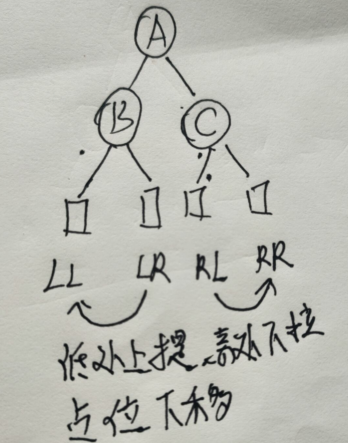
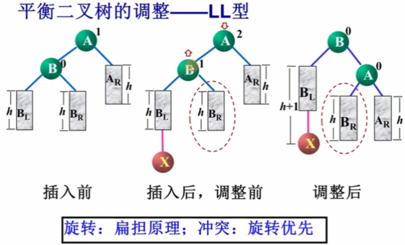

## 平衡二叉树

* 定义
  
  ```go
  是一棵空的二叉排序树，或者有下列性质的排序二叉树
  1. 根结点的左子树和右子树的深度最多相差 1
  2. 根结点的左子树和右子树也是平衡二叉树
  ```

* 平衡因子
  
  * 结点的平衡因子
    * 该结点的左子树的深度和右子树的深度之差  ： 树的深度
    * 平衡树中 ， 结点的平衡因子可以是 1 ， 0 ， -1

* 最小平衡子树
  
  * 在平衡二叉树的构造过程中，以距离插入结点最近的、且平衡因子的绝对值大于 1 的结点为根的子树
    
    ```go
                  5                              5
                /   \                          /   \
               4      8                      4      8
            /                             /
          2                            2
                                    /
                                   1
    
    结点平衡因子   ：左子树深度 - 右子树深度
    问题产生者 ：1
        就是插入结点 1 导致的左树不平衡，所以结点 1 就是问题产生者
    问题发现者 ：4
        离问题产生者最近的 |平衡因子| > 1 的结点
    最小平衡树 ：以 4 为根结点的子树
        就是以问题发现者为根结点的树
    ```

        结点    左右子树深度差值
        1        0 = 0 - 0 
        2        1 = 1 - 0
        4        2 = 2 - 0
        5        2 = 3 - 1
        8        0 = 0 - 0
        ```

## 构造平衡二叉树

## 思想

* 每插入一个结点
  * 从插入结点开始向上计算各结点的平衡因子，如果某个结点平衡因子的绝对值超过 1 ，则说明插入操作破坏了二叉排序的平衡性，主要进行平衡调整，否则继续执行插入操作
  * 如果二叉排序树不平衡，则找出最小不平衡子树的根结点，根据新插入结点与最小不平衡子树根结点之间的关系判断调整类型
  * 根据调整类型进行相应的调整，使之成为新的平衡子树

## 调整类型



* 设结点 A 为最小不平衡子树的根结点，对子树调整归纳如下
  
  ```go
    LL 型
      顺时针旋转 ： 子树 0 -> 1
    RR 型
      逆时针旋转 : 子树 0 -> 1
    LR 型
      左子树先逆时针旋转（变LL -1） ，然后整体顺时针旋转
    RL 型
      右子树先逆时针旋转（边RR  -1） 。 然后整体逆时针旋转
  
  // 原理
      扁担原理 ： 平衡因子大的结点就重，则此结点就要变成子节点的子结点
  
  // 步骤
      1. 计算结点平衡因子，判断平衡性，不平衡的话找到最小不平衡子树的根结点
      2. 判断类型，进行调整
  
  ```
  
* ### LL  型号
  
  ```go
  粗略总结 ：
      A 的左孩子 B 变成父亲， B 的结点重新分配
  ```

    

* RR
  
  ```go
  粗略总结 ：
      A 的右孩子 B 变成父亲， B 的结点重新分配
  ```

    

* LR
  
  ```go
  粗略总结 ： 孙子成爹，孩子平分
      A 的左孩子 B  ,   B 的右孩子 C
      B 的右孩子 C 变成父亲 ，B 的孩子成功新分配
      A 的左孩子 C 变成父亲 ，C 的孩子重新分配
  ```

    

* RL
  
  ```go
  粗略总结 ： 孙子成爹，孩子平分
      A 的右孩子 B  ,   B 的左孩子 C
      B 的左孩子 C 变成父亲 ，C 的孩子重新分配
      A 的右孩子 C 变成父亲 ，C 的孩子重新分配
  ```

    

## 注意

```go
有些树调整过程中，可能需要连续调整多次才能平衡
```
