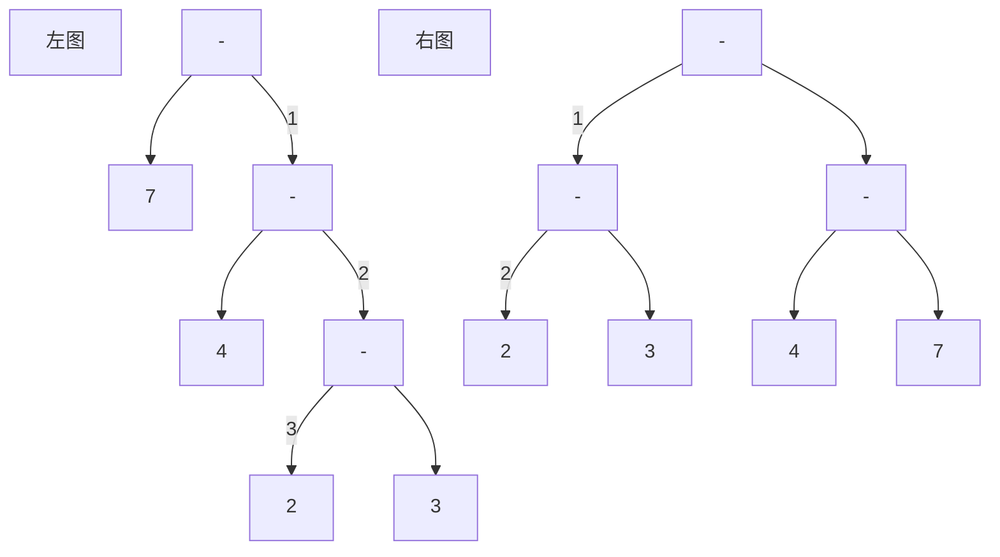

## 6. 赫夫曼树、最优二叉树

*   赫夫曼树
    *   给定一组有确定权值的叶子结点，带权路径长度最小的二叉树
    *   注意是叶子结点
    *   最优二叉树 、哈夫曼树

*   路径

    *   概念
        *   在一棵树中，一个结点到另一个结点之间的通路 
    *   长度
        *   在一条路径中，每经过一个结点，路径长度都要加 1 
        *   在一棵树中，规定根结点所在层数为1层，那么从根结点到第 i 层结点的路径长度为 i - 1 。 
        *   从树中一个结点到另一个结点之间的分支构成两个结点之间的路径，路径上的分支数称作路径长度
    *   树的路径长度
        *   从树根到每一个结点的路径长度之和

    ```mermaid
    graph TB
    A --> B
    A --> C
    B --> D
    B --> E
    C --> F
    C --> G
    ```

    ```go
    A 到 D
    	路径为 	A -> B -> D
    	路径长度   2   分为 AB 之间的连线 、BD之间的连线
    A的路径长度
    	从 A 分别到 B C D E F G 的路径长度之和 
    ```

*   权值

    *   概念
        *   权值是树或者图中两个结点路径上的值
        *   出现的次数、概率
    *   结点的权
        *   给每一个结点赋予一个新的数值，被称为这个结点的权 

    

*   带权路径长度

    *   概念
        *   从根结点到各个叶子结点的路径长度与相应的叶子结点权值的乘积
    *   结点的
        *   指的是从根结点到该结点之间的路径长度与该结点的权的乘积 
    *   树的 
        *   WPL 
        *   树中所有叶子结点的带权路径长度之和 



```go
// 给四个 叶子结点的权值分别为 {2 ，3 ，4 ，7}
到 2 结点的路径长度
	左图 3  经过 3 个线段
	右图 2  经过 2 个线段

左树的带权路径长度
	WPL = 7 * 1 + 4 * 2 + 2 * 3 + 3 * 3
右树的带权路径长度
	WPL = 2 *2 + 3 * 2 + 4 * 2 + 7 * 2
```

*   特点

    ```go
    1. 权重越大的结点离树根越近 , 越小的越远离根结点
    2. 只有度为 2 的分支结点 和 度为 1 的叶子结点， 不存在 度为 1 的结点
    ```

*   基本思路

    *   初始化
        *   给定权值，将权值构造成一个只有根结点的二叉树，得到一个二叉树集合
    *   选取与合并
        *   查找权重值最小的两个结点，分别作为左子树、右子树来构建一个新的二叉树
        *   新二叉树的根结点的权值为 左、右子树根结点的权值之和
    *   删除与加入
        *   将作为左右子树的值，从原权值集合中删除
        *   将构成的新树的根结点的权值，加入权值集合中
    *   重复中间两步 ， 就得到哈夫曼树

    ```go
    // 设置的时候，尽量遵循 左 > 右 
    
    W = {2，4,5,3}
    1. 初始化，将各个权值分别变成一颗只有根结点的数
    	树集合 ： 2 4 5 3
    2. 选取合并
    	找到最小的两个结点，组成新树，根结点权值为两结点权值之和
    	 5
    	/ \
       2    3
    3. 删除加入
    	原树集合中，删除掉 2 3 ，加入 5 
    	树集合为 ： 4 ，5 ，5
    					/ \
      				   2    3
    
    4.重复2 ，找到两个比较小的根结点 4 5 ，构成新树
    	优先生成低层次的树，然后再生成高层次的树，所以选没有左右子树的结点 5
    	 9
    	/ \
       4    5
    5. 重复 3 
    	树集合变为 9   ，    5
    			/ \       / \
                4    5    2   3
    6.重复 2 ,
    	 14
    	/ \
       5    9
    7.重复 3
    	树集合变为 14 
    8. 生一个即为所求的树，然后展开
    	14
    	/ \
       9    5
     / \   /  \
    4   5 3    2
    ```

*   算法描述

    ```go
    // 给定的有各自权值的 n 个结点
    1.  n 个权值中选出两个最小的权值，对应的两个结点组成一个新的二叉树，且新二叉树的根结点的权值为左右孩子权值的和；
    2. 在原有的 n 个权值中删除那两个最小的权值，同时将新的权值加入到 n–2 个权值的行列中，以此类推
    3. 重复 1 和 2 ，直到所以的结点构建成了一棵二叉树为止，这棵树就是哈夫曼树。
    
    //----------------------------------------------------------------------------
    
    1. 根据跟定的 n 个权值{w1,w2, ... ,wn} 构成 n 棵树的集合 F = {T1 , T2 ,... ,Tn} ,其中每颗二叉树 Ti 中只有一个带权为 Wi 的根结点，其左右子树均为空
    2. 在 F中选取两棵根结点的权值最小的树作为左右子树构造一颗新的二叉树，且置信的二叉树的根结点的权值为其左右子树上根结点的权值之和
    3. 在 F 中删除者两棵树，同时将新得到的二叉树加入到 F 中
    4. 重复 2 和 3 。直到 F 只含一棵树为止
    ```

### 实现

### 孩子双亲存储

| weight | lchild     | rchild     | parent       |
| ------ | ---------- | ---------- | ------------ |
| 权值   | 左孩子下标 | 右孩子下标 | 双亲结点下标 |


```go
// 结点设置，使用长度为 2n-1(性质3) 长度的数组
	| weight | lchild | rchild | parent|

    weight :  权值域， 保存该节点的权值
    lchild ： 指针域， 结点的左孩子结点在数组中的下标
    rchild ： 指针域， 结点的右孩子结点在数组中的下标
    parent ： 指针域， 结点的双亲结点在数组中的下标

type element struct {
    weight int
    lchild , rightchild , parent int
}
```


### 伪代码

```go
1. 数组 huffTree 初始化，所有元素节点的双亲、左右孩子都置为 -1
2. 数组 huffTree 前 n 个元素的权值置给定定值 w[n]
3. 进行 n-1 次合并
	3.1 二叉树中选取两个权值最小的根结点，其下标分别为 i1 i2
	3.2 将二叉树 i1 i2 合并为一颗新的二叉树 K
```

### 例子

```go
2 4 5 3 
1. 初始化，创建一个数组，数组长度为 7 
	填入具体的 weight , parent lchild rchild 都设置为 -1
```

| 下标 | weight | parent | lchild | rchild |
| ---- | ------ | ------ | ------ | ------ |
| 0    | 2      | -1     | -1     | -1     |
| 1    | 4      | -1     | -1     | -1     |
| 2    | 5      | -1     | -1     | -1     |
| 3    | 3      | -1     | -1     | -1     |
| 4    |        | -1     | -1     | -1     |
| 5    |        | -1     | -1     | -1     |
| 6    |        | -1     | -1     | -1     |

```go
选出第一个子树 。
	 5
	/ \
   2    3
5 放到下标为 4 的地方
	更改 5 的lchild 为 0 ，rchild 为 3
2  修改其 parent 为 4
3  修改其 parent 为 4
```


| 下标 | weight | parent | lchild | rchild |
| ---- | ------ | ------ | ------ | ------ |
| 0    | 2      | 4      |        |        |
| 1    | 4      |        |        |        |
| 2    | 5      |        |        |        |
| 3    | 3      | 4      |        |        |
| 4    | 5      |        | 0      | 3      |
| 5    |        |        |        |        |
| 6    |        |        |        |        |

```go
挑出子树
	 9
	/ \
   4    5

9 放到下标为 5 的地方
	更改 9 的lchild 为 1 ，rchild 为 2
4  修改其 parent 为 5
5  修改其 parent 为 5
```

| 下标 | weight | parent | lchild | rchild |
| ---- | ------ | ------ | ------ | ------ |
| 0    | 2      | 4      |        |        |
| 1    | 4      | 5      |        |        |
| 2    | 5      | 5      |        |        |
| 3    | 3      | 4      |        |        |
| 4    | 5      |        | 0      | 3      |
| 5    | 9      |        | 1      | 2      |
| 6    |        |        |        |        |


```go
类推
```


## golang 实现

```go
type HTNode struct {
    weight int
    lchild , rightchild , parent int
}


// HTNode huffTree[] 存放的数组
// w[] []int  权值
// int n  叶子结点个数 ，就是 len(w[int])
func HuffmanTree (w []int)(huffTree []HTNode){
    
    // len(w[]) 要生成的hafuman树的 叶子结点个数
    n := len(w[])

    // 用来存储 要输出的 haffman 树
    var hufftree []HTNode
    
    // 初始化
    for i:=0; i < 2*n-1; i++ {
        huffTree[i].parent = -1
        huffTree[i].lchild = -1
        huffTree[i].rchild = -1
    }
    
    // 初始化前 n 个结点的权值
    for i:=0; i<n; i++ {
        huffTree[i].weight = w[i]
    }
    
    // 构建哈夫曼树
    for k:=n; k<2*n-1; k++ {
        // 挑选 parent 为 -1 的最小和次小的结点的下标【秒】
		
        // select 有 return i1 i2
        i1 , i2 := select(huffTree[k])

        huffTree[k].weight = huffTree[i1].weight + huffTree[i2].weight
        // 修改 新根结点的 lchild rchild
        huffTree[k].lchild = i1
        huffTree[k].rchild = i2
        
        // 修改挑出的结点的父节点
        huffTree[i1].parent = k
        huffTree[i2].prent = k
               
    }
    
}
```


## 哈夫曼编码

*   哈夫曼压缩解压缩。
*   这个没有太懂


