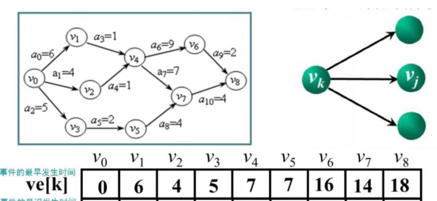

## AOE 网

*   概念

    *   在一个表示工程的  带权有向图 中，
        *   顶点 ： 表示事件
        *   有向边  ： 活动
        *   边权值 ： 活动持续时间
        *   边表示活动的网 ： 带权值的有向图
        *   始点（源点） ： 没有入边的顶点
        *   终点（汇点） ： 没有出边的顶点

*   环

    *   AOE 网不存在环

*   性质

    ```go
    1.   只有在某顶点所代表的时间发生后，从该点出发的各活动才能开始
    2.   只有在进入某顶点的各活动都结束，该顶点所代表的的事件才能发生
    
    开始（源点） -- 10min--> 做饭 -- 11min --> 吃饭 -- 12min --> 玩手机
    开始（源点） --10min-->  a   -- 11min --> b   -- 12min --> c
    	从开始，到事件 a 完成要 10 min
    	从事件 a 完成（做饭结束） 到事件 b 完成（吃饭结束） ，要 11min
    	从事件 b 完成（吃饭结束） 到事件 c 完成（玩手机结束） ，要 12min
    ```

*   应用

    ```go
    1. 完成真个工程至少需要多少时间
    	关键路径 ：用时最长的路径
    2. 为缩短工期所需时间，应该加快哪些活动
    ```

### 几个概念

```go
1. 事件最早发生时间 ve[k]
2. 时间最晚发生时间 vl[k]
3. 活动最早发生时间 ee[k]
4. 活动最晚发生时间 el[k]
5. 关键活动、关键活动路径


/* 
	假设这个图是从 凌晨 00:00 开始制造一个玩具，每个事件表示一个零件
	1.  v0 开始生产这个玩具  开始时间就是 0 点
	2.  生产 v4 , 必须要生产完 零件 v0 v1 v2 v3 ,否则会没法生成 v4 ,一定要注意这个
	3.  到 v8 的最长路径，也就是所有的零件都生产完全，组装成品，就是计划完成的时间
		这个时间是合理规划好的，正好是各个零件完全制造完成，
	4. 各个顶点：代表时间完成 
		v1 顶点 ： 事件 v1 完成 ，
		v4 顶点 ： 事件 v4 完成
         a3     ：  表示从 v1 完成 ，到 v4 完成的时间段 ，v4 的开始点正好是 V1 结束
    5. 与源点相连的点特殊
    	v0 -- a0 -- v2  : v0 是项目开始，所以如果时间充足， v2 可以在 v0 后面后面开始也可以
		
*/
```


*   事件最早发生时间



```go
// 1. 事件最早发生时间 ve[k]
	此事件要发生，
		其所有 前驱节点 都要完成，即取所经路径权值和的最大值	
		是其所有 后继结点 开始的最早时间
	公式
		ve[1] = 0
		ve[k] = max { ve[j] + len<vi,vj>} (<vi,vj> ∈ p[k])
		p[k] 表示所有到达 vk 的有向边的集合


// 最早开始时间 ve[k]
v0	: 0		v1	: 6		v2	: 4		v3	: 5
v4	: 7
	要完成 v4 ,就要完成所有其前继的 v0 , v1, v2， 所以选最大的权值 7 = a0 + a3
	/* 
	选择 v0 v2 v4 ，从 v2 组装到 v4 是 5 点，但是 5 点的时候，v1 还没有做出来呢。就没法生产v4
	但是选择 v0 v1 v4 , 用时 7 个小时，这个时候，v2 肯定已经制造好，能同时组装到 v4 上
	*/

v5 : 7  --|| 路径唯一 { v0-v3-v5}
v6  : 16 = 7 + 9   
v7	: 14 = 7 + 7	
	有两个路径 v4 - v7 和 v5 - v7 , 要确保耗时最长的路径上的零件，在时间内完成，才能组装 v7 ，
v8	：18 = 14 + 4 
	有两个路径 v6 - v8 和 v7 - v8 , 要确保耗时最长的路径上的零件，在时间内完成，才能组装 v8
```

*   事件最晚发生时间

    

    ```go
    // 2. 事件最晚发生时间 vl[k]
    	保证其最接后继结点最晚能发生，从后往前，后继结点最迟发生时间 - 边权值，
    	多个直接后继 ：权值最小的路径
    
    	公式
    		vl[n] = ve[n] 	终点的 最早发生时间 == 最晚发生时间 == 工期
    		vl[k] = min { vl[j] - len<vk,vj>} (<vk,vj> ∈ s[k])
    		s[k] 表示所有从 vk 发出的优先边集合
    
    v0 : 0 
    v8 : 18   
    	/*
    	v8 最晚刚好在 在计划时间最后完成 ，即18 点完成
    	v8 是整个流程指定的时间，就是真个最长的执行时间，也是工程时长，在整个计划内刚好完成
    	*/
    v7 : 14 = 18 - 4 = v8 - a10
    	// v7 装到 v8 上，耗时 a10 = 4 ,所以，v7 最晚也要在 14 点做出出来，否则没有足够时间组装到 v8 上去
    v6 : 16 = 18 - 2 = v8 - a9
    	// v6 装到 v8 上，耗时 a9 = 2 ,所以，v7 最晚也要在 16 点做出出来，否则没有足够时间组装到 v8 上去
    
    v5 : 10 = 14 - 4 = v7 - a8
    	// v5 装到 v7 上，耗时 a8 = 4 ,所以，v5 最晚也要在 14 点做出出来，否则没有足够时间组装到 v7 上去
    
    v4 : 7
    	v6 - a6 = 16 - 9 = 7 
    	v7 - a7 = 14 - 4 = 10
    	// v4 装到 v6 上，耗时 a6 = 9,所以，v4 最晚也要在 7 点做出出来，否则没有足够时间组装到 v6 上去
    	// v4 装到 v7 上，耗时 a6 = 4,所以，v4 最晚也要在 10 点做出出来，否则没有足够时间组装到 v6 上去
    	// 10 点做出来 v4 ，没办法
    	// 综上在 7 点做出来 v4 ,就有足够时间安装 v6、v7 
    
    v1 : 6 = 7 - 1 = v4 -a3
    v2 : 6 = 7 - 1 = v4 - a4
    v3 : 8 = 10 - 2 = v5 - a5
    
    v0 :  0 
    	对于 v1 是 v0=0=v1-a1 ,v2 是 v0=2=v2-a2 , v3 是 v0=3=v3-a3 , 选取最小的 0
    	// 你在 2 点或者 3 点开工，都不能完成 v1 ,所以要取 0 点
    	这个是计划开始，开始实施计划，
    ```

*   活动最早开始时间 + 最晚开始时间

    

    ```go
    // 3. 活动最早开始时间 ee[k]
    	// ee[i] = ve[vi] 最早结束时间
    	活动 ai 是由弧 <vi,vj> 表示，活动 ai 最早开始事件应等于事件 vk 的最早发生时间
    	公式
    		ee[i] = ve[vk]
    	
    
    // 4. 活动最晚开始时间 el[i]
    	// el[i] = vl[vi] 最晚发生时间
    	活动 ai 是由弧 <vi,vj> 表示，活动 ai 最晚开始事件要保证事件 vj 的最迟发生时间不拖后
    	在不推迟整个供其的前提下，事件 vk 允许的最晚发生时间 ，
    
    	公式
    		el[i] = ve[k] 	终点的 最早发生时间 == 最晚发生时间 == 工期
    		el[k] = min { vl[j] - len<vk,vj>} (<vk,vj> ∈ s[k])
    		s[k] 表示所有从 vk 发出的优先边集合
    
    	
    	// 特殊在跟 v0 相连的弧上 a0 a1 a2
    	活动     弧     时间发生的最晚时间	         各点意义				活动开始点/vi开始点
    	a0=6   v0-v1	     v1 : 6  		  v1 最晚在 6 点完成				0 = 6 - 6
    	a1=4   v0-v2 	     v2 : 6  		  v2 最晚在 6 点完成				2 = 6 - 4
    	a2=5   v0-v3	     v3 : 8  		  v3 最晚在 8 点完成 				3 = 8 - 5
    	// 即 a0 最晚在 0 点开工， a1 最晚在 2 点开始 ， a2 最晚在 3 点开始 
    	// 所以对于 a1 a2 的前几个小时，就可以空出来，什么都不做
    
    // 关键路径
    	1. 关键路径点
    		活动最早开始的时间 == 活动最晚开始的时间 ：紫色框的
    	2. 关键路径
    		由关键路径点组成的，关键路径不止一条，图中有两条  ： 红色的箭头
    	3. 重要性
    		1. 该活动既不能延迟，也不能提前，是需要按时按点完成的
    		2. 
    	4. 公式
    		各个活动的时间余量 el[k] - ee[k] , 时间剩余量为 0 者 即为关键活动
    ```


### 代码思路

```go
1. 从源点 v0 出发 ， 令 ve[0] = 0 , 按拓扑排序求其余各项顶点的最早发生时间 ve[i]
2. 如果得到的拓扑序列中顶点个数小于 AOE 网中的定点数，则说明王忠存在环，不能求关键路径，算法终止，否则执行步骤 3
3. 从终点 v(n-1) 触发，令 vl[n-1] = ve[n-1] , 按逆序拓扑有序求其余各顶点的最迟发生时间 vl[i]
4. 根据各项顶点的 ve 和 vl 值，求每条有向边的最早开始事件 ee[i] 和最迟开始事件 el[i]
5. 若某条有向边 ai 满足条件 ee[i] = el[i] , 则 ai 为关键活动
```


### 邻接表

### 拓扑序列


