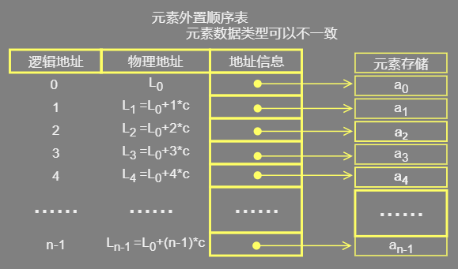
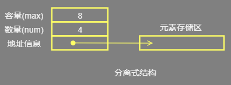

<font sinze=5 color=yellow>线性表</font>

## 1.介绍

*   顺序存储结构
*    将“具有 '一对一' 逻辑关系的数据按照次序连续存储到一整块物理空间上” 
*   计算机内存中以数组的形式保存的，是一组地址连续的存储单元依次存储的结构
*   内存布局
    *    顺序表存储数据时，会提前申请一整块足够大小的物理空间 
    *    然后将数据依次存储起来，存储时做到数据元素之间不留一丝缝隙。 


## 2.形式

### 1.基本形式


*    数据元素本身连续存储，每个元素所占的存储单元大小固定相同， 

*    元素的下标是其逻辑地址 

*    元素存储的物理地址（实际内存地址）可以通过存储区的起始地址Loc (e0)加上逻辑地址（第i个元素）与存储单元大小（c）的乘积计算而得 

    ```go
    Loc(ei) = Loc(e0) + c*i 
    ```

*    访问指定元素时无需从头遍历，通过计算便可获得对应地址,时间复杂度为O(1)。 

### 2.元素外置形式



*    元素的大小不统一 时使用
*    被称为对实际数据的索引，这是最简单的索引结构 
*    将实际数据元素另行存储，而顺序表中各单元位置保存对应元素的地址信息（即链接） 
*    每个链接所需的存储量相同，通过上述公式，可以计算出元素链接的存储位置，而后顺着链接找到实际存储的数据元素 
*    **图中的c不再是数据元素的大小，而是存储一个链接地址所需的存储量，这个量通常很小。** 

## 3.实现方式

*    一部分是表中的元素集合，
*   另一部分是为实现正确操作而需记录的信息，即有关表的整体情况的信息，
    *   元素存储区的**容量**
    *   当前表中已有的**元素个数**

### 一体式


*    存储表信息的单元与元素存储区以连续的方式安排在一块存储区里，两部分数据的整体形成一个完整的顺序表对象。
*    整体性强，易于管理。但是由于数据元素存储区域是表对象的一部分，顺序表创建后，元素存储区就固定了。 

### 分离式



*    表对象里只保存与整个表有关的信息（即容量和元素个数），
*   实际数据元素存放在另一个独立的元素存储区里，通过链接与基本表对象关联。 


## 1.操作

### 1.元素存储区替换

*   一体式
    *    由于顺序表信息区与数据区连续存储在一起，所以若想更换数据区，则只能整体搬迁，即整个顺序表对象（指存储顺序表的结构信息的区域）改变了。 
*    分离式结构 
    *    更换数据区，只需将表信息区中的数据区链接地址更新即可，而该顺序表对象不变。 

### 2.扩容

*    分离式
    *    将数据区更换为存储空间更大的区域，则可以在不改变表对象的前提下对其数据存储区进行了扩充，所有使用这个表的地方都不必修改。 
    *    只要程序的运行环境（计算机系统）还有空闲存储，这种表结构就不会因为满了而导致操作无法进行 
    *    采用这种技术实现的顺序表称为动态顺序表，因为其容量可以在使用中动态变化。 
*   扩容的策略
    *    线性增长：  每次扩充增加固定数目的存储位置，如每次扩充增加10个元素位置 
        *    特点：节省空间，但是扩充操作频繁，操作次数多。 
    *   超级加倍：  每次扩充容量加倍，如每次扩充增加一倍存储空间 
        *    减少了扩充操作的执行次数，但可能会浪费空间资源。以空间换时间，推荐的方式。 

### 3.插入元素


### 1.初始化

*     申请足够大小的物理空间 
*   顺序表申请的存储容量； 
    *   正常状态下，顺序表申请的存储容量要大于顺序表的长度  
    *   这个在 C 中需要，其他的貌似不需要了
*    记录顺序表的长度 