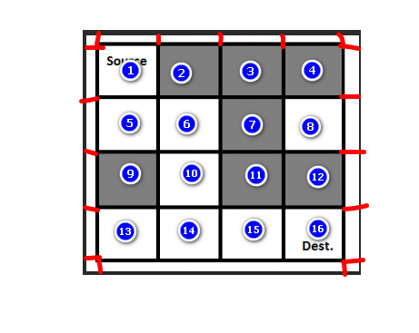

## 理解



```java
问题
    从入口开始， 按照一定方向进行探索，知道找到出口
本质
    是一种穷举，是一种穷举的方法
    把所有的可能进行记录
// 顺序是先右后下
				  ╭﹣﹣﹣﹣﹣﹣﹣ 1 ﹣﹣﹣﹣﹣﹣╮ 
            	  null                  ╭﹣﹣﹣ 5 ﹣﹣﹣╮               
                  			       ╭﹣ 6 ﹣╮           null
                                 null  ╭﹣ 10 ﹣╮   
                                     null  ╭﹣ 14 ﹣╮
                                       ╭﹣ 15 ﹣╮    null
                                   ╭﹣ 16 ﹣╮    null
// 个人理解
	基于穷举的案例，都可以利用树，表达出来                      
	其实就是穷举，将所有的情况都列举出来，就像一棵树，                      
	从树根一个一个分支去寻找结果，找到了                      
// 解题思路
	1. 开始处在 1 号位置，接下来有两种方案走 ：2  5 
		// 假如 2 号能走，就先不走 2 号，等一条路结束再回来走                      
          2 不能走，所以我标记为 null
		 5 可以走
	2. 走到 5 好位置， 接下来有两种方案走： 6 9
		9 不能走， 所以我标记为 null                      	
		6 可以走
	3. 走到 6 号位置， 接下俩有两种方案可以走： 7 10     
		7 不能走， 所以我标记为 null                      	
		10 可以走       
	4. 走到 10 号位置， 接下俩有两种方案可以走： 11 14     
		11 不能走， 所以我标记为 null                      	
		14 可以走                                     
    5. 走到 14 号位置， 接下来只能走 15		                    	
		15 号可以走  
	6. 走到 15 号位置， 接下来只能走 16 号位置
		16 号可以走，即到达终点                      
```

## === 深度优先 ===

## 优缺点

```java
优点： 
    无需像广度优先搜索那样（BFS）记录前驱结点。
缺点： 
    找到的第一条可行路径不一定是最短路径，
    如果需要找到最短路径，那么需要找出所有可行路径后，再逐一比较，求出最短路径
```


## 堆栈

```java
public class Direction{
    int x;
    int y;
}

public class Box {
	int x;  // 当前格子的 x 坐标
    int y;  // 当前格子的 y 坐标 

    
    public boolean findPath(int maze[][], direction[], Stack s) {
		
        
    }
}
```


## === 广度优先 ===

## 优缺点

```java
优点： 
    找出的第一条路径就是最短路径。
缺点： 
    需要记录结点的前驱结点，来形成路
```


## 需要总结

```java
https://blog.csdn.net/k346k346/article/details/51289478
```

