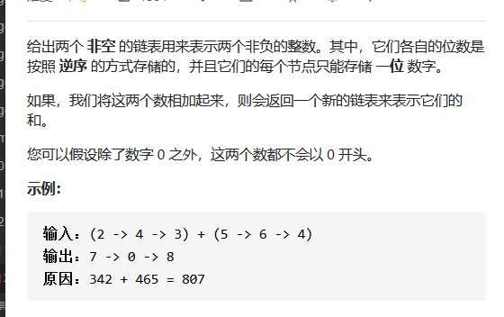

```go
type ListNode struct {
	Val  int
	Next *ListNode
}

// 返回最后一个节点，用于遍历找到第一个数字
func addTwoNumbers(l1 *ListNode, l2 *ListNode) *ListNode {

	curNode := new(ListNode)
	headNode := curNode
	// carry 进位数
	carry := 0

	// curNode.data = l1.val + l2.val + carry
	// 当
	for (l1 != nil )||(l2!=nil)||(carry > 0){

		// 要操作的数据点
		curNode.Next = new(ListNode)
		curNode = curNode.Next

		if l1 != nil {
			carry += l1.Val
			l1 = l1.Next 
		} 

		if l2 != nil {
			carry += l2.Val
			l2 = l2.Next
		}

		curNode.Val = carry % 10
		carry /= 10

	}

	// 返回第一个数据结点，
	// 但是不能用 for 之前的curNode,next 是nil。不能
	// 你用 head = curNode.next ，然后返回head , 这里返回的并不是第一个数据结点

	return headNode.Next
}
```

