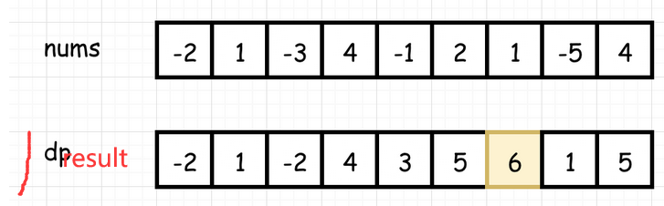

## 题目

```GO
给定一个整数数组 nums ，找到一个具有最大和的连续子数组（子数组最少包含一个元素），返回其最大和。

// 示例
输入: [-2,1,-3,4,-1,2,1,-5,4]
输出: 6
解释: 连续子数组 [4,-1,2,1] 的和最大，为 6。

// 进阶
如果你已经实现复杂度为 O(n) 的解法，尝试使用更为精妙的分治法求解。
```

## 思路

```go
// 怎么判断和一致在增大 ： 以一个数字加上大于零领的数字，就会变大

// 还有就是你怎么给分出来子序列，该在什么时候分,到什么时候结束？？

极端情况
1. 都是负数的话，单个元素就行了，就不要加了
	往后约加越小，直接使用下一个元素就行了
2. 都是正数的话，把所有的元素都加起来就行了
	一直往后加就行了，和会越来越大
3. 有正有负，这个是正常的情况，
	和是负数： 
		如果加一个负数，越加越小，就不要加了
		如果加一个正数，还不如直接使用正数
		所以和是负数就直接断了
	和是正数 ：那就一直加
		直接加就行了，往上加的结果是正数，还直接往上加，加的结果是负数，那就断了，直接使用下一个元素就行了
4. 从所有的结果中挑出来最大的就行了
```




## golang 实现

### 按照思路写的代码

```go
func maxSubArray(nums []int) int {
    if len(nums) < 1 {
        return 0
    }
    
    //  result 用来存放每个元素存在的子列对应的最大值
    //  最后一个位置存放最大的和
    result := make([]int,len(nums)+1)

    // 初始化第一个值,用来存放所有的元素对应的最大值 
    result[0] = nums[0]
    // 这个是要输出的结果
    res := nums[0]
    for i:=2;i<len(nums);i++ {
        if results[i-1] < 0 {
            result[i] = nums[i]
        } else {
            result[i] = result[i-1]+nums[i]
        }    
    }
    
    // 找到最大的那个
    for i:=0 ; i < len(nums); i++ {
        if nums[i] > res {
            res = nums[i]
        }
    }
    return res  
}
```

### 思路优化一

```go
 前面的思路很清晰：关键就在于连续子序列的和是正数还是负数
负数的话 ：就不要往后加了
正数的话 ：继续往后加

// ---------------------------------------------------------------------

func maxSubArray(nums []int) int {
    if len(nums) < 1 {
        return 0
    }
    
    result := make([]int,len(nums))
    // 存放序列和的切片
    result[0] = nums[0]
    
    // 需要打印出来的结果
    // 初始条件下,让默认打印第一个元素
    resprint := nums[0]
    
    for i:=1; i<len(nums); i++ {
        // 一个数加上一个小于零的数，结果小于自身
        // 如果前面的子序的和是负数，就把 nums[i] 作为 result[i]
        result[i] = max(nums[i],nums[i-1]+result[i-1])
        resprint = max(resprint , result[i])      
    }
    
    return resprint
}

func max(a,b int) int {
    if a > b {
        return a
    } 
    return b
}
```

