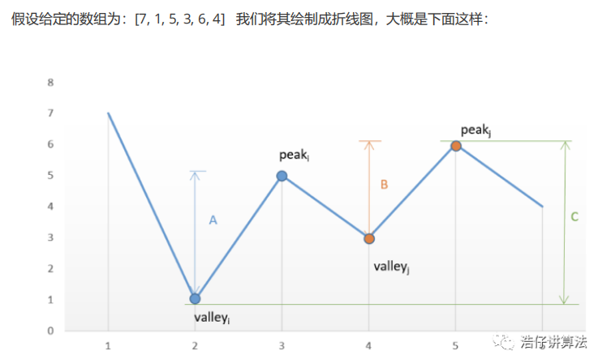

## 题目

```go
// 给定一个数组，它的第 i 个元素是一支给定股票第 i 天的价格。
1. 不能参与多笔交易
	最多只允许完成一笔交易（即买入和卖出一支股票）
	不能在手中有股票没有卖出的情况下再次买入
2. 尽可能多次交易
	即：进行多次的买卖，让利润最大化

实例
输入: [7,1,5,3,6,4] 
输出: 7
	第一天买入 7 第三天卖出 3 ，获利为 7-3=4

输入: [7,6,4,3,1] 
输出: 0
```

## 分析

*   leetcode 上的评论

    ```go
    1. 策略是所有上涨交易日都买卖（赚到所有利润），所有下降交易日都不买卖（永不亏钱）。这个解释是真的很棒，我怎么就没想到这一层呢
    
    2. 而是预知明天下降则不买入
    
    3. 价于“每天都在赚（差价）利润，赚取相邻两天的差价” 如果单理解为每天买了又卖是不正确的 前者是支付一次钱拿n天的差价，后者是支付了n-1次拿n天的差价 这也是为什么连续上涨时，我们不中途买卖，而要最后那天卖 12345
    
    4. 
    ```

    

*   自己的想法

    ```go
    // 贪心算法，只考虑当日最优，累积称为全局最优
    股票交易所得的利润就是两个点之间的垂直距离
    
    1. 一直上升 	1 ，2 ，3 ，4 ，5   
    	这种情况，是直接找第一个 1 和 最后一个 5 ，
    	这就牵扯到如何实现跨越多天进行买卖的问题了
    	这道题来说，跨越多天的利润就是就是相邻连两天的利润差的和（垂直线上的长度就是利润）	
    	即 5 - 1 = (2-1) + (3-2) + (4-3) + (5-4) 你换其他递增序列也是如此
    
    
    
    2. 一直下降 	5 ， 4 ，3 ，1
    	就不买
    
    
    3. 有上升有下降
    	此时就如图所示，获得的利润就是竖线的长度，所以统计上升线段的垂直高度差
    	同时要预测第二天的价格 // 最重要的就是这个，是要根据第二天的价格确定今天是买入还是卖出
    		（具体分的话，还要分你手里有没有股票，）
    		第二天价格下降
    			当天卖出或者不买
    		第二天价格上升
    			就手持股票或者购入股票
    
    if prices[i] > prices[i+1] {
        // 卖出或者不买入
    } 
    if prices[i] < prices[i+1]{
        // 保持或者购入
    }
    if prices[i] == prices[i+1]{
        //保持现状
    }
    ```

    

    

    

### golang

```go
func maxProfit(prices []int) int {
    if len(prices) < 2 {
        return  0
    }
    // dp[赚取的利润][买入的时候的股票价格（买入是负值）]
    dp := make([][2]int,len(prices))
    dp[0][0] = 0
    dp[0][1] = -prices[0]
    for i:=1; i<len(prices); i++ {
        
    }
}

if prices
```

