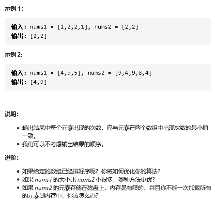
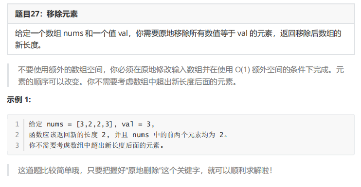

## 双指针+排序

## 两数组交集

### 题目



### 思路

```java
1. 先对两个数组排序: 
	// 排序这一部很重要
2. 使用两个指针，分别指向两个数组开始的位置。
    //  如果两个指针指向的值不同，那么指向的值相对小的往后移一步，相对大的先不动，然后再比较
	相等的值，就加入到集合 list 中， 然后两个指针分别往后移一步
```

### 代码

```java
public int[] intersect(int[] num1, int[] num2){
        Arrays.sort(num1);
        Arrays.sort(num2);
        int i = 0;
        int j = 0;
        ArrayList<Integer> result = new ArrayList<>();
        // 两个有一个结束就结束
        while (i < num1.length && j < num2.length) {
            if (num1[i] == num2[j]) {
                result.add(num1[i]);
                i++;
                j++;
            } else if (num1[i] > num2[j]) {
                j++;
            } else if (num1[i] < num2[j]) {
                i++;
            }
        }

        int[] arr = new int[result.size()];
        for( i = 0; i < result.size(); i++) {
            arr[i] = result.get(i);
        }
        return arr;
    }
```

## 原地删除 - 27

### 题目



### 思路

```java
快指针
    找不等于删除的值
慢指针    
    找等于删除的值
删除
    将不等于删除的值 覆盖删除的值
```


### 代码

```java

```


## map

### 题目


### 思路

```java
注意
    map 是一种能够快速寻找值的理想结构，给定 key，就可以迅速找到对应的 value。
一个数组
    遍历所有元素，把它存放到map中
    	// 存入一个键值对的map {value:count}
    	key： nums1中的元素，
    	value： 这个元素在数组nums1中出现的次数。
	
另个一数组
    遍历所有元素，查看map中是否包含nums2的元素，
    	如果包含，就把当前值加入到集合list中，然后对应的 次数 count 减1。
存在问题
	count > 0
重复、个数问题
	重复几次，count 就会响应增加几个，遇到重复的就会较少 1 ，解决形同元素的问题
输出
	count 不是 1 的value,就是相交的

```

### 代码

```java
    public static int[] intersect(int[] num1, int[] num2){

            // 循环遍历数组1 ，存入 map
            HashMap<Integer, Integer> midMap = new HashMap<>();
            for (Integer key: num1) {
                midMap.put(key, midMap.getOrDefault(key,0)+1);
            }

            // 找到相同元素
            ArrayList<Integer> result = new ArrayList<>();
            for (Integer key: num2) {
                if (midMap.getOrDefault(key, 0) > 0){
                    result.add(key);
                    midMap.put(key, midMap.getOrDefault(key,0)-1);
                }
            }

            // 转换为 int[]
            int[] arr = new int[result.size()];
            for (int i = 0; i < result.size(); i++) {
               arr[i] = result.get(i);
            }
            return arr;
        }
```

