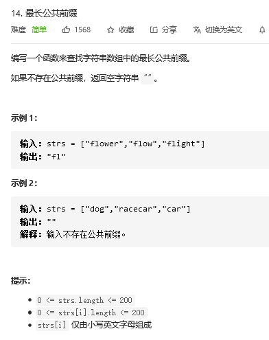

## 整体

### 最长公共前缀

#### 题目



#### 思路

```java
找一个字符串作为前缀
    这个前缀依次和后面的字符串进行对比，然后将不含有的都给截去，剩下的就是公共的
```

#### 代码

```java
   public static String longestCommonPrefix(String[] strs) {
        if (strs.length == 0) {
            return "";
        }

        // 以第一个字符串作为公共前缀
        String tempString = strs[0];

        // 其中第一个字符多比较了一次，
        // 依次向后比较，
        for (String value: strs) {
            // 最长公共前缀，第一出现的地方应该是第一个位置
            // 即下标为 0 的位置
            while (value.indexOf(tempString) != 0) {
                // 一直寻找合适的公共前缀
                tempString = tempString.substring(0,tempString.length()-1);

                // 边界判断
                if (tempString.equals("")) {
                    return "" ;
                }
            }
        }

        return tempString;
    }
```


### 移除元素

#### 题目

```java

```


## 图解法

### 股票问题