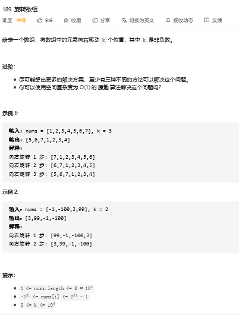

## 综述

```java
这种都是从有典型的规律，就是有 K 步操作
    // 这个貌似就需要经验的积累了
    一般情况下，需要从三步或者四步中以后发现规律
```


## 数组翻转

### 题目



### 思路

```java
向右移动 K 个位置，其实就是重复向右移动一次
  
// 向右移动 k 步骤    
1. 先将数组翻转
2. 将数组的前 K 个元素进行翻转， 然后将后面剩余的元素进行翻转
```

### 代码

```java
public class Soluton {

    public void  reverse(int[] num, int start, int end) {

        while (start < end) {
            int temp = num[start];
            num[start] = num[end];   // 越界
            num[end] = temp;
            start++;
            end--;

        }

    }

    public void rotate(int[] nums, int k) {

        // 当 K 超过 数组的界限，需要重新循环回来
        k = k%nums.length;

        // 数组先完全翻转
        reverse(nums,0, nums.length-1);

        reverse(nums, 0, k-1);
        reverse(nums,k,nums.length-1);
    }

}
```

